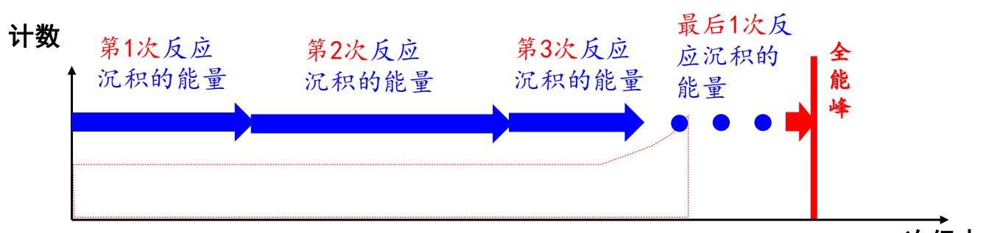
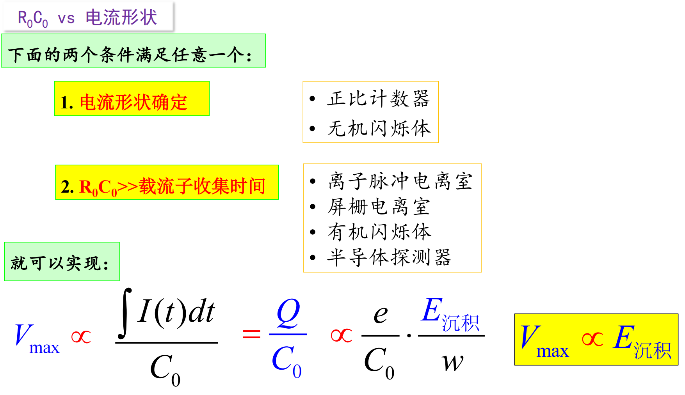
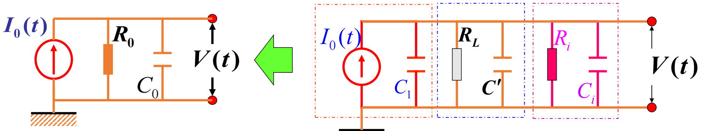
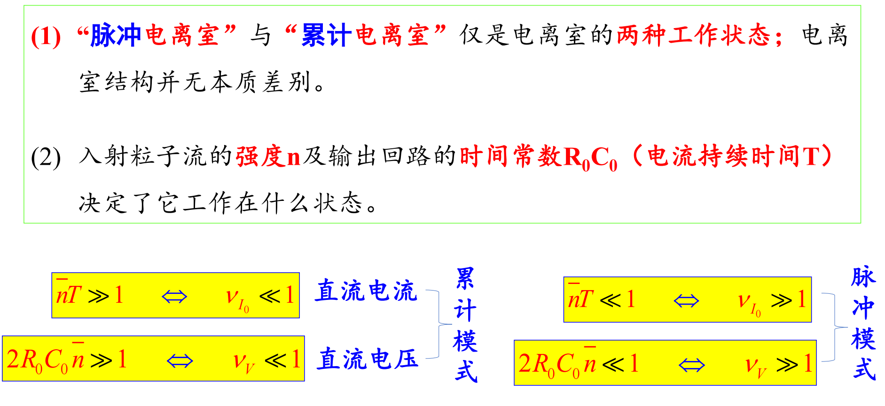
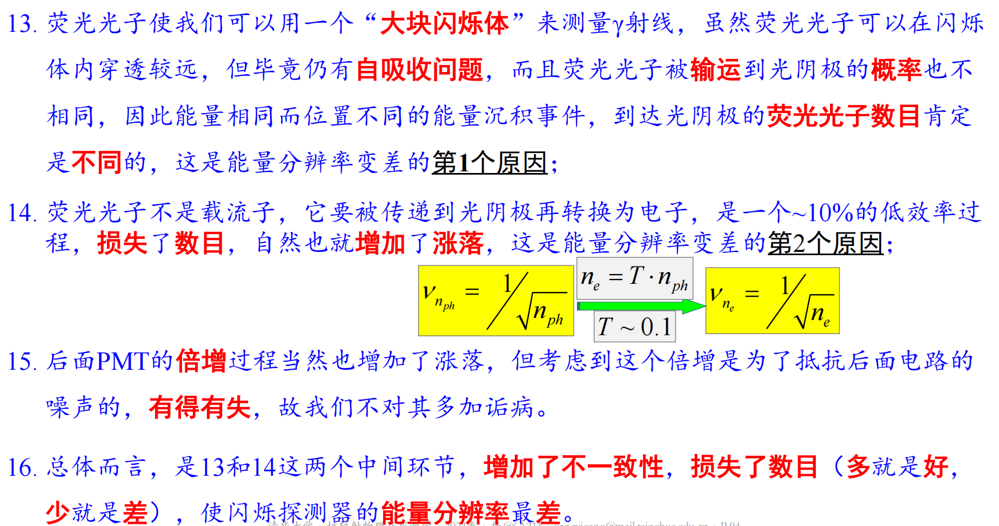
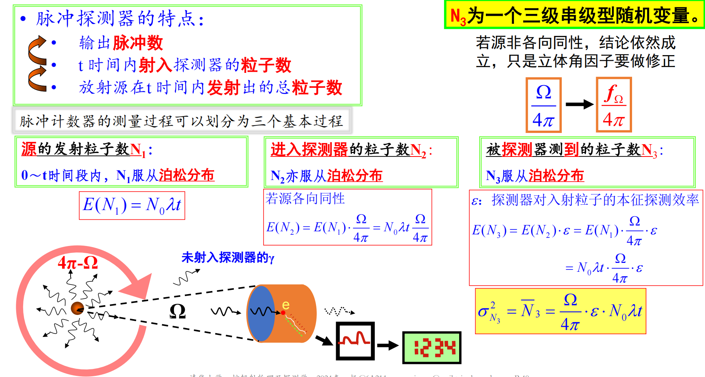

## 期末口试（杨祎罡）

*解答仅供参考！*

### 01 形成全能峰的最后一个反应是什么(6)(9)(12)

在测量 $\gamma$ 能谱时，我们希望 $\gamma$ 光子的全部能量都可以用来形成信号，然后在“全能峰”（全部光子能量的峰）那里形成贡献。如果，你现在面对的是一个 $1.33\text{MeV}$ 的光子，并且最后在探测器输出的能谱中确实也看到了它的全能峰，请分析一下该全能峰可能的形成过程。解释一下：最后一步反应是谁？

#### 解答

$\gamma$ 光子通过康普顿散射、光电效应、电子对效应产生次级电子，次级电子能量沉积，而产生的光子继续反应，能量不断沉积，直至能量完全沉积下来形成全能峰。

最后一步反应是光电效应：
- 光子能量逐渐降低，而在低能区光电效应截面最大；
- 当能量小于 $1.022\text{MeV}$ 时，不能发生电子对效应；
- 电子对效应与康普顿散射都会产生光子，还需要后续反应进行能量沉积。

### 02 随机性是如何“演变”为确定性的(7)(8)(9)(10)(12)

核辐射测量过程的各个环节都包含有随机性。例如：我们在测量活度时，放射源中每个原子核的衰变都是独立而随机的，那我们为什么又可以言之凿凿地说“测得某源的活度是多少多少”呢？又如：带电粒子在探测器介质内的电离过程是随机的，产生的载流子数目并不确定，每个载流子的产生都是随机的，可是为什么我们最终又能够以很好的分辨率（如半导体探测器）来形成全能峰呢？简而言之，微观过程总是难以免除随机性，那么宏观过程是如何变得越来越确定呢？

#### 解答

在实验测量过程中，客观性存在偶然误差，但是偶然误差可以发现与消除，利用大量的实验数据，可以实现对偶然误差的统计分析。即“‘确定’的大厦，构建于‘不确定’的砖块”。

在众多随机变量堆叠而成新变量的过程中：不确定性在以0.5次方增长，其确定性在以1次方增长，且确定性增长地更快， $\nu \propto \frac{1}{\sqrt{N}}$ 。因此，增加数量的过程，也就是相对精度提升的过程。

### 03 关于湮没辐射的问题(6)(12)

$\gamma$ 能谱中，我们通常可以看到 $511\text{keV}$ 的湮没峰，它来自于一个正电子和一个负电子湮没后的 2 个 $511\text{keV}$ $\gamma$ 光子中的 1 个，那么，我们为什么几乎看不到 $1.022\text{MeV}$ 的“湮没峰”呢？此外，看到湮没峰时，你认为正电子的产生方式可能是什么？

#### 解答

因为正负电子湮没主要是两个光子出射，且要遵循动量能量守恒，所以背向出射，这样探测器一般只能接收到一个光子。

正电子产生方式：
1. $\beta+$ 衰变
2. 电子对效应

### 04(选) 为什么基于 $\text{MeV}$ X-ray 的集装箱检测系统只能测量质量厚度信息(6)

在集装箱检测系统中，通常会用 $6\text{MeV}$ 的电子与钨靶来制备轫致辐射，然后根据 $6\text{MeV}$ X-ray 的衰减量来分析集装箱内所藏匿物质的情况。但是基于 $6\text{MeV}$ X-ray 的透射成像技术，只能提取射线穿透路径上的集装箱内物体的质量厚度，请问这是为什么？

#### 解答

### 05 为什么实测计数一定低于期望计数(7)(12)

当我们测量某个放射源（例如 $^{137}\text{Cs}$ ）的活度时，若根据源强和探测器的探测效率算出期望计数率为 $m$ ，但实测计数率的期望值 $n$ 总是比 $m$ 小，请问这是为什么？

#### 解答

因为探测器的 $R_0$ 和 $C_0$ 不可能为 $0$ ，所以分辨时间（死时间）一定存在，在上一个计数的分辨时间里假如又来了一个信号，那么这两个信号就无法区分开了，只能记作一个信号，因此实测计数一定低于期望计数。

### 06 和峰的成因(7)(12)

用 NaI(Tl) 探测器测某单能 $\gamma$ 源，不妨认为是 $^{137}\text{Cs}$ 的 $0.622\text{MeV}$ ，通常，我们不仅能够看到 $0.622\text{MeV}$ 的全能峰，还有可能看到 $1.324\text{MeV}$ 的和峰，这是为什么？和峰是否可以完全消除呢？

#### 解答

和峰产生原因：因为在分辨时间里进入探测器中两个伽马光子，在这些时间内，两者能量全部沉积，产生的电压信号会叠在一起，自然就得到了两个全能峰之和的能量。

和峰不可以完全消除，原因如下：
1. 探测器的分辨时间不可能变成 $0$
2. 伽马源总可能产生两个几乎在同一时间发射的伽马光子并进入探测器内。

### 07(选) 如何利用放射源来制备时钟(7)

若你拥有活度已知（大小可以“随心所欲”地设定）的放射源，以及本征效率已知、死时间很小（可忽略）的探测器和计数器，是否可以制备出一个比较精准的秒表来？

#### 解答

### 08 为什么气体探测器通常具有较好的 $\text{n}/\gamma$ 区分能力(6)(8)(13)

气体探测器在测量中子和 $\gamma$ 时，信号表现很不一样，前者幅度大，后者幅度小，这使得利用甄别阈来区分中子和 $\gamma$  变得很容易，算是气体探测器的天然优点，请问这是为什么？

#### 解答

*涉及中子探测，暂略*

### 09 探测器的电流形状是确定的吗(8)(9)(10)

从气体探测器开始，我们会学习 3 种探测器（气体探测器又可以分为：普通电离室、圆柱形电离室、屏栅电离室、正比计数器、G-M 管）。这些探测器都会将射线沉积在灵敏体积内的能量转换为电流。提问：
1. 电流的形状（不是幅度）是确定的吗？对哪些探测器可以认为是确定的，对哪些则不能认为是确定的？
2. 电流的形状若不定，则会对射线能量的分析造成什么影响？我们又是如何解决这个问题的？

#### 解答

如果电流形状不定，就需要考虑弹道亏损，因为形状定的话说明弹道亏损成固定比例。解决这个问题就靠增大 $R_0C_0$ ，或者缩短电流形成的时间 $\tau$ 。

### 10 什么是等效电路(8)(9)(10)

进入探测器的学习阶段之后，我们就免不了老提“等效电路”这个术语，那么构成等效电路的电阻、电容是哪些呢？这个电路有个冲击响应，可以由什么函数来描述呢？这个冲击响应又为什么会对一个探测器是工作在“脉冲”模式，还是工作在“累计”模式构成影响呢？

#### 解答

冲击响应用指数下降 $h(t)$ 来描述。

$V(t) = I(t) * h(t)$ ，如果 $h(t)$ 下降过慢，会使得多个 $V(t)$ 叠加在一起，
如果迅速下降，则多个 $V(t)$ 之间可以分辨。

### 11 为什么正比计数器的输出信号幅度正比于射线沉积的能量(8)

在正比计数器中，我们用的 $R_0C_0$ 并不大，也许只有几个 $\mu\text{s}$ ，而又知道正比计数器中是离子在做主要贡献，后者的弹道亏损问题应该是不能忽略的，那么为什么利用正比计数器还能测量射线的沉积能量——即 $V$ 和 $E_{\text{dep}}$ 之间还存在正比关系呢？

#### 解答

因为正比计数器的电流形状是确定的，故虽然弹道亏损存在，但对于不同的电流信号产生的是相同倍数的变化，之后经过的雪崩过程对信号的增益倍数整体上也是相同的，故电压与能量之间成正比关系。输出脉冲幅度 $h \sim NAe/C_0$

### 12 气体探测器 vs 闪烁探测器的 $\gamma$ 探测效率(8)(9)

气体探测器的 $\gamma$ 探测效率通常不高，闪烁探测器的则可以很高，是什么原因导致了前者低、后者高呢？

#### 解答

对 $\gamma$ 探测效率为 $1-\mathrm{e}^{-N\sigma D} = 1 - \mathrm{e}^{-N_A \rho \frac{\sigma}{A}  D} $ ，气体探测器不能做的很大，$D$ 不够大，气体分子 $Z$ 的一般不大，因此反应截面不大，因为气体分子的密度 $\rho$ 小，因此 $N$ 也很小，这样就导致了探测效率很低。

### 13 为什么在测量能谱时，无机闪烁体的弹道亏损可以不考虑(9)

我们用无机闪烁体可以测量射线的沉积能量，此时一般 $R_0C_0$ 选的和无机闪烁体的发光时间相当（对此你可以理解为电流持续时间和等效电路的时间常数是一样的），因此弹道亏损一定是存在的。但是，我们似乎并不担心由此而导致的能量测量问题（即输出信号的幅度和能量沉积之间的正比关系），为什么？

#### 解答

电流形状是确定的，弹道亏损的程度也是确定的，所以电压与沉积的能量是成正比的。

### 14 为什么闪烁探测器的能量分辨率通常最差(9)

众所周知，闪烁体探测器的探测效率可以说是最好的，但是它的能量分辨率却排在半导体、气体之后，几乎是最差的，这是为什么？

#### 解答

$$
\nu_{\xi}^2 = \nu_{\xi_1}^2 + \frac{\nu_{\xi_2}^2}{E(\xi_1)} + \cdots
$$

- 荧光光子在闪烁体中存在自吸收，导致 $E(\xi_1) 变小$ ；
- 荧光光子被输运到光阴极的概率不同，同能量不同位置的电离到达光阴极的荧光光子数目不同，导致 $\nu_{\xi_2}^2$ 变大；
- 荧光光子在光阴级转换为电子，损失了数目，增加了涨落，光电倍增过程也有统计涨落。

### 15 PN 结对于 Si 探测器的意义是什么(10)

在金硅面垒探测器中，PN 结的作用是巨大的，如果没有 PN 结，半导体探测器能量分辨率好的优点就不可能发挥出来，这其中具体的道理是什么呢？

#### 解答

PN 结显著增大了半导体的电阻率，如果电阻率较小，外加电压会导致显著的暗电流，淹没掉所测的信号；即使消除暗电流，产生的噪声电压也会显著恶化能量分辨率；且欧姆热效应会使半导体发热，会进一步降低电阻率，导致能量分辨率更差。

### 16 相较于金硅面垒探测器，高纯锗探测器的效率为什么可以很高(10)

金硅面垒探测器通常只适合于测量重带电粒子和低能电子，对于高能 $\gamma$ 射线其效率很低。但是，同样作为 PN 结型探测器的高纯锗，却可以实现很高的 $\gamma$ 探测效率，道理是什么？

#### 解答

探测效率：
$$
1-\mathrm{e}^{-N\sigma D} = 1 - \mathrm{e}^{-N_A \rho \frac{\sigma}{A}  D} 
$$

耗尽层宽度
$$
W = \sqrt{\frac{2\varepsilon V_0}{eN_i}}
$$

- Ge 的 $Z$ 更大，反应截面 $\sigma$ 更大；
- 高纯锗探测器杂质密度 $N_i$ 更低，所以耗尽层宽度 $W$ 更大，即 $D$ 更大；而金硅面垒探测器由于为了防止击穿，结区宽度不能很大。

### 17 为什么半导体探测器的前置放大器的 $R_0C_0$ 很大(10)

在半导体探测器中，前置放大器的时间常数 $R_0C_0$ 通常会选择为 $\text{ms}$ 这么大，这是为什么？如果不这样选择，可能会导致什么问题？

#### 解答

半导体探测器的电流形状不确定，故需要削减弹道亏损，需要让 $R_0C_0$ 远大于电流持续时间 $\tau$ 。

### 18 哪种探测器的等效电容是不确定的、而是随工作条件变化的(8)(9)(10)

在三种探测器中，等效电路中的 $C_0$ 都可以被认为是由探测器自身的 $C_1$ ，分布电容 $C'$ ，仪器的输入电容 $C_i$ 共同构成的，看上去应该是确定不变的。但是有一种探测器，它的 $C_1$ 是变的，导致了 $C_0$ 也就变了。这是哪种探测器， $C_1$ 改变的原因是什么？

#### 解答

PN结型半导体探测器

工作电压 $V_0$ 的变化会导致耗尽层宽度 $W = \sqrt{\frac{2\varepsilon V_0}{eN_i}}$ 变化，所以 $C_0 \propto V_0^{-\frac12}$ 也会变化。 

### 19 请列举出三种探测器在探测过程中所涉及的级联过程(7)(8)(9)(10)

在第七章的学习中，我们知道了大的数量往往意味着好的统计性（即相对涨落小），但这个结论对于级联变量并不成立，因为级联变量中的第二级过程虽然增加了数量，却实际上恶化了统计性（相对涨落增大）。请你回顾下气体、闪烁和半导体探测器，列举出在这些探测器中的哪些过程涉及到了级联变量？

#### 解答

- 脉冲探测器：源发射粒子数（泊松）——进入探测器粒子数（泊松）——被探测到粒子数（泊松）
- 正比计数器：能量沉积转化为电子离子对（法诺）——电子离子对倍增（雪崩）；
- 闪烁探测器：能量沉积转化荧光光子（法诺）——产生光电子——第一打拿极收集——光电倍增（级联）

### 20 死时间校正的问题(12)

在一个用来测量核计数的探测器系统中，死时间是否必然存在？为什么？如果用 NaI(Tl)探测器去测量某 $\gamma$ 源的计数，若全能峰的计数率为 $10000\text{cps}$ ，峰总比是 $0.5$ ，死时间为 $10\mu\text{s}$ ，则死时间校正因子是 $1/0.9$ ，对吗？如果有错，错在哪里？

#### 解答

死时间必然存在，因为 $R_0C_0$ 必不为零。

计算错误，错误如下：
- 没有计算全谱计数率 $10000\text{cps} / 0.5 = 20000\text{cps}$ 之后再进行计算；
- 在满足 $n\tau_D \ll 1$ 的情况下，才可用 $f_{\tau} = 1 -n\tau_D$ 计算死时间校正因子，而此例不满足。
- 校正因子使用 $n/m$ 计算，而非 $m/n$ 。

### 21 真符合与偶然符合(12)

真符合发生的条件是什么？偶然符合能被完全消除吗？请分别解释其原因。

#### 解答

*辐射测量方法问题，暂略*

### 22 一个 $\gamma$ 能谱里面有多少个可能的峰(12)

在 $\gamma$ 能谱里面，你可能看到很多峰，都有什么峰呢？它们的成因分别是什么？

#### 解答

- 光电峰
- 康普顿边沿、反散射峰
- 全能峰、单逃逸峰、双逃逸峰
- 湮没峰
- 特征X射线峰（内转换）
- 和峰

### 23 一个探测器的能谱形状，与计数率有关吗(12)

我们用 NaI(Tl)探测器来测量某 $\gamma$ 射线源的能谱时，是否可以认为，所测 $\gamma$ 能谱的形状，与源强是无关的？为什么？

#### 解答

与源强是有关的：
- 能谱中大多数峰的高度与计数率成正比，但和峰的增长与其他峰不成正比，因此形状改变；
- 当源强过低时，部分信号可能被本底淹没；

### 24 在 $\gamma$ 能谱的特征中，有哪些是与“逃逸现象”有关的？(12)

在测量 $\gamma$ 能谱时，我们会遇到很多种“逃逸现象”，请尽可能多地列举出由光子逃逸所致的能谱特征。

#### 解答

- 单/双逃逸峰：入射粒子能量沉积过程中，探测器内电子对效应产生正电子，其湮没产生的一个/一对湮没光子逃逸。
- 光电峰：退激过程产生的特征X射线逃逸。
- 康普顿散射：康普顿效应产生的散射光子逃逸。

### 25 如何测量慢中子(4)(13)

在测量能量很低的慢中子时，例如 $1\text{eV}$ 的中子，应该利用什么方法？可否用反冲法，为什么？

#### 解答

*中子测量问题，暂略*

### 26 中子灵敏度的物理意义是什么(13)

在测量慢中子时，有个中子灵敏度的概念，请问它的量纲是什么？怎么理解它的物理意义？

#### 解答

*中子测量问题，暂略*

### 27 如何测量快中子(4)(13)

对于数 $\text{MeV}$ 的快中子，通常应该怎么测？为什么不能沿用慢中子的测量方法了？

#### 解答

*中子测量问题，暂略*

### 28(选) 中子的存活时间及分布函数(4)(13)

在 F.Reines 和 C.L. Cowan 开展的反电子中微子测量实验中，利用反电子中微子和质子产生了正电子和中子，通过正电子事件和中子事件的符合，确认了反电子中微子的存在。在这个过程中，正电子湮没得快，中子最终被 $^{113}\text{Cd}$ 俘获得慢，请分析一下，一个 $1\text{MeV}$ 的中子在掺有一定浓度 $^{113}\text{Cd}$ 的溶液中的存活时间服从什么样的分布，平均寿命由什么决定？为了回答这个问题，需要用到第四章、第九章和第十三章的知识，大家需要先回顾课程文件中的第三章阅读材料(14) 。

#### 解答

*中子测量问题，暂略*
