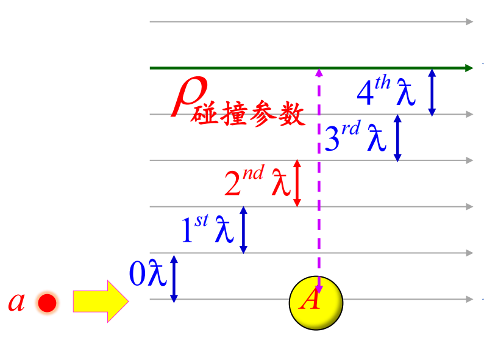
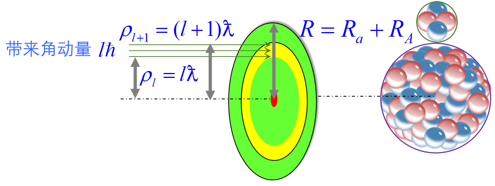

## 核反应中的分波分析

入射粒子带来的轨道角动量有不同的组成（ $s,p,d,f,\cdots$ ），可以根据不同的**轨道角动量**来分析核反应截面。

### 半经典的分波分析

对于核反应

$$
A + a \longrightarrow B + b
$$

设入射粒子 $a$ 的速度为 $v_a$ ，入射方向与靶核 $A$ 的距离为 $\rho$ （又叫做**碰撞参数**），在质心系下考虑，相对运动动量

$$
p = \sqrt{2\mu T'} = \mu v_a = \frac{m_A}{m_a+m_A} m_a v_a
$$

约化德布罗意波长

$$
\mkern5mu\bar{}\mkern-5mu\lambda = \frac{\hbar}{p}
$$

相对运动的角动量

$$
L = p \cdot \rho = \frac{\rho}{\mkern5mu\bar{}\mkern-5mu\lambda} \hbar
$$

由于轨道角动量是量子化的，即 $L=l\hbar \kern 1em (l=0,1,2,\cdots)$ ，故

$$
\frac{\rho}{\mkern5mu\bar{}\mkern-5mu\lambda} = 0,1,2,3,\cdots
\Longrightarrow
\rho = l \mkern5mu\bar{}\mkern-5mu\lambda = 0\mkern5mu\bar{}\mkern-5mu\lambda, 1\mkern5mu\bar{}\mkern-5mu\lambda, 2\mkern5mu\bar{}\mkern-5mu\lambda, \cdots
$$

这样，入射粒子 $a$ 与靶核 $A$ 的碰撞过程，就可以被分解为对应于不同轨道角动量的部分，相当于是一层一层的圆环形状。

考虑到核力是短程力，为使碰撞能够发生，碰撞参数应有最大值的限制，即

$$
\rho = l\mkern5mu\bar{}\mkern-5mu\lambda \le R = R_a + R_A
$$

则轨道角动量量子数 $l$ 应满足

$$
l \le \frac{R}{\mkern5mu\bar{}\mkern-5mu\lambda} = l_{\max}
$$

轨道角动量为 $l\hbar$ 的入射粒子与靶核的作用截面为

$$
S_l
= \pi (\rho_{l+1}^2 - \rho_l^2)
= \pi [(l+1)^2 - l^2] \mkern5mu\bar{}\mkern-5mu\lambda^2
= (2l+1) \pi \mkern5mu\bar{}\mkern-5mu\lambda^2
$$

则发生核反应的截面

$$
\sigma_{r,l} \le S_l = (2l+1) \pi \mkern5mu\bar{}\mkern-5mu\lambda^2
$$

总截面

$$
\sigma = \sum_{l=0}^{R/\mkern5mu\bar{}\mkern-5mu\lambda} (2l+1) \pi \mkern5mu\bar{}\mkern-5mu\lambda^2 = \pi (R + \mkern5mu\bar{}\mkern-5mu\lambda)^2
$$

其中 $R$ 表征核的尺寸， $\mkern5mu\bar{}\mkern-5mu\lambda$ 表征波动性，说明核的尺寸和粒子的波动性都对截面有贡献。

### 量子力学的分波分析

向 $x$ 方向入射的粒子束可用平面波 $\mathrm{e}^{\mathrm{i}kx}$ 表示，在有心力场中，可以用球面波分解

$$
\psi_i = \mathrm{e}^{\mathrm{i}kx} = \mathrm{e}^{\mathrm{i}kr\cos\theta} = \sum_{l=0}^{+\infty} (2l+1)\mathrm{i}^l \cdot j_l(kr) \cdot \mathrm{P}_l(\cos\theta)
$$

其中 $j_l(kr)$ 是球贝塞尔函数，当 $kr \gg 1$ 时，即波函数远离原子核时，有

$$
j_l(kr) \approx \frac{\sin(kr-l\pi/2)}{kr} = \mathrm{i} \frac{\mathrm{e}^{-\mathrm{i}(kr-l\pi/2)} - \mathrm{e}^{\mathrm{i}(kr-l\pi/2)}}{2kr}
$$

故

$$
\psi_i = \frac{1}{2kr} \sum_{l=0}^{+\infty} (2l+1)\mathrm{i}^{l+1} \left[ \mathrm{e}^{-\mathrm{i}(kr-\frac{l\pi}{2})} - \mathrm{e}^{\mathrm{i}(kr-\frac{l\pi}{2})} \right] \mathrm{P}_l(\cos\theta)
$$

其中 $\mathrm{e}^{-\mathrm{i}(kr-l\pi/2)}$ 中 $r$ 前系数为负，指向内部，为**入射球面波**； $\mathrm{e}^{\mathrm{i}(kr-l\pi/2)}$ 中 $r$ 前系数为正，指向外部，为**出射球面波**。

若原点上有靶核，对入射波没有影响，而散射会导致出射波函数的变化，即 $\mathrm{e}^{\mathrm{i}(kr-l\pi/2)}$ 前乘上系数 $\eta_l$ ，则 $\psi_i$ 变为

$$
\psi_i = \frac{1}{2kr} \sum_{l=0}^{+\infty} (2l+1)\mathrm{i}^{l+1} \left[ \mathrm{e}^{-\mathrm{i}(kr-\frac{l\pi}{2})} -  \eta_l \cdot \mathrm{e}^{\mathrm{i}(kr-\frac{l\pi}{2})} \right] \mathrm{P}_l(\cos\theta)
$$

这里的出射波系数 $\eta_l$ 是一个与 $l$ 有关的复数，由于入射轨道角动量 $l$ 不同，出射波的振幅和相位也不同。 $\eta_l$ 与散射、反应有关：
- 散射时 $|\eta_l| = 1$ ；
- 反应时 $|\eta_l| < 1$ 。

