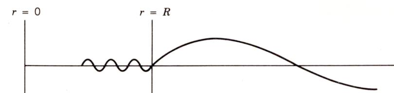
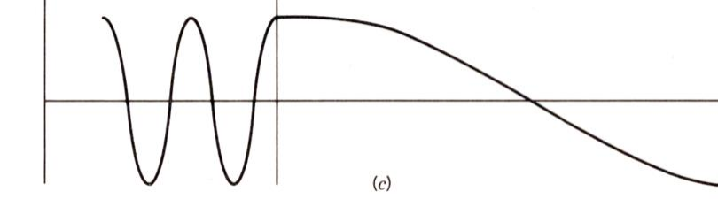

## 核反应中的分波分析

入射粒子带来的轨道角动量有不同的组成（ $s,p,d,f,\cdots$ ），可以根据不同的**轨道角动量**来分析核反应截面。

### 半经典的分波分析

对于核反应

$$
A + a \longrightarrow B + b
$$

设入射粒子 $a$ 的速度为 $v_a$ ，入射方向与靶核 $A$ 的距离为 $\rho$ （又叫做**碰撞参数**），在质心系下考虑，相对运动动量

$$
p = \sqrt{2\mu T'} = \mu v_a = \frac{m_A}{m_a+m_A} m_a v_a
$$

约化德布罗意波长

$$
\mkern5mu\bar{}\mkern-5mu\lambda = \frac{\hbar}{p}
$$

相对运动的角动量

$$
L = p \cdot \rho = \frac{\rho}{\mkern5mu\bar{}\mkern-5mu\lambda} \hbar
$$

由于轨道角动量是量子化的，即 $L=l\hbar \kern 1em (l=0,1,2,\cdots)$ ，故

$$
\frac{\rho}{\mkern5mu\bar{}\mkern-5mu\lambda} = 0,1,2,3,\cdots
\Longrightarrow
\rho = l \mkern5mu\bar{}\mkern-5mu\lambda = 0\mkern5mu\bar{}\mkern-5mu\lambda, 1\mkern5mu\bar{}\mkern-5mu\lambda, 2\mkern5mu\bar{}\mkern-5mu\lambda, \cdots
$$

这样，入射粒子 $a$ 与靶核 $A$ 的碰撞过程，就可以被分解为对应于不同轨道角动量的部分，相当于是一层一层的圆环形状。

考虑到核力是短程力，为使碰撞能够发生，碰撞参数应有最大值的限制，即

$$
\rho = l\mkern5mu\bar{}\mkern-5mu\lambda \le R = R_a + R_A
$$

则轨道角动量量子数 $l$ 应满足

$$
l \le \frac{R}{\mkern5mu\bar{}\mkern-5mu\lambda} = l_{\max}
$$

轨道角动量为 $l\hbar$ 的入射粒子与靶核的作用截面为

$$
S_l
= \pi (\rho_{l+1}^2 - \rho_l^2)
= \pi [(l+1)^2 - l^2] \mkern5mu\bar{}\mkern-5mu\lambda^2
= (2l+1) \pi \mkern5mu\bar{}\mkern-5mu\lambda^2
$$

则发生核反应的截面

$$
\sigma_{r,l} \le S_l = (2l+1) \pi \mkern5mu\bar{}\mkern-5mu\lambda^2
$$

总截面

$$
\sigma = \sum_{l=0}^{R/\mkern5mu\bar{}\mkern-5mu\lambda} (2l+1) \pi \mkern5mu\bar{}\mkern-5mu\lambda^2 = \pi (R + \mkern5mu\bar{}\mkern-5mu\lambda)^2
$$

其中 $R$ 表征核的尺寸， $\mkern5mu\bar{}\mkern-5mu\lambda$ 表征波动性，说明核的尺寸和粒子的波动性都对截面有贡献。

### 量子力学的分波分析

向 $x$ 方向入射的粒子束可用平面波 $\mathrm{e}^{\mathrm{i}kx}$ 表示，在有心力场中，可以用球面波分解

$$
\psi_i = \mathrm{e}^{\mathrm{i}kx} = \mathrm{e}^{\mathrm{i}kr\cos\theta} = \sum_{l=0}^{+\infty} (2l+1)\mathrm{i}^l \cdot j_l(kr) \cdot \mathrm{P}_l(\cos\theta)
$$

其中 $j_l(kr)$ 是球贝塞尔函数，当 $kr \gg 1$ 时，即波函数远离原子核时，有

$$
j_l(kr) \approx \frac{\sin(kr-l\pi/2)}{kr} = \mathrm{i} \frac{\mathrm{e}^{-\mathrm{i}(kr-l\pi/2)} - \mathrm{e}^{\mathrm{i}(kr-l\pi/2)}}{2kr}
$$

故

$$
\psi_i = \frac{1}{2kr} \sum_{l=0}^{+\infty} (2l+1)\mathrm{i}^{l+1} \left[ \mathrm{e}^{-\mathrm{i}(kr-\frac{l\pi}{2})} - \mathrm{e}^{\mathrm{i}(kr-\frac{l\pi}{2})} \right] \mathrm{P}_l(\cos\theta)
$$

其中 $\mathrm{e}^{-\mathrm{i}(kr-l\pi/2)}$ 中 $r$ 前系数为负，指向内部，为**入射球面波**； $\mathrm{e}^{\mathrm{i}(kr-l\pi/2)}$ 中 $r$ 前系数为正，指向外部，为**出射球面波**。

若原点上有靶核，对入射波没有影响，而散射会导致出射波函数的变化，即 $\mathrm{e}^{\mathrm{i}(kr-l\pi/2)}$ 前乘上系数 $\eta_l$ ，则波函数变为

$$
\psi = \frac{1}{2kr} \sum_{l=0}^{+\infty} (2l+1)\mathrm{i}^{l+1} \left[ \mathrm{e}^{-\mathrm{i}(kr-\frac{l\pi}{2})} -  \eta_l \cdot \mathrm{e}^{\mathrm{i}(kr-\frac{l\pi}{2})} \right] \mathrm{P}_l(\cos\theta)
$$

这里的出射波系数 $\eta_l$ 是一个与 $l$ 有关的复数，由于入射轨道角动量 $l$ 不同，出射波的振幅和相位也不同。 $\eta_l$ 与散射、反应有关：
- 散射时 $|\eta_l| = 1$ ；
- 反应时 $|\eta_l| < 1$ 。

考虑靶核导致的散射对应的波函数，其应该为有靶核时的波函数与无靶核时的波函数之差，即

$$
\psi_{sc} = \psi - \psi_i
\\ \ \\
= \frac{1}{2kr} \sum_{l=0}^{+\infty} (2l+1)\mathrm{i}^{l+1} \left[ \mathrm{e}^{\mathrm{i}(kr-\frac{l\pi}{2})} -  \eta_l \cdot \mathrm{e}^{\mathrm{i}(kr-\frac{l\pi}{2})} \right] \mathrm{P}_l(\cos\theta)
\\ \ \\
= \frac{1}{2kr} \sum_{l=0}^{+\infty} (2l+1)\ \mathrm{i}^{l+1}\ (1-\eta_l)\ \mathrm{e}^{\mathrm{i}(kr-\frac{l\pi}{2})}\ \mathrm{P}_l(\cos\theta)
\\ \ \\
= \frac{1}{2kr} \sum_{l=0}^{+\infty} (2l+1)\ \mathrm{i}^{l+1}\ (1-\eta_l)\ \mathrm{e}^{\mathrm{i}kr}\ \mathrm{i}^{-l}\ \mathrm{P}_l(\cos\theta)
\\ \ \\
= \frac{1}{2kr} \sum_{l=0}^{+\infty} \mathrm{i} (2l+1)\ (1-\eta_l)\ \mathrm{e}^{\mathrm{i}kr}\ \mathrm{P}_l(\cos\theta)
\\ \ \\
= \sum_{l=0}^{+\infty} \psi_{sc,l}
$$

接下来计算入射波函数与散射波函数对应的概率流密度 $j = -\frac{\mathrm{i}\hbar}{2m}(\psi^*\frac{\partial}{\partial r}\psi - \psi\frac{\partial}{\partial r}\psi^*)$ ，即

$$
j_i
= -\frac{\mathrm{i}\hbar}{2m}(\psi_i^* \frac{\partial}{\partial r} \psi_i - \psi_i \frac{\partial}{\partial r} \psi_i^*)
\\ \ \\
= -\frac{\mathrm{i}\hbar}{2m}( \mathrm{e}^{-\mathrm{i}kx} \frac{\partial}{\partial x} \mathrm{e}^{\mathrm{i}kx} - \mathrm{e}^{\mathrm{i}kx} \frac{\partial}{\partial x} \mathrm{e}^{-\mathrm{i}kx})
\\ \ \\
= -\frac{\mathrm{i}\hbar}{2m}(\mathrm{i}k + \mathrm{i}k)
\\ \ \\
= \frac{\hbar k}{m}
$$

$$
j_{sc}
= -\frac{\mathrm{i}\hbar}{2m}  \left(\psi_{sc}^* \frac{\partial}{\partial r} \psi_{sc} - \psi_{sc} \frac{\partial}{\partial r} \psi_{sc}^* \right)
\\ \ \\
= -\frac{\mathrm{i}\hbar}{2m} \left( \psi_{sc}^* \frac{\partial}{\partial r} \psi_{sc} - 复共轭项 \right)
\\ \ \\
= -\frac{\mathrm{i}\hbar}{2m} \left\{ \psi_{sc}^* \frac{\partial}{\partial r} \left[ \frac{1}{2kr} \sum_{l=0}^{+\infty} \mathrm{i} (2l+1)\ (1-\eta_l)\ \mathrm{e}^{\mathrm{i}kr}\ \mathrm{P}_l(\cos\theta) \right] - 复共轭项 \right\}
\\ \ \\
= -\frac{\mathrm{i}\hbar}{2m} \left[ \psi_{sc}^* \left( -\frac{1}{r} + \mathrm{i}k \right) \psi_{sc} - 复共轭项 \right]
\\ \ \\
= -\frac{\mathrm{i}\hbar}{2m} \left[ \left( -\frac{1}{r} + \mathrm{i}k \right) |\psi_{sc}|^2 - 复共轭项 \right]
\\ \ \\
= -\frac{\mathrm{i}\hbar}{2m} \left( 2\mathrm{i}k |\psi_{sc}|^2 \right)
\\ \ \\
= \frac{\hbar k}{m} |\psi_{sc}|^2
\\ \ \\
= \frac{\hbar k}{m} \left| \frac{1}{2kr} \sum_{l=0}^{+\infty} \mathrm{i} (2l+1)\ (1-\eta_l)\ \mathrm{e}^{\mathrm{i}kr}\ \mathrm{P}_l(\cos\theta) \right|^2
\\ \ \\
= \frac{\hbar k}{m} \frac{1}{4k^2r^2} \left| \sum_{l=0}^{+\infty} (2l+1)(1-\eta_l) \mathrm{P}_l(\cos\theta) \right|^2
$$

故散射微分截面

$$
\frac{\mathrm{d}\sigma_{sc}}{\mathrm{d}\Omega}
= \frac{j_{sc} \cdot r^2 \mathrm{d}\Omega}{j_i \mathrm{d}\Omega}
= \frac{1}{4k^2} \left| \sum_{l=0}^{+\infty} (2l+1)(1-\eta_l) \mathrm{P}_l(\cos\theta) \right|^2
\\ \ \\
= \frac{\mkern5mu\bar{}\mkern-5mu\lambda^2}{4} \left| \sum_{l=0}^{+\infty} (2l+1)(1-\eta_l) \mathrm{P}_l(\cos\theta) \right|^2
$$

根据勒让德函数的正交归一化公式

$$
\int_{0}^{\pi} \mathrm{P}_l(\cos\theta) \mathrm{P}_{l'}(\cos\theta) \sin\theta \mathrm{d}\theta = \frac{2}{2l+1} \delta_{ll'}
$$

可得散射的总截面为

$$
\sigma_{sc} = \int \frac{\mathrm{d}\sigma_{sc}}{\mathrm{d}\Omega} \mathrm{d}\Omega
\\ \ \\
= \frac{\mkern5mu\bar{}\mkern-5mu\lambda^2}{4} \int_{0}^{2\pi} \mathrm{d}\varphi \int_{0}^{\pi} \left| \sum_{l=0}^{+\infty} (2l+1)(1-\eta_l) \mathrm{P}_l(\cos\theta) \right|^2 \sin\theta \mathrm{d}\theta
\\ \ \\
= \frac{\pi \mkern5mu\bar{}\mkern-5mu\lambda^2}{2} \sum_{l,l'=0}^{+\infty} (2l+1)\ |1-\eta_l|\ (2l'+1)\ |1-\eta_{l'}| \int_{0}^{\pi} \mathrm{P}_l(\cos\theta) \mathrm{P}_{l'}(\cos\theta) \sin\theta \mathrm{d}\theta
\\ \ \\
= \frac{\pi \mkern5mu\bar{}\mkern-5mu\lambda^2}{2} \sum_{l=0}^{+\infty} (2l+1)^2\ |1-\eta_l|^2 \frac{2}{2l+1}
\\ \ \\
= \pi \mkern5mu\bar{}\mkern-5mu\lambda^2 \sum_{l=0}^{+\infty} (2l+1)\ |1-\eta_l|^2
$$

由于散射时入射粒子与出射粒子均为 $a$ ，故需要考虑波函数的相干叠加，而发生核反应时出射粒子为 $b$ ，可认为 $a$ 消失了，关心的只是通量被吸收的比例，故用 $|\eta_l|$ 替代 $\eta_l$ 即可得到核反应截面的表达式

$$
\sigma_r = \pi \mkern5mu\bar{}\mkern-5mu\lambda^2 \sum_{l=0}^{+\infty} (2l+1)\ (1-|\eta_l|)^2
$$

### 低能入射粒子的散射截面

令

$$
\psi(r) = \frac{u(r)}{r}
$$

则积分

$$
\int_{0}^{?} \int_{0}^{\pi} \int_{0}^{2\pi} \psi^* \psi r^2 \mathrm{d}r \sin\theta \mathrm{d}\theta \mathrm{d}\varphi
\\ \ \\
= \int_{0}^{\pi} \int_{0}^{2\pi} \sin\theta \mathrm{d}\theta \mathrm{d}\varphi \int_{0}^{?}  \frac{u^*u}{r^2} r^2 \mathrm{d}r
\\ \ \\
= 4\pi \int_{0}^{?} u^*u \mathrm{d}r
$$

对于低能入射粒子， $p$ 较小， $\mkern5mu\bar{}\mkern-5mu\lambda$ 较大， $l_{\max}$ 较小，可认为只能取 $l=0$ ，此时核外波函数简化为

$$
\psi_o(r) = \frac{\mathrm{i}}{2kr} \left( \mathrm{e}^{-\mathrm{i}kr} -  \eta_0 \cdot \mathrm{e}^{\mathrm{i}kr} \right)
$$

故

$$
u_o(r) = \frac{\mathrm{i}}{2k} \left( \mathrm{e}^{-\mathrm{i}kr} -  \eta_0 \cdot \mathrm{e}^{\mathrm{i}kr} \right)
$$

在核内（即 $r<R$ ），由于具有核力的作用，入射粒子的能量会比核外高出一些， $p$ 更大一些， $\mkern5mu\bar{}\mkern-5mu\lambda$ 更小一些，故核内波函数 $u_i(r)$ 震荡频率会比核外更高一些，入射粒子能量越低，震荡频率相对高的就更多。

虽然核内外波函数不同，但函数 $u(r)$ 在核内与核外边界处 $r=R$ 应一阶连续可导，故可定义无量纲的对数导数

$$
f = \left. r\left(\ln u\right)' \right|_{r=R} = \frac{r}{u_i} \left. \frac{\mathrm{d}u_i}{\mathrm{d}r} \right|_{r=R} = \frac{r}{u_o} \left. \frac{\mathrm{d}u_o}{\mathrm{d}r} \right|_{r=R}
$$

由核外波函数表达式可得

$$
f
= \frac{r}{u_o} \left. \frac{\mathrm{d}u_o}{\mathrm{d}r} \right|_{r=R}
= \left. r \frac{ -\mathrm{i}k \mathrm{e}^{-\mathrm{i}kr} - \mathrm{i}k\eta_0 \cdot \mathrm{e}^{\mathrm{i}kr} }{ \mathrm{e}^{-\mathrm{i}kr} -  \eta_0 \cdot \mathrm{e}^{\mathrm{i}kr} } \right|_{r=R}
\\ \ \\
= R \frac{ -\mathrm{i}k \mathrm{e}^{-\mathrm{i}kR} - \mathrm{i}k\eta_0 \cdot \mathrm{e}^{\mathrm{i}kR} }{ \mathrm{e}^{-\mathrm{i}kR} -  \eta_0 \cdot \mathrm{e}^{\mathrm{i}kR} }
= f_R + \mathrm{i} f_I
$$

由此可用 $f$ 表示 $\eta_0$ ，即

$$
f \cdot (\mathrm{e}^{-\mathrm{i}kR} -  \eta_0 \cdot \mathrm{e}^{\mathrm{i}kR}) = -\mathrm{i}kR \mathrm{e}^{-\mathrm{i}kR} - \mathrm{i}kR\eta_0 \cdot \mathrm{e}^{\mathrm{i}kR}
\\ \Downarrow \\
f \mathrm{e}^{-\mathrm{i}kR} + \mathrm{i}kR \mathrm{e}^{-\mathrm{i}kR} = \eta_0 \cdot ( f\mathrm{e}^{\mathrm{i}kR} - \mathrm{i}kR \mathrm{e}^{\mathrm{i}kR} )
\\ \Downarrow \\
\eta_0 = \frac{f+\mathrm{i}kR}{f-\mathrm{i}kR} \mathrm{e}^{-2\mathrm{i}kR}
$$

若入射粒子与核的作用已知，则核内波函数 $u_i$ 可知，继而可知核边界处的对数导数 $f$ ，然后即可求出 $\eta_0$ ，从而得到散射截面

$$
\sigma_{sc,0} = \pi \mkern5mu\bar{}\mkern-5mu\lambda^2 |1-\eta_0|^2
$$

考虑两种极端的情况：

第一种为 $u_o(R) \to 0$ 的情况，此时 $\frac{\mathrm{d}u_o}{\mathrm{d}r}(R) \ne 0$ ，故 $f = \frac{R}{u_o(R)} \frac{\mathrm{d}u_o}{\mathrm{d}r}(R) \to \infty$ ，如图所示

这种情况下，由于核内波函数震荡频率远高于核外，为了保证波函数一阶连续可导，在核内的波函数振幅会很小，相当于入射粒子被核排斥而弹出，几乎不可能进入核内。此时

$$
\eta_0
= \lim_{f\to\infty} \frac{f+\mathrm{i}kR}{f-\mathrm{i}kR} \mathrm{e}^{-2\mathrm{i}kR}
= \mathrm{e}^{-2\mathrm{i}kR}
$$

对应于**势（形状）弹性散射截面**：

$$
\sigma_{sc,0}
= \pi \mkern5mu\bar{}\mkern-5mu\lambda^2 \left| 1 - \eta_0 \right|^2
= \pi \mkern5mu\bar{}\mkern-5mu\lambda^2 \left| 1 - \mathrm{e}^{-2\mathrm{i}kR} \right|^2
$$

对于低能中子， $kR \ll 1$ ，使用泰勒展开做以估计，取到一阶近似，结合 $\mkern5mu\bar{}\mkern-5mu\lambda k = 1$ ，可得

$$
\sigma_{sc,0}
= \pi \mkern5mu\bar{}\mkern-5mu\lambda^2 \left| 2\mathrm{i}kR \right|^2
= 4\pi \mkern5mu\bar{}\mkern-5mu\lambda^2 k^2 R^2
= 4\pi R^2
$$

第二种为 $u_o(R)$ 取到最大值的情况，此时 $\frac{\mathrm{d}u_o}{\mathrm{d}r}(R) = 0$ ，故 $f = \frac{R}{u_o(R)} \frac{\mathrm{d}u_o}{\mathrm{d}r}(R) \to 0$ ，如图所示

这种情况下，为了保证波函数一阶连续可导，在核内的波函数振幅会与核外保持一致，相当于入射粒子进入靶核并发生共振。此时

$$
\eta_0
= \lim_{f\to0} \frac{f+\mathrm{i}kR}{f-\mathrm{i}kR} \mathrm{e}^{-2\mathrm{i}kR}
= -\mathrm{e}^{-2\mathrm{i}kR}
$$

对应于**共振（复合核）散射截面**：

$$
\sigma_{sc,0}
= \pi \mkern5mu\bar{}\mkern-5mu\lambda^2 \left| 1 - \eta_0 \right|^2
= \pi \mkern5mu\bar{}\mkern-5mu\lambda^2 \left| 1 + \mathrm{e}^{-2\mathrm{i}kR} \right|^2
$$

对于低能中子， $kR \ll 1$ ，使用泰勒展开做以估计，取到零阶近似，可得

$$
\sigma_{sc,0}
= \pi \mkern5mu\bar{}\mkern-5mu\lambda^2 \left| 2 \right|^2
= 4\pi \mkern5mu\bar{}\mkern-5mu\lambda^2
$$

考虑一般的情况，应处于上述两种极端情况之间

$$
\sigma_{sc,0}
= \pi \mkern5mu\bar{}\mkern-5mu\lambda^2 \left| 1 - \eta_0 \right|^2
= \pi \mkern5mu\bar{}\mkern-5mu\lambda^2 \left| 1 - \frac{f+\mathrm{i}kR}{f-\mathrm{i}kR} \mathrm{e}^{-2\mathrm{i}kR} \right|^2
\\ \ \\
= \pi \mkern5mu\bar{}\mkern-5mu\lambda^2 \left| \mathrm{e}^{2\mathrm{i}kR} - \frac{f+\mathrm{i}kR}{f-\mathrm{i}kR} \right|^2
\\ \ \\
= \pi \mkern5mu\bar{}\mkern-5mu\lambda^2 \left| (\mathrm{e}^{2\mathrm{i}kR} - 1) - \frac{2\mathrm{i}kR}{f-\mathrm{i}kR} \right|^2
\\ \ \\
= \pi \mkern5mu\bar{}\mkern-5mu\lambda^2 \left| (\mathrm{e}^{2\mathrm{i}kR} - 1) - \frac{2\mathrm{i}kR}{ f_R + \mathrm{i}(f_I - kR) } \right|^2
\\ \ \\
= \pi \mkern5mu\bar{}\mkern-5mu\lambda^2 \left| A_{pot} + A_{res} \right|^2
$$

其中 $A_{pot}$ 对应势弹性散射，

$$
A_{pot}
= \mathrm{e}^{2\mathrm{i}kR} - 1
= \mathrm{e}^{\mathrm{i}kR} ( \mathrm{e}^{\mathrm{i}kR} - \mathrm{e}^{-\mathrm{i}kR} )
= 2\mathrm{i}\mathrm{e}^{\mathrm{i}kR} \sin(kR)
$$

对于低能入射粒子， $kR \ll 1$ ，故势弹性散射截面

$$
\sigma_{pot,0}
= \pi \mkern5mu\bar{}\mkern-5mu\lambda^2 \left| 2\mathrm{i}\mathrm{e}^{\mathrm{i}kR} \sin(kR) \right|^2
\approx 4\pi \mkern5mu\bar{}\mkern-5mu\lambda^2 (kR)^2
= 4\pi R^2
$$

可知当入射粒子能量不大时，势（形状）弹性散射的截面是个常数，与核的大小有关。

$A_{res}$ 对应共振散射，

$$
A_{res} = \frac{-2\mathrm{i}kR}{ f_R + \mathrm{i}(f_I - kR) }
$$

故势弹性散射截面

$$
\sigma_{res,0}
= \pi \mkern5mu\bar{}\mkern-5mu\lambda^2 \left| \frac{-2\mathrm{i}kR}{ f_R + \mathrm{i}(f_I - kR) } \right|^2
\\ \ \\
= \pi \mkern5mu\bar{}\mkern-5mu\lambda^2  \frac{4k^2R^2}{ f_R^2 + (f_I - kR)^2 }
\\ \ \\
\approx 4\pi \mkern5mu\bar{}\mkern-5mu\lambda^2  \frac{k^2R^2}{ \left( \cfrac{\mathrm{d}f_R}{\mathrm{d}T'} \right)_{T' = E_0}^2 (T' - E_0)^2 + (f_I - kR)^2 }
$$