## 辐射测量过程中的统计学

### 要求记住的公式总览

#### 5. 常用统计误差公式及计数统计误差的传递公式

1. 计数测量值**标准偏差**（ $N_i$ 为计数测量值，满足**泊松分布** ）

$$
\sigma = \sqrt{m} = \sqrt{\overline{N}} = \sqrt{N_i} 
$$

2. 计数测量值**相对标准偏差**（ $N_i$ 为计数测量值，满足**泊松分布** ）

$$
\nu = \frac{\sigma}{m} = \frac{1}{\sqrt{m}} = \frac{1}{\sqrt{N_i}}
$$

3. **计数率**

$$
n = \frac{N}{t}
$$

其**标准偏差**

$$
\sigma_n = \sqrt{\frac{n}{t}}
$$

其**相对标准偏差**

$$
\nu_n = \frac{\sigma_n}{n} = \frac{1}{\sqrt{nt}} = \frac{1}{\sqrt{N}}
$$

4. **净计数率**（ $n_{\text{s}}$ 为样品总计数率，即本底与源之和， $t_{\text{s}}$ 为样品测量时间；$n_{\text{b}}$ 为本底计数率， $t_{\text{b}}$ 为本底测量时间 ）

$$
n_0 = n_{\text{s}} - n_{\text{b}} = \frac{N_{\text{s}}}{t_{\text{s}}} - \frac{N_{\text{b}}}{t_{\text{b}}} 
$$

其**标准偏差**

$$
\sigma_{n_0} = \sqrt{ \frac{n_{\text{s}}}{t_{\text{s}}} + \frac{n_{\text{b}}}{t_{\text{b}}} }
$$

其**相对标准偏差**

$$
\nu_{n_0} = \frac{1}{n_{\text{s}} - n_{\text{b}}} \sqrt{ \frac{n_{\text{s}}}{t_{\text{s}}} + \frac{n_{\text{b}}}{t_{\text{b}}} }
$$

5. 在规定的总测量时间 $T = t_{\text{s}} + t_{\text{b}}$ 内使测量结果误差最小时，得到**最佳测量条件**（**时间分配**） 为

$$
\frac{t_{\text{s}}}{t_{\text{b}}} = \sqrt{\frac{n_{\text{s}}}{n_{\text{b}}}}
\\ \ \\
t_{\text{s}} = \frac{\sqrt{n_{\text{s}}/n_{\text{b}}}}{1+\sqrt{n_{\text{s}}/n_{\text{b}}}}T
,\kern 1em
t_{\text{b}} = \frac{1}{1+\sqrt{n_{\text{s}}/n_{\text{b}}}}T
$$

在最佳测量条件下得到的测量结果——净计数率的相对方差（ $T$ 内测量可得的最小值）为：

$$
\nu_{n_0}^2
= \left[ \frac{1}{n_{\text{s}} - n_{\text{b}}} \sqrt{ \frac{n_{\text{s}}}{t_{\text{s}}} + \frac{n_{\text{b}}}{t_{\text{b}}} } \right]^2
= \frac{1}{Tn_{\text{b}}(\sqrt{n_{\text{s}}/n_{\text{b}}}-1)^2}
= \frac{1}{T(\sqrt{n_{\text{s}}}-\sqrt{n_{\text{b}}})^2}
$$

在 $\nu_{n_0}$ 给定的情况下，需要的最小测量时间为

$$
T_{\min}
= \frac{1}{n_{\text{b}}\nu_{n_0}^2(\sqrt{n_{\text{s}}/n_{\text{b}}}-1)^2}
= \frac{1}{\nu_{n_0}^2(\sqrt{n_{\text{s}}}-\sqrt{n_{\text{b}}})^2}
$$

#### 8. 各种探测器的能量分辨率（只考虑统计涨落或统计涨落+倍增过程的涨落， $\times 100\%$ 省略）

1. **电离室**（ $F$ 为法诺因子）

$$
\eta
= 2.355 \sqrt{\frac{F}{\,\overline{N}\,}}
= 2.355 \sqrt{\frac{FW}{E}}
$$

2. **正比计数器**（ $\nu_A^2 = 0.68$ 为气体放大系数的相对方差 ）

$$
\eta
= 2.355 \sqrt{\frac{F+0.68}{\overline{N}}}
$$

3. **闪烁探测器**（ $n_e = E Y_{\text{ph}} T$ 为第一打拿极收集到的光电子数）

$$
\eta
= 2.355 \sqrt{\frac{1}{\overline{n}_e} \left[ 1 + \frac{\delta}{\delta_1} \left( \frac{1}{\delta-1} \right) \right] }
$$

4. **半导体探测器**

$$
\eta
= 2.355 \sqrt{\frac{F}{\,\overline{N}\,}}
= 2.355 \sqrt{\frac{FW}{E}}
$$

#### 9. 和能量分辨率相关的公式

1. **能量分辨率**的两种表示（以电离室或半导体探测器为例，只考虑统计涨落）

- 用百分数表示：
  
$$
\eta
= \frac{\text{FWHM}}{E}
= 2.355 \sqrt{\frac{FW}{E}} \times 100\%
$$

- 用**半高宽**（线宽）表示（一般 $W$ 单位为 $\text{eV}$ ， $E$ 单位为 $\text{MeV}$ ，此时 $\Delta E$ 单位为 $\text{keV}$ ）：

$$
\Delta E
= \text{FWHM}
= 2.355 \sqrt{F \cdot W \cdot E}
$$

2. 当考虑影响分辨率的各种影响因素时，谱仪**总分辨率**为

$$
\Delta E
= \text{FWHM}
= \sqrt{ \sum_{i} \Delta E_i^2 }
$$

3. **电荷灵敏前置放大器的噪声**

$$
\Delta E_{\text{noise}}
= \Delta E_{\text{零电容}} + \Delta E_{\text{电容噪声}}
= \Delta E_{\text{零电容}} + \text{噪声斜率} \times \text{探测器电容}
$$

或

$$
\Delta E_{\text{noise}}
= 2.355 \cdot W \cdot \text{ENC}
$$

4. 放大器的**信噪比**（ $h_1$ 为信号幅度， $\sigma_{h_2}$ 为噪声的标准偏差）

$$
J = \frac{\overline{h}_1}{\sigma_{h_2}}
$$

放大器噪声对能量分辨率的影响（以电离室为例）

$$
\eta = 2.355 \sqrt{\frac{F}{\,\overline{N}\,} + \frac{1}{J^2}} \times 100\%
$$

### 概率论基本知识

#### 随机变量

##### 随机变量的基本定义

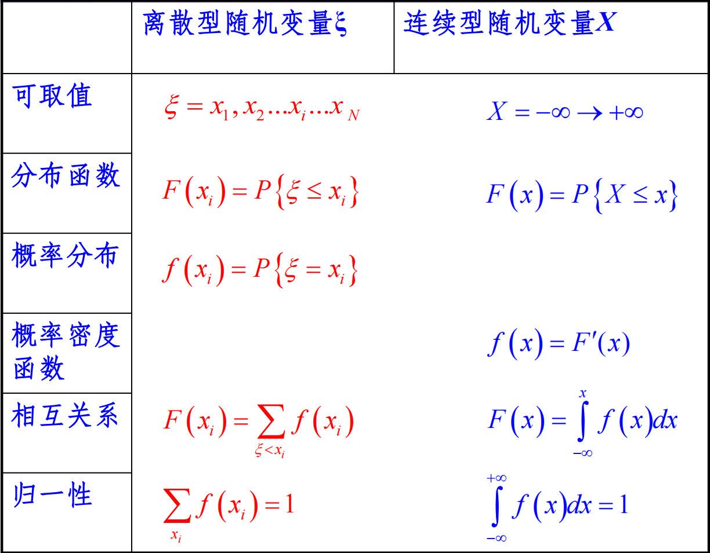

##### 随机变量的数字表征

* **准确度**(accuracy)：
  
  - 测量值与被测对象真值的一致程度。
  - 由测量值的平均值与真值的差来描述。

* **精密度**(precision)：
  
  - 测量的可重复性或可靠性。
  - 可用测量的均方偏差来描述。

###### 平均值表征

**数学期望**

$$
E(\xi) = \sum_{i=1}^{N\text{或}\infty} x_i \cdot  f(x_i)
\\ \ \\
E(X) = \int_{-\infty}^{+\infty} x \cdot f(x)\ \mathrm{d}x
$$

###### 离散程度表征

**均方偏差**，简称为**方差**

$$
D(\xi) = \sum_{i=1}^{N\text{或}\infty} [x_i - E(\xi)]^2 \cdot f(x_i)
\\ \ \\
D(X) = \int_{-\infty}^{+\infty} [x - E(X)]^2 \cdot f(x)\ \mathrm{d}x
$$

**均方根偏差**

$$
\sigma = \sqrt{D}
$$

**相对均方偏差**

$$
\nu^2 = \frac{D}{E^2}
$$

**相对均方根偏差**

$$
\nu = \frac{\sigma}{E}
$$

#### 随机变量的组合

##### 独立随机变量的组合

若 $x_1,x_2,\cdots,x_n$ 是相互独立的随机变量，各随机变量相应的标准偏差分别为 $\sigma_{x_1},\sigma_{x_2},\cdots,\sigma_{x_n}$ ，那么由这些随机变量导出的任何量 $y=f(x_1,x_2,\cdots,x_n)$ 的均方偏差为

$$
\sigma_{y}^2 = \left( \frac{\partial y}{\partial x_1} \right)^2 \sigma_{x_1}^2 + \left( \frac{\partial y}{\partial x_2} \right)^2 \sigma_{x_2}^2 + \cdots + \left( \frac{\partial y}{\partial x_n} \right)^2 \sigma_{x_n}^2
$$

几个简单函数的标准偏差及相对标准偏差如表所示：

| 函数 $f$              | 标准偏差                                                                                                                            | 相对标准偏差                                                                                                           |
|:-------------------:|:-------------------------------------------------------------------------------------------------------------------------------:|:----------------------------------------------------------------------------------------------------------------:|
| $y = ax_1 \pm bx_2$ | $[(a\sigma_{x_1})^2 + (b\sigma_{x_2})^2]^{\frac12}$                                                                             | $[(a\sigma_{x_1})^2 + (b\sigma_{x_2})^2]^{\frac12}/(ax_1 \pm bx_2)$                                              |
| $y = x_1 \cdot x_2$ | $x_1 \cdot x_2 \left[ \left( \frac{\sigma_{x_1}}{x_1} \right)^2 + \left( \frac{\sigma_{x_2}}{x_2} \right)^2 \right]^{\frac12}$  | $\left[ \left( \frac{\sigma_{x_1}}{x_1} \right)^2 + \left( \frac{\sigma_{x_2}}{x_2} \right)^2 \right]^{\frac12}$ |
| $y = x_1 / x_2$     | $\frac{x_1}{x_2}\left[ \left( \frac{\sigma_{x_1}}{x_1} \right)^2 + \left( \frac{\sigma_{x_2}}{x_2} \right)^2 \right]^{\frac12}$ | $\left[ \left( \frac{\sigma_{x_1}}{x_1} \right)^2 + \left( \frac{\sigma_{x_2}}{x_2} \right)^2 \right]^{\frac12}$ |

###### 随机变量与常数的乘积

$$
E(C \cdot \xi) = C \cdot E(\xi)
\\ \ \\
D(C \cdot \xi) = C^2 \cdot D(\xi)
\\ \ \\
\nu^2(C \cdot \xi) = \frac{D(\xi)}{[E(\xi)]^2}
$$

###### 随机变量的和差

$$
E(\xi_1 \pm \xi_2 \pm \cdots \pm \xi_n) = E(\xi_1) \pm E(\xi_2) \pm \cdots \pm E(\xi_n)
\\ \ \\
D(\xi_1 \pm \xi_2 \pm \cdots \pm \xi_n) = D(\xi_1) + D(\xi_2) + \cdots + D(\xi_n)
$$

###### 随机变量的积

$$
E(\xi_1 \cdot \xi_2 \cdots \xi_n) = E(\xi_1) \cdot E(\xi_2) \cdots E(\xi_n)
\\ \ \\
D(\xi_1 \cdot \xi_2 \cdots \xi_n) = (\xi_1 \cdot \xi_2 \cdots \xi_n)^2 \left[ \left(\frac{D(\xi_1)}{\xi_1^2}\right)^2 + \left(\frac{D(\xi_1)}{\xi_1^2}\right)^2 + \cdots + \left(\frac{D(\xi_1)}{\xi_1^2}\right)^2 \right]
\\ \ \\
\nu^2(\xi_1 \cdot \xi_2 \cdots \xi_n) = \nu^2(\xi_1) + \nu^2(\xi_2) + \cdots + \nu^2(\xi_n)
$$

##### 串级随机变量

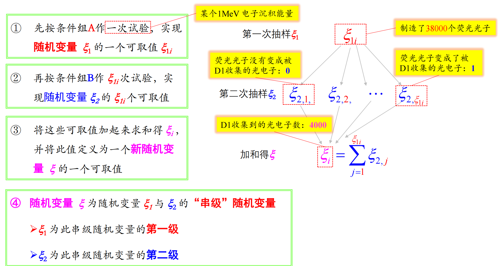

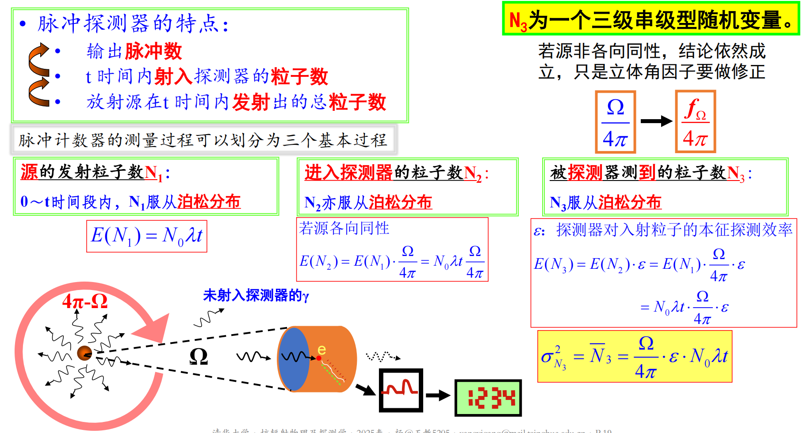

###### 二级串级变量的期望与方差

$$
E(\xi) = E(\xi_1) \cdot E(\xi_2)
\\ \ \\
D(\xi) = [E(\xi_2)]^2 \cdot D(\xi_1) + E(\xi_1) \cdot D(\xi_2)
\\ \ \\
\nu_\xi^2 = \frac{D(\xi)}{[E(\xi)]^2} = \nu_{\xi_1}^2 + \frac{1}{E(\xi_1)} \nu_{\xi_2}^2
$$

若第一级随机变量的数学期望很大，则可忽略第二级随机变量的相对方差对串级随机变量的相对方差的贡献。

###### $N$ 级串级变量的期望与方差

$$
E(\xi) = E(\xi_1) \cdot E(\xi_2) \cdots E(\xi_N)
\\ \ \\
\nu_\xi^2 = \nu_{\xi_1}^2 + \frac{\nu_{\xi_2}^2}{E(\xi_1)} + \frac{\nu_{\xi_3}^2}{E(\xi_1) \cdot E(\xi_2)} + \cdots + \frac{\nu_{\xi_N}^2}{E(\xi_1) \cdot E(\xi_2) \cdots E(\xi_{N-1})}
$$

#### 测量的统计误差

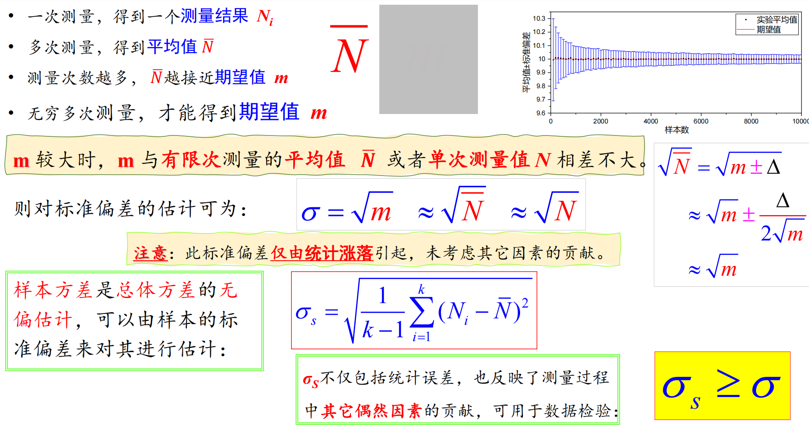

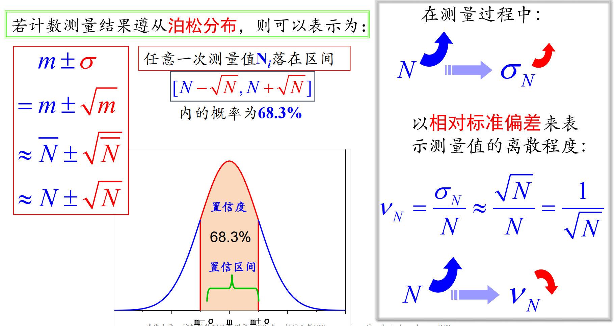

##### 不等精度独立测量值的组合

对计数率进行 $k$ 次独立测量，各次测量的时间 $t_i$ 不同，计数为 $N_i$ ，得到不同的 $n_i$ ，则计数率的**加权平均值**

$$
\overline{n}
= \frac{\sum_i t_i n_i}{\sum_i t_i}
= \frac{\sum_i N_i}{\sum_i t_i}
$$

**标准偏差**

$$
\sigma_{\overline{n}}
= \frac{\sqrt{\sum_i \sigma_{N_i}^2}}{\sum_i t_i}
= \frac{\sqrt{\sum_i N_i}}{\sum_i t_i}
= \sqrt{\frac{\overline{n}}{\sum_i t_i}}
$$

**相对标准偏差**

$$
\nu_{\overline{n}}
= \frac{\sigma_{\overline{n}}}{\overline{n}}
= \sqrt{\frac{1}{\sum_i N_i}}
$$

就统计误差而言，无论是一次测量还是多次测量，只要**总的计数相同**，多次测量平均计数率的相对误差和一次测量的计数率的相对误差是一致的。

### 辐射测量中的统计问题

#### 常见的统计分布

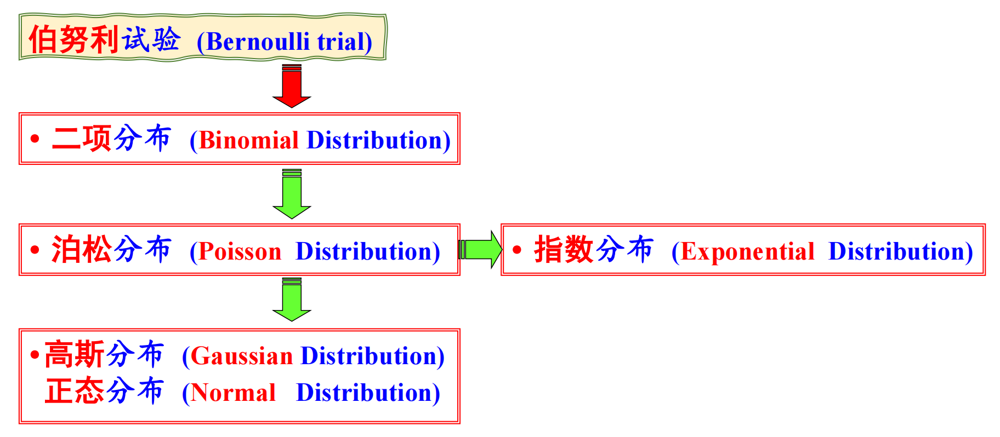

##### 二项式分布、泊松分布、高斯分布

###### 三种分布的描述

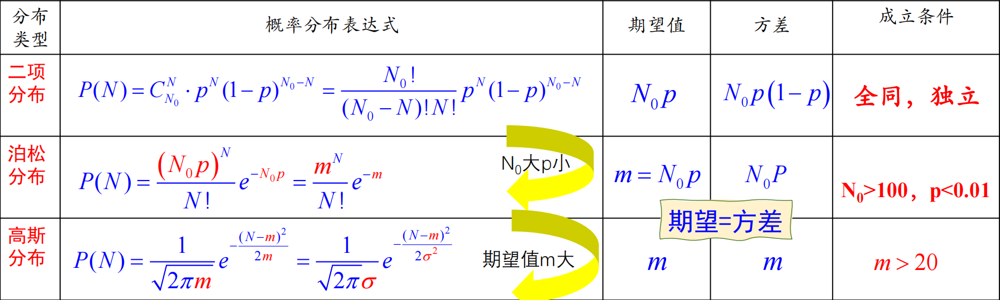

核衰变在任何情况下严格服从二项式分布：

$$
p = 1 - \mathrm{e}^{-\lambda t}
$$

当 $\lambda t$很小时，核衰变服从泊松分布：

$$
m = \sigma^2 = N_0 \cdot \lambda \cdot t
$$

当 $m>20$ 时，满足高斯分布（正态分布），高斯分布本身不具有期望与方差相等的特征，若是从泊松分布演化而来，则满足期望与方差相等。

###### 串级变量以及独立变量组合的常见分布

**伯努利**串级**伯努利**仍为**伯努利**：

$$
p = p_1 \cdot p_2
\\ \ \\
E(\xi) = E(\xi_1) \cdot E(\xi_2)
\\ \ \\
\nu_\xi^2 = \frac{1-p_1}{p_1} + \frac{1}{p_1} \frac{1-p_2}{p_2} = \frac{1-p_1p_2}{p_1p_2}
$$

**泊松**串级**伯努利**仍为**泊松**:

$$
E(\xi) = m_1 \cdot p_2
\\ \ \\
\nu_\xi^2 = \frac{1}{m_1} + \frac{1}{m_1} \frac{1-p_2}{p_2} = \frac{1}{m_1p_2}
$$

相互独立的服从泊松分布的随机变量之**和**服从泊松分布：

$$
E(\xi_1 + \xi_2) = E(\xi_1) + E(\xi_2)
\\ \ \\
D(\xi_1 + \xi_2) = D(\xi_1) + D(\xi_2)
$$

##### 法诺分布

由于带电粒子在气体中总的碰撞次数是不确定的，且碰撞过程是不独立的，故带电粒子在气体中电离产生的总电子离子对数不能简单用泊松分布描述，而应使用**法诺分布**，法诺因子

$$
F = \frac{\sigma^2}{\overline{n}}
$$

气体的法诺因子一般在 $\frac13 \sim \frac12$ 之间，半导体的法诺因子一般在 $0.1 \sim 0.15$ 之间。法诺分布的方差即相对反差为

$$
\sigma^2 = F \cdot \overline{n} = F \cdot \frac{E}{W}
\\ \ \\
\nu^2 = \frac{F}{\overline{n}} = \frac{F \cdot W}{E}
$$

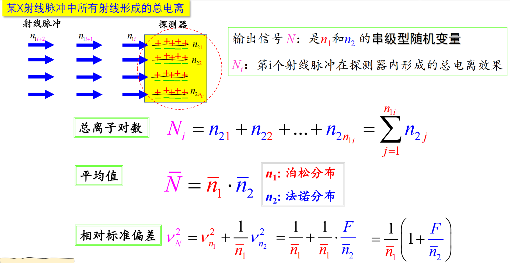

#### 存在本底时的计数率

##### 计数率的计算及误差

第一次，在时间 $t_{\text{b}}$ 内测得**本底**的计数为 $N_{\text{b}}$ ，得到本底计数率 $n_{\text{b}} = N_{\text{b}} / t_{\text{b}}$ ；第二次，在时间 $t_{\text{s}}$ 内测得**样品和本底**的计数为 $N_{\text{s}}$ ，得到本底计数率 $n_{\text{s}} = N_{\text{s}} / t_{\text{s}}$ 。则样品的**净计数率**

$$
n_0 = n_{\text{s}} - n_{\text{b}} = \frac{N_{\text{s}}}{t_{\text{s}}} - \frac{N_{\text{b}}}{t_{\text{b}}} 
$$

其**标准偏差**为

$$
\sigma_{n_0} = \sqrt{ \frac{n_{\text{s}}}{t_{\text{s}}} + \frac{n_{\text{b}}}{t_{\text{b}}} }
$$

其**相对标准偏差**为

$$
\nu_{n_0} = \frac{1}{n_{\text{s}} - n_{\text{b}}} \sqrt{ \frac{n_{\text{s}}}{t_{\text{s}}} + \frac{n_{\text{b}}}{t_{\text{b}}} }
$$

##### 最佳时间分配策略

在规定的总测量时间 $T = t_{\text{s}} + t_{\text{b}}$ 内使测量结果误差最小时，得到**最佳测量条件**（**时间分配**） 为

$$
\frac{t_{\text{s}}}{t_{\text{b}}} = \sqrt{\frac{n_{\text{s}}}{n_{\text{b}}}}
\\ \ \\
t_{\text{s}} = \frac{\sqrt{n_{\text{s}}/n_{\text{b}}}}{1+\sqrt{n_{\text{s}}/n_{\text{b}}}}T
,\kern 1em
t_{\text{b}} = \frac{1}{1+\sqrt{n_{\text{s}}/n_{\text{b}}}}T
$$

在最佳测量条件下得到的测量结果——净计数率的相对方差（ $T$ 内测量可得的最小值）为：

$$
\nu_{n_0}^2
= \left[ \frac{1}{n_{\text{s}} - n_{\text{b}}} \sqrt{ \frac{n_{\text{s}}}{t_{\text{s}}} + \frac{n_{\text{b}}}{t_{\text{b}}} } \right]^2
= \frac{1}{Tn_{\text{b}}(\sqrt{n_{\text{s}}/n_{\text{b}}}-1)^2}
= \frac{1}{T(\sqrt{n_{\text{s}}}-\sqrt{n_{\text{b}}})^2}
$$

在 $\nu_{n_0}$ 给定的情况下，需要的最小测量时间为

$$
T_{\min}
= \frac{1}{n_{\text{b}}\nu_{n_0}^2(\sqrt{n_{\text{s}}/n_{\text{b}}}-1)^2}
= \frac{1}{\nu_{n_0}^2(\sqrt{n_{\text{s}}}-\sqrt{n_{\text{b}}})^2}
$$

若 $n_{\text{b}} \gg n_0$ ，则

$$
T_{\min} \to \frac{4n_{\text{b}}}{\nu_{n_0}^2n_0^2}
$$

这表明降低本底可以实现节省测量时间的作用。

#### 辐射粒子与信号的时间分布

##### 相邻两个信号脉冲的时间间隔

相邻脉冲信号时间间隔为 $t$ 的概率

$$
f(t) = m \cdot \mathrm{e}^{-m \cdot t}
$$

其中 $m$ 为单位时间内的平均信号脉冲数。由此可知相邻脉冲信号时间间隔满足指数分布，且接收到一个信号后，在当前时刻接收到下一个信号的可能性最大。

相邻脉冲信号时间间隔的平均值、方差及相对均方根偏差分别为

$$
\overline{t} = \int_0^{+\infty} t \cdot f(t)\ \mathrm{d}t = \frac{1}{m}
\\ \ \\
\sigma_t^2 = \int_0^{+\infty} (t-\overline{t})^2 \cdot f(t)\ \mathrm{d}t = \frac{1}{m^2}
\\ \ \\
\nu_t = \frac{\sigma_t}{\overline{t}} = 1
$$

##### 相邻进位脉冲的时间间隔

在计数率较高时，需要使用具有进位系数 $S$ 的定标器来计数。每接受来自探测器的 $S$ 个信号，定标器产生一个进位信号脉冲。相邻进位脉冲的时间间隔为 $t$ 的概率

$$
f_S(t) = \frac{(mt)^{S-1}}{(S-1)!} m \mathrm{e}^{-mt}
$$

使得 $f(t)$ 取值最大的值 $t_S$ 为

$$
t_S = \frac{S-1}{m}
$$

相邻进位脉冲时间间隔的平均值、均方根偏差及相对均方根偏差分别为

$$
\overline{T}_S = \frac{S}{m}
\\ \ \\
\sigma_{T_S}^2 = \frac{S}{m^2}
\\ \ \\
\nu_{T_S} = \frac{1}{\sqrt{S}} 
$$

### 探测器的时间分辨率

#### 能量分辨率及其影响因素

##### 能量分辨率的定义

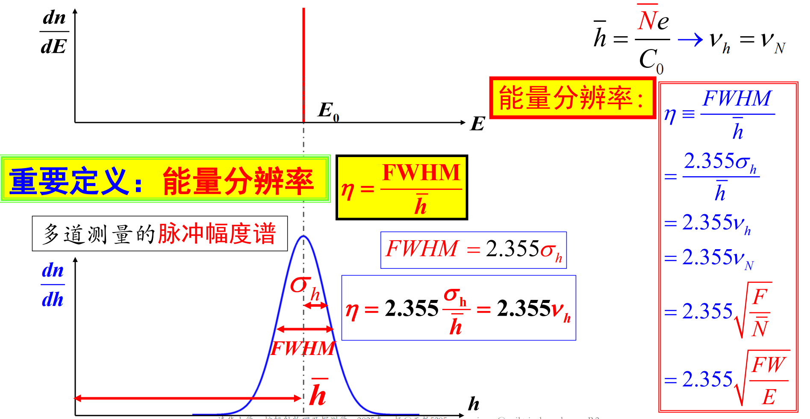

定义**能量分辨率**为

$$
\eta = \frac{\Delta E}{E} \times 100\% = \frac{\Delta h}{h} \times 100\%
$$

式中 $\Delta E$ 表示**能谱半高宽**，即谱峰极大值一半处的全宽度，缩写符号为 $\text{FWHM}$ 。

##### 能量分辨率的影响因素

$$
(\Delta E)^2
= \text{FWHM}_{\text{total}}^2
= \sum_{i} (\Delta E_i)^2
= \sum_{i} \text{FWHM}_i^2
\\ \ \\
= \text{FWHM}_{\text{statistical}}^2 + \text{FWHM}_{\text{drift}}^2 + \text{FWHM}_{\text{noise}}^2 + \cdots
$$

综合考虑放大器放大倍数 $A$ 的涨落，放大器噪声的影响，则电离室谱仪放大器输出信号器输出信号的**相对均方涨落**为

$$
\nu_{h_A}^2 = \frac{F \cdot W}{E} + \nu_A^2 + \frac{1}{J^2}
$$

**能量分辨率**为

$$
\eta = 2.355 \sqrt{\frac{F \cdot W}{E} + \nu_A^2 + \frac{1}{J^2}} \times 100\%
$$

###### 统计涨落statistical

因为统计涨落必然存在，所以能量分辨率不可能为 $0$ 。

$$
\eta_{\text{statistical}} = 2.355 \sqrt{\frac{F \cdot W}{E}}
\\ \ \\
\text{FWHM}_{\text{statistical}} = 2.355 \sqrt{F \cdot W \cdot E}
$$

其中 $F \cdot W$ 与探测器类型有关， $E$ 为射线沉积的能量。

###### 测量工作中条件的不稳定drift

信号幅度 $h_0$ 经过放大器放大后输出的脉冲幅度为 $A h_0$ ，这里 $A$ 为放大器的放大倍数，是一个连续型随机变量。

综合考虑statistical与drift，则相对均方涨落

$$
\nu_{h_A}^2 = \frac{F \cdot W}{E} + \nu_A^2
$$

###### 探测器或电子学的随机噪声noise

放大器噪声（ $h_2$ ）对输出幅度涨落的影响是叠加关系

$$
h = h_1 + h_2
$$

综合考虑statistical与drift，则相对均方涨落

$$
\nu_{h}^2
= \frac{\sigma_{h_1}^2}{\overline{h_1}^2} + \frac{\sigma_{h_2}^2}{\overline{h_2}^2}
= \frac{F \cdot W}{E} + \frac{1}{J^2}
$$

其中放大器的**信噪比**定义为

$$
J = \frac{\overline{h}_1}{\sigma_{h_2}}
$$

#### 各种探测器的时间分辨率

##### 脉冲电离室

**能量分辨率**为

$$
\eta
= 2.355 \sqrt{\frac{F}{\,\overline{N}\,}}
= 2.355 \sqrt{\frac{FW}{E}} \times 100\%
$$

##### 电流电离室的信号涨落

电流电离室输出电流信号的平均值和相对均方涨落为

$$
\overline{I} = \overline{n} \cdot \overline{N} \cdot e
\\ \ \\
\nu_I^2 = \frac{1+\cfrac{F}{\,\overline{N}\,}}{\overline{n} \cdot T} \approx \frac{1}{\overline{n} \cdot T}
$$

输出电压信号的平均值和相对均方涨落为

$$
\overline{I} = \overline{n} \cdot \overline{N} \cdot e \cdot R_0 = I_0 R_0
\\ \ \\
\nu_V^2 = \frac{1+\cfrac{F}{\,\overline{N}\,}}{2R_0C_0\overline{n}} \approx \frac{1}{2R_0C_0\overline{n}}
$$

累计信号的相对均方涨落有如下特点:
- 主要决定于入射粒子数 $n$ 的涨落
- 离子对数 $N$ 的涨落的影响很小

##### 正比计数器

正比计数器的输出脉冲幅度 $h$ 是一个二级串级型随机变量

$$
h \sim \frac{NAe}{C_0}
$$

**相对均方涨落**为

$$
\nu_h^2
= \nu_N^2 + \frac{1}{\,\overline{N}\,} \nu_A^2
= \frac{F}{\,\overline{N}\,} + \frac{1}{\,\overline{N}\,} \nu_A^2
$$

其中实验测得 $\nu_A^2 \approx 0.68$ ，故**能量分辨率**为

$$
\eta
= 2.355 \sqrt{\frac{F+0.68}{\overline{N}}} \times 100\%
$$

##### 闪烁探测器

光电倍增管PMT的倍增系数 $M$ 的**相对均方涨落**为

$$
\nu_M^2 = \frac{\delta}{\delta_1} \left( \frac{1}{\delta-1} \right)
$$

其中 $\delta_1$ 为第一打拿极的倍增因子， $\delta$ 为第一打拿极外其余各打拿极的倍增因子。

**能量分辨率**为

$$
\eta
= 2.355 \sqrt{\frac{1}{\overline{n}_e} \left[ 1 + \frac{\delta}{\delta_1} \left( \frac{1}{\delta-1} \right) \right] }
$$

其中 $n_e = E Y_{\text{ph}} T$ 为第一打拿极收集到的光电子数。

##### 半导体探测器

只考虑统计涨落的**能量分辨率**为

$$
\eta
= 2.355 \sqrt{\frac{F}{\,\overline{N}\,}}
= 2.355 \sqrt{\frac{FW}{E}}
$$

考虑电荷灵敏前置放大器的噪声：

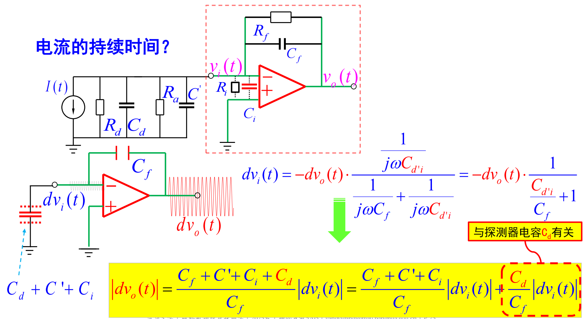

$$
\Delta E_{\text{noise}}
= \Delta E_{\text{零电容}} + \Delta E_{\text{电容噪声}}
= \Delta E_{\text{零电容}} + \text{噪声斜率} \times \text{探测器电容}
$$

也可以用等效噪声电荷 $\text{ENC}$ 来表示，以电子电荷为单位，其含义为放大器输出端噪声电压均方根值等效到输入端的电荷数，则

$$
\Delta E_{\text{noise}}
= 2.355 \cdot W \cdot \text{ENC}
$$

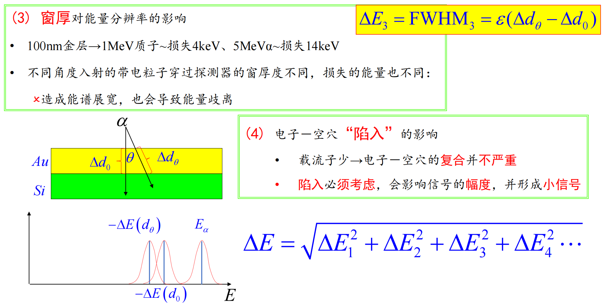