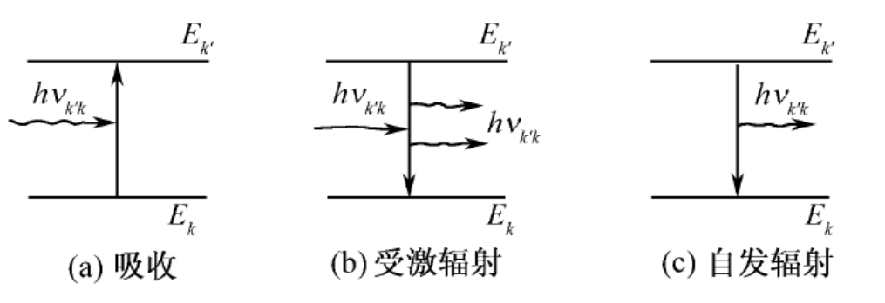

## 第10章 量子跃迁

### 10.1 [量子态随时间的演化](https://cloud.tsinghua.edu.cn/d/20694cb9c0fb44e6894a/files/?p=%2F%E4%B8%93%E4%B8%9A%E5%9F%BA%E7%A1%80%E8%AF%BE%E7%A8%8B%2F%E9%87%8F%E5%AD%90%E5%8A%9B%E5%AD%A6%2F%EF%BC%88%E9%83%AD%E6%B0%B8%EF%BC%89%2F%E8%AF%BE%E4%BB%B6%2F%E7%AC%AC36%E8%AE%B2.pdf)

#### Hamilton量不含时的体系

如果Hamilton量不含时，即 $\frac{\partial \hat{H}}{\partial t} = 0$ ，则体系能量守恒，若已知初态为 $| \psi(0) \rangle$ ，则量子态随时间的演化为

$$
| \psi(t) \rangle
= \hat{U}(t) | \psi(0) \rangle
= \mathrm{e}^{-\frac{\mathrm{i}}{\hbar}\hat{H}t} | \psi(0) \rangle
$$

将初态按能量本征态展开，即

$$
| \psi(0) \rangle = \sum_n a_n | \psi_n \rangle
$$

其中

$$
\hat{H} | \psi_n \rangle = E_n | \psi_n \rangle
\\ \ \\
a_n = \langle \psi_n | \psi(0) \rangle \kern 1em (不显含时间)
$$

则 $t$ 时刻的量子态可以表示为

$$
| \psi(t) \rangle
= \mathrm{e}^{-\frac{\mathrm{i}}{\hbar}\hat{H}t} \sum_n a_n | \psi_n \rangle
= \sum_n a_n \mathrm{e}^{-\frac{\mathrm{i}}{\hbar}E_nt} | \psi_n \rangle
$$

如果初态为能量本征态，即

$$
| \psi(0) \rangle = | \psi_k \rangle
$$

则 $t$ 时刻的量子态为

$$
| \psi(t) \rangle = \mathrm{e}^{-\frac{\mathrm{i}}{\hbar}E_kt} | \psi_k \rangle
$$

这种量子态，称为**定态**；若初态不是能量本征态，则称为**非定态**。

#### Hamilton量含时体系的量子跃迁的微扰论

##### 量子跃迁及一级近似

对于含时Hamilton量 $\hat{H}(t)$ 所描述的体系，能量是不守恒的，Hamilton量可以分解为不含时部分与含时微扰两部分

$$
\hat{H}(t) = \hat{H}_0 + \hat{H}'(t)
$$

若体系初态为 $\hat{H}_0$ 的本征态 $| \psi_k \rangle$ ，则体系不能保持在原有的本征态，而是将变成各本征态的叠加态，即

$$
| \psi(t) \rangle = \sum_n C_{nk}(t) \mathrm{e}^{-\frac{\mathrm{i}}{\hbar}E_nt} | \psi_n \rangle
$$

再次测量时，有一定的概率离开初态而处于其它定态，这种现象叫做**量子跃迁**。

在一级近似下，从 $\psi_k$ 态跃迁到 $\psi_{k'}$ 态的**跃迁振幅**为

$$
C_{k'k}(t) = \delta_{k'k} + \frac{1}{\mathrm{i}\hbar} \int_0^t H'_{k'k}(\tau) \mathrm{e}^{\mathrm{i}\omega_{k'k}\tau} \mathrm{d}\tau
$$

其中

$$
H'_{k'k}(t) = \langle k' | \hat{H}'(t) | k \rangle
\\ \ \\
\omega_{k'k} = \frac{E_{k'}-E_k}{\hbar}
$$

对于 $k' \ne k$ 的情况，即末态不同于初态，有

$$
C_{k'k}(t) = \frac{1}{\mathrm{i}\hbar} \int_0^t H'_{k'k}(\tau) \mathrm{e}^{\mathrm{i}\omega_{k'k}\tau} \mathrm{d}\tau
$$

**跃迁概率**为

$$
P_{k'k}(t)
= |C_{k'k}(t)|^2
= \frac{1}{\hbar^2} \left| \int_0^t H'_{k'k}(\tau) \mathrm{e}^{\mathrm{i}\omega_{k'k}\tau} \mathrm{d}\tau \right|^2
$$

单位时间内的跃迁概率，即**跃迁速率**为

$$
w_{k'k}(t)
= \frac{\mathrm{d}}{\mathrm{d}t} |C_{k'k}(t)|^2
= \frac{1}{\hbar^2} \frac{\mathrm{d}}{\mathrm{d}t} \left| \int_0^t H'_{k'k}(\tau) \mathrm{e}^{\mathrm{i}\omega_{k'k}\tau} \mathrm{d}\tau \right|^2
$$

##### 跃迁振幅推导

$$
\begin{cases}
| \psi(t) \rangle = \sum_n C_{nk}(t) \mathrm{e}^{-\frac{\mathrm{i}}{\hbar}E_nt} | \psi_n \rangle \\
C_{nk}(0) = \delta_{nk}
\end{cases}
$$

将 $t$ 时刻的量子态表达式代入Schrödinger方程，可得

$$
\mathrm{i}\hbar \frac{\partial}{\partial t} \sum_n C_{nk}(t) \mathrm{e}^{-\frac{\mathrm{i}}{\hbar}E_nt} | \psi_n \rangle = \left( \hat{H}_0 + \hat{H}'(t) \right) \sum_n C_{nk}(t) \mathrm{e}^{-\frac{\mathrm{i}}{\hbar}E_nt} | \psi_n \rangle
\\ \Downarrow \\
\mathrm{i}\hbar \sum_n \left[ \frac{\partial}{\partial t} C_{nk}(t) \right] \mathrm{e}^{-\frac{\mathrm{i}}{\hbar}E_nt} | n \rangle + \mathrm{i}\hbar \sum_n C_{nk}(t) \left[ \frac{\partial}{\partial t} \mathrm{e}^{-\frac{\mathrm{i}}{\hbar}E_nt} \right] | n \rangle 
\\ \ \\
= \sum_n C_{nk}(t) \mathrm{e}^{-\frac{\mathrm{i}}{\hbar}E_nt} \hat{H}_0 | n \rangle + \sum_n C_{nk}(t) \mathrm{e}^{-\frac{\mathrm{i}}{\hbar}E_nt} \hat{H}'(t) | n \rangle
\\ \Downarrow \\
\mathrm{i}\hbar \sum_n \dot{C}_{nk}(t) \mathrm{e}^{-\frac{\mathrm{i}}{\hbar}E_nt} | n \rangle + \sum_n C_{nk}(t) \mathrm{e}^{-\frac{\mathrm{i}}{\hbar}E_nt} E_n | n \rangle 
\\ \ \\
= \sum_n C_{nk}(t) \mathrm{e}^{-\frac{\mathrm{i}}{\hbar}E_nt} E_n | n \rangle + \sum_n C_{nk}(t) \mathrm{e}^{-\frac{\mathrm{i}}{\hbar}E_nt} \hat{H}'(t) | n \rangle
\\ \Downarrow \\
\mathrm{i}\hbar \sum_n \dot{C}_{nk}(t) \mathrm{e}^{-\frac{\mathrm{i}}{\hbar}E_nt} | n \rangle
= \sum_n C_{nk}(t) \mathrm{e}^{-\frac{\mathrm{i}}{\hbar}E_nt} \hat{H}'(t) | n \rangle
$$

对上式左乘 $\langle k' |$ ，利用本征函数的正交归一性，可得

$$
\mathrm{i}\hbar \sum_n \dot{C}_{nk}(t) \mathrm{e}^{-\frac{\mathrm{i}}{\hbar}E_nt} \langle k' | n \rangle
= \sum_n C_{nk}(t) \mathrm{e}^{-\frac{\mathrm{i}}{\hbar}E_nt} \langle k' | \hat{H}'(t) | n \rangle
\\ \Downarrow \\
\mathrm{i}\hbar \dot{C}_{k'k}(t) \mathrm{e}^{-\frac{\mathrm{i}}{\hbar}E_{k'}t} 
= \sum_n C_{nk}(t) \mathrm{e}^{-\frac{\mathrm{i}}{\hbar}E_nt} \langle k' | \hat{H}'(t) | n \rangle
\\ \Downarrow \\
\mathrm{i}\hbar \dot{C}_{k'k}(t)
= \sum_n C_{nk}(t) \mathrm{e}^{\frac{\mathrm{i}}{\hbar}(E_{k'}-E_n)t} \langle k' | \hat{H}'(t) | n \rangle
$$

记

$$
H'_{k'n}(t) = \langle k' | \hat{H}'(t) | n \rangle
\\ \ \\
\omega_{k'n} = \frac{E_{k'}-E_n}{\hbar}
$$

则跃迁振幅满足方程

$$
\begin{cases}
\mathrm{i}\hbar \dot{C}_{k'k}(t)
= \sum_n H'_{k'n}(t) \mathrm{e}^{\mathrm{i}\omega_{k'n}t} C_{nk}(t) \\
C_{k'k}(0) = \delta_{k'k}
\end{cases}
$$

方程两边对 $t$ 积分可得

$$
C_{k'k}(t)
= C_{k'k}(0) + \frac{1}{\mathrm{i}\hbar} \int_0^t \sum_n H'_{k'n}(\tau) \mathrm{e}^{\mathrm{i}\omega_{k'n}\tau} C_{nk}(\tau) \mathrm{d}\tau
\\ \ \\
= \delta_{k'k} + \frac{1}{\mathrm{i}\hbar} \int_0^t \sum_n H'_{k'n}(\tau) \mathrm{e}^{\mathrm{i}\omega_{k'n}\tau} C_{nk}(\tau) \mathrm{d}\tau
$$

该积分方程可迭代求解，即

$$
C_{k'k}(t)
\\ \ \\
= \delta_{k'k} + \frac{1}{\mathrm{i}\hbar} \int_0^t \sum_n H'_{k'n}(\tau) \mathrm{e}^{\mathrm{i}\omega_{k'n}\tau} \left[ \delta_{nk} + \frac{1}{\mathrm{i}\hbar} \int_0^t \sum_m H'_{nm}(\tau') \mathrm{e}^{\mathrm{i}\omega_{nm}\tau'} C_{mk}(\tau') \mathrm{d}\tau' \right] \mathrm{d}\tau
\\ \ \\
= \delta_{k'k} + \frac{1}{\mathrm{i}\hbar} \int_0^t \sum_n H'_{k'n}(\tau) \mathrm{e}^{\mathrm{i}\omega_{k'n}\tau} \delta_{nk}\mathrm{d}\tau
\\ \ \\
+ \frac{1}{\mathrm{i}\hbar} \int_0^t \sum_n H'_{k'n}(\tau) \mathrm{e}^{\mathrm{i}\omega_{k'n}\tau} \left[ \frac{1}{\mathrm{i}\hbar} \int_0^t \sum_m H'_{nm}(\tau') \mathrm{e}^{\mathrm{i}\omega_{nm}\tau'} C_{mk}(\tau') \mathrm{d}\tau' \right] \mathrm{d}\tau
\\ \ \\
= \delta_{k'k} + \frac{1}{\mathrm{i}\hbar} \int_0^t H'_{k'k}(\tau) \mathrm{e}^{\mathrm{i}\omega_{k'k}\tau} \mathrm{d}\tau
\\ \ \\
+ \frac{1}{\mathrm{i}\hbar} \int_0^t \sum_n H'_{k'n}(\tau) \mathrm{e}^{\mathrm{i}\omega_{k'n}\tau} \left[ \frac{1}{\mathrm{i}\hbar} \int_0^t \sum_m H'_{nm}(\tau') \mathrm{e}^{\mathrm{i}\omega_{nm}\tau'} C_{mk}(\tau') \mathrm{d}\tau' \right] \mathrm{d}\tau
$$

故零级近似

$$
C^{(0)}_{k'k}(t) = \delta_{k'k}
$$

一级近似

$$
C^{(1)}_{k'k}(t) = \frac{1}{\mathrm{i}\hbar} \int_0^t H'_{k'k}(\tau) \mathrm{e}^{\mathrm{i}\omega_{k'k}\tau} \mathrm{d}\tau
$$

##### 对简并的处理

###### 初态有简并

对初态按各简并的各本征态展开，按照各本征态出现的概率对各本征态向末态的跃迁概率求**加权平均和**。

###### 末态有简并

对向末态的各简并态的跃迁概率求**和**。

#### 量子跃迁理论与定态微扰论的关系

### 10.2 [周期微扰与常微扰](https://cloud.tsinghua.edu.cn/d/20694cb9c0fb44e6894a/files/?p=%2F%E4%B8%93%E4%B8%9A%E5%9F%BA%E7%A1%80%E8%AF%BE%E7%A8%8B%2F%E9%87%8F%E5%AD%90%E5%8A%9B%E5%AD%A6%2F%EF%BC%88%E9%83%AD%E6%B0%B8%EF%BC%89%2F%E8%AF%BE%E4%BB%B6%2F%E7%AC%AC37%E8%AE%B2.pdf)

#### 周期微扰

考虑周期微扰

$$
\hat{H}'(t) = H' \mathrm{e}^{\mathrm{i}\omega t}
$$

则在 $t$ 时刻体系从初态 $| k \rangle$ 跃迁到末态 $| k' \rangle \ (k' \ne k)$ 的**跃迁振幅**为

$$
C_{k'k}(t) = \frac{1}{\mathrm{i}\hbar} \int_0^t H'_{k'k}(\tau) \mathrm{e}^{\mathrm{i}\omega_{k'k}\tau} \mathrm{d}\tau
\\ \ \\
= \frac{1}{\mathrm{i}\hbar} \int_0^t \langle k' | H' | k \rangle \mathrm{e}^{\mathrm{i}(\omega_{k'k}-\omega)\tau} \mathrm{d}\tau
\\ \ \\
= \frac{1}{\mathrm{i}\hbar} \langle k' | H' | k \rangle \frac{\mathrm{e}^{\mathrm{i}(\omega_{k'k}-\omega)t}-1}{\mathrm{i}(\omega_{k'k}-\omega)}
$$

记 $H'_{k'k} = \langle k' | H' | k \rangle$ ，则**跃迁概率**

$$
P_{k'k}(t) = |C_{k'k}(t)|^2
= \frac{4|H_{k'k}|^2}{\hbar^2} \left\{ \frac{\sin[\omega_{k'k}-\omega)t/2]}{\omega_{k'k}-\omega} \right\}^2
$$

利用 $\lim_{\alpha\to\infty} \frac{\sin^2\alpha x}{x^2} = \pi\alpha\delta(x)$ ，可得当 $(\omega_{k'k} - \omega) \gg 1$ 时，

$$
P_{k'k}(t) 
= \frac{2\pi t}{\hbar^2} |H_{k'k}|^2 \delta(\omega_{k'k}-\omega)
$$

**跃迁速率**为

$$
w_{k'k} = \frac{\partial}{\partial t} P_{k'k}(t)
= \frac{2\pi}{\hbar^2} |H_{k'k}|^2 \delta(\omega_{k'k}-\omega)
\\ \ \\
= \frac{2\pi}{\hbar^2} |H_{k'k}|^2 \delta(E_{k'}-E_k-\hbar\omega)
$$

由此可见，如果周期微扰持续的时间足够长，即远大于体系的内禀特征时间，则跃迁速率将与时间无关。

上述结果适用于分立谱的情况，对于连续谱，有意义的是计算跃迁到能量 $E_{k'}$ 附近全部可能末态的总概率，即设末态的态密度为 $\rho(E_{k'})$ ，则**总跃迁概率**

$$
P_{\text{total}}(t) = \int P_{k'k}(t) \rho(E_{k'}) \mathrm{d}E_{k'}
\\ \ \\
= \int \frac{2\pi t}{\hbar^2} |H_{k'k}|^2 \delta(E_{k'}-E_k-\hbar\omega) \rho(E_{k'}) \mathrm{d}E_{k'}
\\ \ \\
= \frac{2\pi t}{\hbar^2} |H_{k'k}|^2 \rho(E_{k} + \hbar\omega)
$$

**总跃迁速率**

$$
w_{\text{total}} = \frac{\partial}{\partial t} P_{\text{total}}(t)
= \frac{2\pi}{\hbar^2} |H_{k'k}|^2 \rho(E_{k} + \hbar\omega)
$$

#### 常微扰

只在一段时间间隔（如 $0 \sim T$ ）内，对体系施加与时间无关的微扰，称为**常微扰**，即

$$
\hat{H}'(t) = H' [\theta(t) - \theta(t-T)]
$$

其中 $\theta(t)$ 为阶梯函数，定义为 

$$
\theta(t) =
\begin{cases}
0 , & t<0 \\
1 , & t>0
\end{cases}
$$

故

$$
\hat{H}'(t) =
\begin{cases}
H' , & 0 \le t < T \\
0  , & t > T
\end{cases}
$$

则一级近似下的**跃迁振幅**为

$$
C^{(1)}_{k'k}(t) = \frac{1}{\mathrm{i}\hbar} \int_{-\infty}^t H'_{k'k}(\tau) \mathrm{e}^{\mathrm{i}\omega_{k'k}\tau} \mathrm{d}\tau
\\ \ \\
= -\frac{H'_{k'k}(t)\mathrm{e}^{\mathrm{i}\omega_{k'k}t}}{\hbar\omega_{k'k}} + \int_{-\infty}^t \frac{\partial H'_{k'k}(\tau)}{\partial \tau} \frac{\mathrm{e}^{\mathrm{i}\omega_{k'k}\tau}}{\hbar\omega_{k'k}} \mathrm{d}\tau
\\ \ \\
= -\frac{H'_{k'k}(t)\mathrm{e}^{\mathrm{i}\omega_{k'k}t}}{\hbar\omega_{k'k}} + \int_{-\infty}^t H'_{k'k} [\delta(\tau) - \delta(\tau-T)] \frac{\mathrm{e}^{\mathrm{i}\omega_{k'k}\tau}}{\hbar\omega_{k'k}} \mathrm{d}\tau
$$

当 $t>T$ 后

$$
C^{(1)}_{k'k}(t)
= \frac{H'_{k'k}}{\hbar\omega_{k'k}} \left( 1 - \mathrm{e}^{\mathrm{i}\omega_{k'k}T} \right)
$$

故 $k' \ne k$ 的**跃迁概率**为

$$
P_{k'k}(t) = |C_{k'k}(t)|^2
= \frac{|H'_{k'k}|^2}{\hbar^2} \frac{\sin^2(\omega_{k'k}T/2)}{(\omega_{k'k}/2)^2}
$$

利用 $\lim_{\alpha\to\infty} \frac{\sin^2\alpha x}{x^2} = \pi\alpha\delta(x)$ ，可得当常微扰作用的时间间隔足够长，即 $\omega_{k'k}T \gg 1$ 时，

$$
P_{k'k}(t)
= \frac{2\pi T}{\hbar^2} |H_{k'k}|^2 \delta(\omega_{k'k})
= \frac{2\pi T}{\hbar^2} |H_{k'k}|^2 \delta(E_{k'} - E_k)
$$

**跃迁速率**为

$$
w_{k'k} = \frac{P_{k'k}(t)}{T} = \frac{2\pi}{\hbar^2} |H_{k'k}|^2 \delta(E_{k'}-E_k)
$$

由此可见，如果常微扰作用的时间足够长，即远大于体系的内禀特征时间，则跃迁速率将与时间无关。

上述结果适用于分立谱的情况，对于连续谱，有意义的是计算跃迁到能量 $E_{k'}$ 附近全部可能末态的总概率，即设末态的态密度为 $\rho(E_{k'})$ ，则**总跃迁概率**

$$
P_{\text{total}}(t)
= \int P_{k'k}(t) \rho(E_{k'}) \mathrm{d}E_{k'}
\\ \ \\
= \int \frac{2\pi T}{\hbar^2} |H_{k'k}|^2 \delta(E_{k'}-E_k) \rho(E_{k'}) \mathrm{d}E_{k'}
\\ \ \\
= \frac{2\pi T}{\hbar^2} |H_{k'k}|^2 \rho(E_{k})
$$

**总跃迁速率**（Fermi黄金规则）

$$
w_{\text{total}} = \int w_{k'k} \rho(E_{k'}) \mathrm{d}E_{k'}
\\ \ \\
= \int \frac{2\pi}{\hbar^2} |H_{k'k}|^2 \delta(E_{k'}-E_k) \rho(E_{k'}) \mathrm{d}E_{k'}
\\ \ \\
= \frac{2\pi}{\hbar^2} |H_{k'k}|^2 \rho(E_{k})
$$

### 10.3 [光的吸收与辐射](https://cloud.tsinghua.edu.cn/d/20694cb9c0fb44e6894a/files/?p=%2F%E4%B8%93%E4%B8%9A%E5%9F%BA%E7%A1%80%E8%AF%BE%E7%A8%8B%2F%E9%87%8F%E5%AD%90%E5%8A%9B%E5%AD%A6%2F%EF%BC%88%E9%83%AD%E6%B0%B8%EF%BC%89%2F%E8%AF%BE%E4%BB%B6%2F%E7%AC%AC37%E8%AE%B2.pdf)

在光的照射下，原子可能吸收光而从低能级跃迁到较高能级，称为**光的吸收**(obsorption)；或从较高能级跃迁到较低能级并放出光，称为**受激辐射**(induced radiation)；如果原子本来处于激发能级，即使没有外界光的照射，也可能跃迁到某些较低能级而放出光来，称为**自发辐射**(spontaneous radiation)。

*注：本节均使用高斯单位制CGS。*

#### 光的吸收与受激辐射

##### 电偶极跃迁及其速率

先假设入射光为平面单色光，其电磁场强度分别为

$$
\vec{E} = \vec{E}_0 \cos(\omega t - \vec{k} \cdot \vec{r})
\\ \ \\
\vec{B} = \vec{k} \times \frac{\vec{E}}{|\vec{k}|}
$$

由于在原子中，电子的速度 $v \ll c$ ，故磁场对电子的作用 $\left| \frac{e}{c} \vec{v} \times \vec{B} \right|$ 远小于电场的作用 $\left| e \vec{E} \right|$ ，同时，对于可见光与紫外光，波长 $\lambda$ 远大于Borh半径 $a$ ，故在原子大小范围中， $\vec{k} \cdot \vec{r} \sim 2\pi a / \lambda \ll 1$ ，故电场随空间的变化极微，可视为匀强电场，故

$$
\vec{E} = \vec{E}_0 \cos(\omega t)
$$

入射可见光对于原子中电子的作用可表示为

$$
\hat{H}'(t) = - \vec{D} \cdot \vec{E} = - \vec{D} \cdot \vec{E}_0 \cos(\omega t) = - W \cos(\omega t)
$$

其中

$$
W = - \vec{D} \cdot \vec{E}_0 , \kern 2em \vec{D} = -e \vec{r} (电偶极矩)
$$

电偶极矩与电场作用引起的跃迁称为**电偶极跃迁**。

在一级近似下，对于从 $E_k \to E_{k'} \kern 1em (E_{k'}>E_k)$ 的跃迁，**跃迁振幅**

$$
C^{(1)}_{k'k}(t) = -\frac{W_{k'k}}{2\hbar} \frac{\mathrm{e}^{\mathrm{i}(\omega_{k'k}-\omega)t}-1}{\omega_{k'k}-\omega} 
$$

**跃迁概率**

$$
P_{k'k}(t) = \left| C^{(1)}_{k'k}(t) \right|^2 = \frac{|W_{k'k}|^2}{4\hbar^2} \frac{\sin^2[(\omega_{k'k}-\omega)t/2]}{[(\omega_{k'k}-\omega)/2]^2}
$$

当时间足够长时，只有 $\omega \approx \omega_{k'k}$ 的入射光才对跃迁有明显贡献，此时

$$
P_{k'k}(t) = \frac{\pi t}{4\hbar^2} |W_{k'k}|^2\ \delta[(\omega_{k'k}-\omega)/2]
$$

**跃迁速率**

$$
w_{k'k}
= \frac{\mathrm{d}}{\mathrm{d}t} P_{k'k}
= \frac{\pi}{2\hbar^2} |W_{k'k}|^2\ \delta(\omega_{k'k}-\omega)
\\ \ \\
= \frac{\pi}{2\hbar^2} |\vec{D}_{k'k} \cdot \vec{E}_0|^2\ \delta(\omega_{k'k}-\omega)
\\ \ \\
= \frac{\pi}{2\hbar^2} |\vec{D}_{k'k}|^2 E_0^2\ \cos^2\theta\ \delta(\omega_{k'k}-\omega)
$$

其中 $\theta$ 为 $\vec{D}_{k'k}$ 与 $E_0$ 的夹角。如果入射光为非偏振光，即 $\vec{E}_0$ 的方向是完全无规定的，故 $\cos^2\theta$ 应取为对空间各方向的平均值

$$
\overline{\cos^2\theta}
= \frac{1}{4\pi} \int \mathrm{d}\Omega\ \cos^2\theta
\\ \ \\
= \frac{1}{4\pi} \int_{0}^{2\pi} \mathrm{d}\varphi \int_{0}^{\pi} \sin\theta \cos^2\theta \mathrm{d}\theta
= \frac13
$$

故**非偏振光的跃迁速率**

$$
w_{k'k} = \frac{\pi}{6\hbar^2} |\vec{D}_{k'k}|^2 E_0^2\ \delta(\omega_{k'k}-\omega)
$$

对于非单色光，用 $\rho(\omega)$ 表示角频率为 $\omega$ 的电磁辐射场的能量密度对时间的平均值，可得

$$
\rho(\omega) = \frac{1}{8\pi} \overline{(E^2+B^2)}
\\ \ \\
= \frac{1}{4\pi} \overline{E^2}
\\ \ \\
= \frac{E_0^2(\omega)}{4\pi} \frac{1}{T} \int_0^T \cos^2 \omega t\ \mathrm{d}t
\\ \ \\
= \frac{1}{8\pi} E_0^2(\omega)
\\ \Downarrow \\
E_0^2(\omega) = 8\pi\rho(\omega)
$$

故**非单色光的跃迁速率**

$$
w_{\text{total}}
= \int_{-\infty}^{+\infty} w_{k'k}\ \mathrm{d}\omega
\\ \ \\ 
= \int_{-\infty}^{+\infty} \frac{\pi}{6\hbar^2} |\vec{D}_{k'k}|^2 E_0^2(\omega)\ \delta(\omega_{k'k}-\omega) \mathrm{d}\omega
\\ \ \\
= \frac{4\pi^2}{3\hbar^2} |\vec{D}_{k'k}|^2 \int_{-\infty}^{+\infty} \rho(\omega) \delta(\omega_{k'k}-\omega) \mathrm{d}\omega
\\ \ \\
= \frac{4\pi^2}{3\hbar^2} |\vec{D}_{k'k}|^2 \rho(\omega_{k'k})
\\ \ \\
= \frac{4\pi^2e^2}{3\hbar^2} |\vec{r}_{k'k}|^2 \rho(\omega_{k'k})
$$

其中 $|\vec{r}_{k'k}|^2 = |x_{k'k}|^2 + |y_{k'k}|^2 + |z_{k'k}|^2$ ，这三个分量矩阵元至少有一个不为零时，跃迁才可能发生。

跃迁的快慢与入射光中频率为 $\omega_{k'k}$ 的光强度 $\rho(\omega_{k'k})$ 成正比，若入射光不包含频率为 $\omega_{k'k}$ 的成分，则不能引起 $E_{k} \leftrightarrow E_{k'}$ 两能级之间的跃迁。

##### 跃迁振幅推导

把 $\hat{H}'(t)= - W \cos(\omega t)$ 代入跃迁振幅的一级微扰公式可得

$$
C^{(1)}_{k'k}(t)
= \frac{1}{\mathrm{i}\hbar} \int_0^t H'_{k'k}(\tau) \mathrm{e}^{\mathrm{i}\omega_{k'k}\tau} \mathrm{d}\tau
\\ \ \\
= -\frac{W_{k'k}}{\mathrm{i}\hbar} \int_0^t \cos(\omega\tau) \mathrm{e}^{\mathrm{i}\omega_{k'k}\tau} \mathrm{d}\tau
\\ \ \\
= -\frac{W_{k'k}}{2\mathrm{i}\hbar} \int_0^t (\mathrm{e}^{\mathrm{i}\omega\tau} + \mathrm{e}^{-\mathrm{i}\omega\tau}) \mathrm{e}^{\mathrm{i}\omega_{k'k}\tau} \mathrm{d}\tau
\\ \ \\
= -\frac{W_{k'k}}{2\hbar} \left[ \frac{\mathrm{e}^{\mathrm{i}(\omega_{k'k}+\omega)t}-1}{\omega_{k'k}+\omega} + \frac{\mathrm{e}^{\mathrm{i}(\omega_{k'k}-\omega)t}-1}{\omega_{k'k}-\omega} \right]
$$

对于可见光以及紫外光， $\omega$ 很大，故括号中的第一项产生的贡献可以忽略，只有当 $\omega \approx \omega_{k'k}$ 时，第二项才能有显著的贡献，故

$$
C^{(1)}_{k'k}(t) = -\frac{W_{k'k}}{2\hbar} \frac{\mathrm{e}^{\mathrm{i}(\omega_{k'k}-\omega)t}-1}{\omega_{k'k}-\omega} 
$$

##### 选择定则

###### 理论描述

电偶极跃迁的角动量**选择定则**为：初末态量子数满足

$$
\Delta l = \pm1 ,\kern 1em \Delta m_l = 0, \pm 1 , \kern 1em \Delta m_s = 0
$$

其中对于电场平行于 $z$ 轴的偏振光， $\Delta m_l = 0$ ，对于电场平行于 $x$ 轴或 $y$ 轴的偏振光， $\Delta m_l = \pm1$ 。

原子的宇称 $\pi = (-1)^l$ ，故只有初末态宇称不同，才可能发生电偶极跃迁。

如果使用耦合表象，则选择定则表述为

$$
\Delta l = \pm1 ,\kern 1em \Delta j = 0, \pm 1 , \kern 1em \Delta m_j = 0, \pm1
$$

###### 证明

考虑矩阵元 $\vec{r}_{k'k}$ ，因为其与自旋无关，故

$$
\langle k' | \vec{r} | k \rangle
= \langle n'l'm_l's'm_s' | \vec{r} | nlm_lsm_s \rangle
\\ \ \\
= \langle n'l'm_l' | \vec{r} | nlm_l \rangle \langle \frac12m_s' | \frac12m_s \rangle
\\ \ \\
= \langle n'l'm_l' | \vec{r} | nlm_l \rangle \delta_{m_s'm_s}
$$

故只有 $m_s' = m_s$ 时，即自旋方向不变，跃迁才可能发生，接下来的讨论基于此条件。

对于电场平行于 $z$ 轴的偏振光，只有矩阵元 $z_{k'k}$ 对跃迁有贡献

$$
z_{k'k}
= \langle n'l'm_l' | r\cos\theta | nlm_l \rangle
\\ \ \\
= \langle R_{n'l'}(r) \mathrm{Y}_{l'm_l'}(\theta,\varphi) | r\cos\theta | R_{nl}(r) \mathrm{Y}_{lm_l}(\theta,\varphi) \rangle
\\ \ \\
= (R_{n'l'} , r R_{nl}) (\mathrm{Y}_{l'm_l'} , \cos\theta \mathrm{Y}_{lm_l})
$$

其中 $(R_{n'l'} , r R_{nl}) \ne 0$ ，考虑球谐函数的递推关系式

$$
\cos\theta\mathrm{Y}_{l,m_l} = \sqrt{\frac{(l+1)^2-m_l^2}{(2l+1)(2l+3)}} \mathrm{Y}_{l+1,m_l} + \sqrt{\frac{l^2-m_l^2}{(2l-1)(2l+1)}} \mathrm{Y}_{l-1,m_l}
$$

可得

$$
(\mathrm{Y}_{l'm_l'} , \cos\theta \mathrm{Y}_{lm_l})
\\ \ \\
= \sqrt{\frac{(l+1)^2-m_l^2}{(2l+1)(2l+3)}} \delta_{l',l+1}\delta_{m_l',m_l} + \sqrt{\frac{l^2-m_l^2}{(2l-1)(2l+1)}} \delta_{l',l-1}\delta_{m_l',m_l}
$$

故当 $\Delta l = \pm1 ,\kern 1em \Delta m_l = 0$ 时，跃迁才可能发生；

对于电场平行于 $x$ 轴的偏振光，只有矩阵元 $x_{k'k}$ 对跃迁有贡献

$$
x_{k'k}
= \langle n'l'm_l' | r\sin\theta\cos\varphi | nlm_l \rangle
\\ \ \\
= \langle R_{n'l'}(r) \mathrm{Y}_{l'm_l'}(\theta,\varphi) | \frac{r}{2}\sin\theta(\mathrm{e}^{\mathrm{i}\varphi}+\mathrm{e}^{-\mathrm{i}\varphi}) | R_{nl}(r) \mathrm{Y}_{lm_l}(\theta,\varphi) \rangle
\\ \ \\
= \frac12 (R_{n'l'} , r R_{nl}) (\mathrm{Y}_{l'm_l'} , \cos\theta(\mathrm{e}^{\mathrm{i}\varphi}+\mathrm{e}^{-\mathrm{i}\varphi}) \mathrm{Y}_{lm_l})
$$

其中 $(R_{n'l'} , r R_{nl}) \ne 0$ ，考虑球谐函数的递推关系式

$$
\mathrm{e}^{\pm\mathrm{i}\varphi}\cos\theta\mathrm{Y}_{l,m_l} = \sqrt{\frac{(l\pm m_l+1)(l\pm m_l+2)}{(2l+1)(2l+3)}} \mathrm{Y}_{l+1,m_l\pm1} \mp \sqrt{\frac{(l\mp m_l)(l\mp m_l-1)}{(2l-1)(2l+1)}} \mathrm{Y}_{l-1,m_l\pm1}
$$

可得

$$
(\mathrm{Y}_{l'm_l'} , \cos\theta(\mathrm{e}^{\mathrm{i}\varphi}+\mathrm{e}^{-\mathrm{i}\varphi}) \mathrm{Y}_{lm_l})
\\ \ \\
= \sqrt{\frac{(l+m_l+1)(l+m_l+2)}{(2l+1)(2l+3)}} \delta_{l+1,m_l+1} - \sqrt{\frac{(l-m_l)(l-m_l-1)}{(2l-1)(2l+1)}} \delta_{l-1,m_l+1}
\\ \ \\
+ \sqrt{\frac{(l-m_l+1)(l-m_l+2)}{(2l+1)(2l+3)}} \delta_{l+1,m_l-1} + \sqrt{\frac{(l-m_l)(l-m_l-1)}{(2l-1)(2l+1)}} \delta_{l-1,m_l-1}
$$

故当 $\Delta l = \pm1 ,\kern 1em \Delta m_l = \pm 1$ 时，跃迁才可能发生；

对于电场平行于 $y$ 轴的偏振光，只有矩阵元 $y_{k'k}$ 对跃迁有贡献

$$
y_{k'k}
= \langle n'l'm_l' | r\sin\theta\sin\varphi | nlm_l \rangle
\\ \ \\
= \langle R_{n'l'}(r) \mathrm{Y}_{l'm_l'}(\theta,\varphi) | \frac{r}{2\mathrm{i}}\sin\theta(\mathrm{e}^{\mathrm{i}\varphi}-\mathrm{e}^{-\mathrm{i}\varphi}) | R_{nl}(r) \mathrm{Y}_{lm_l}(\theta,\varphi) \rangle
\\ \ \\
= \frac{1}{2\mathrm{i}} (R_{n'l'} , r R_{nl}) (\mathrm{Y}_{l'm_l'} , \cos\theta(\mathrm{e}^{\mathrm{i}\varphi}-\mathrm{e}^{-\mathrm{i}\varphi}) \mathrm{Y}_{lm_l})
$$

其中 $(R_{n'l'} , r R_{nl}) \ne 0$ ，考虑球谐函数的递推关系式

$$
\mathrm{e}^{\pm\mathrm{i}\varphi}\cos\theta\mathrm{Y}_{l,m_l} = \sqrt{\frac{(l\pm m_l+1)(l\pm m_l+2)}{(2l+1)(2l+3)}} \mathrm{Y}_{l+1,m_l\pm1} \mp \sqrt{\frac{(l\mp m_l)(l\mp m_l-1)}{(2l-1)(2l+1)}} \mathrm{Y}_{l-1,m_l\pm1}
$$

可得

$$
(\mathrm{Y}_{l'm_l'} , \cos\theta(\mathrm{e}^{\mathrm{i}\varphi}-\mathrm{e}^{-\mathrm{i}\varphi}) \mathrm{Y}_{lm_l})
\\ \ \\
= \sqrt{\frac{(l+m_l+1)(l+m_l+2)}{(2l+1)(2l+3)}} \delta_{l+1,m_l+1} - \sqrt{\frac{(l-m_l)(l-m_l-1)}{(2l-1)(2l+1)}} \delta_{l-1,m_l+1}
\\ \ \\
- \sqrt{\frac{(l-m_l+1)(l-m_l+2)}{(2l+1)(2l+3)}} \delta_{l+1,m_l-1} - \sqrt{\frac{(l-m_l)(l-m_l-1)}{(2l-1)(2l+1)}} \delta_{l-1,m_l-1}
$$

故当 $\Delta l = \pm1 ,\kern 1em \Delta m_l = \pm 1$ 时，跃迁才可能发生。

#### 自发辐射的Einstein理论

在强度为 $\rho(\omega)$ 的辐射的照射下，原子从 $k$ 态到 $k'$ 态的跃迁速率为（设 $E_{k'}>E_k$ ）

$$
w_{k'k} = B_{k'k} \rho(\omega_{k'k})
$$

其中**吸收系数**

$$
B_{k'k} = \frac{4\pi^2e^2}{3\hbar^2} |\vec{r}_{k'k}|^2
$$

从 $k'$ 态到 $k$ 态的跃迁速率为

$$
w_{kk'} = B_{kk'} \rho(\omega_{k'k})
$$

其中**受激辐射系数**

$$
B_{kk'} = \frac{4\pi^2e^2}{3\hbar^2} |\vec{r}_{kk'}|^2
$$

由于 $\hat{\vec{r}}$ 为厄米算符，则 $\vec{r}_{k'k} = \vec{r}^*_{kk'}$ ，故

$$
B_{k'k} = B_{kk'}
$$

即受激辐射系数等于吸收系数，他们都与入射光强度无关，只决定于原子的自身性质。

根据Boltzmann分布律，处于平衡状态时，粒子数 $n$ 与能量有关，当 $E_{k'} \ne E_k$ 时， $n_{k'} \ne n_k$ （通常情况下 $n_{k'} < n_k$ ），则

$$
n_k\ B_{k'k}\ \rho(\omega_{k'k}) > n_{k'}\ B_{kk'}\ \rho(\omega_{k'k}) 
$$

故如只有受激辐射，就无法与吸收过程达到平衡，出自热力学平衡的要求，必须引进**自发辐射**，在等式右侧加上一项，即

$$
n_k\ B_{k'k}\ \rho(\omega_{k'k}) = n_{k'}\ [ B_{kk'}\ \rho(\omega_{k'k}) + A_{kk'} ]
$$

其中 $A_{kk'}$ 称为**自发辐射系数**，表示在没有外界光照射的条件下，单位时间内原子从 $k'$ 态到 $k$ 态的跃迁概率。

结合 $n_k / n_{k'} = \mathrm{e}^{\hbar\omega_{k'k}/kT}$ ，可得

$$
\rho(\omega_{k'k})
= \frac{A_{kk'}}{B_{kk'}} \frac{1}{n_k / n_{k'} - 1}
= \frac{A_{kk'}}{B_{kk'}} \frac{1}{\mathrm{e}^{\hbar\omega_{k'k}/kT} - 1}
\\ \ \\
\overset{T\to+\infty}{\longrightarrow} \frac{A_{kk'}}{B_{kk'}} \frac{kT}{\hbar\omega_{k'k}}
$$

结合Planck黑体辐射公式

$$
\rho(\omega) = \frac{\hbar\omega^3}{\pi^2c^3} \frac{1}{\mathrm{e}^{\hbar\omega_{k'k}/kT} - 1}
$$

可得自发辐射系数的表达式为

$$
A_{kk'}
= \frac{\hbar\omega_{k'k}^3}{\pi^2c^3} B_{k'k}
= \frac{4e^2\omega_{k'k}^3}{3\hbar c^3} |\vec{r}_{k'k}|^2
$$

自发辐射的选择定则与吸收和受激辐射的相同。