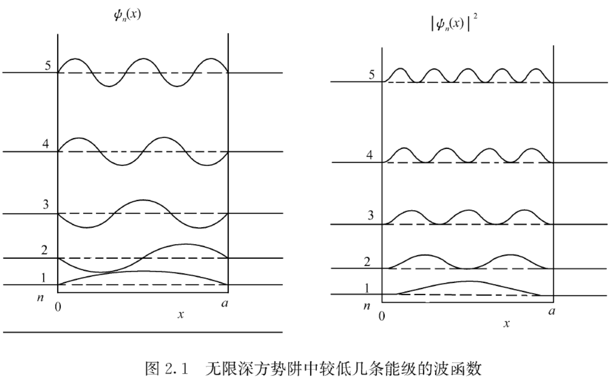
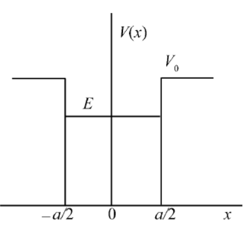
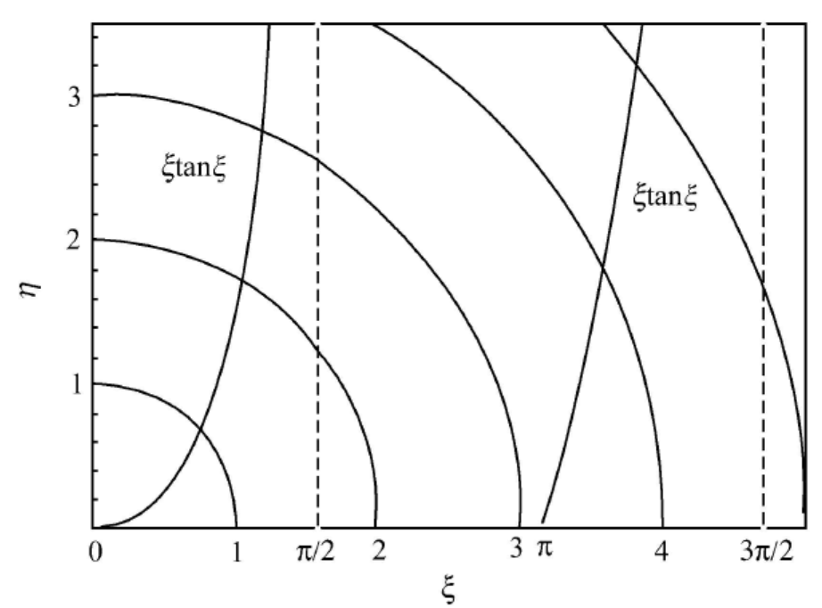
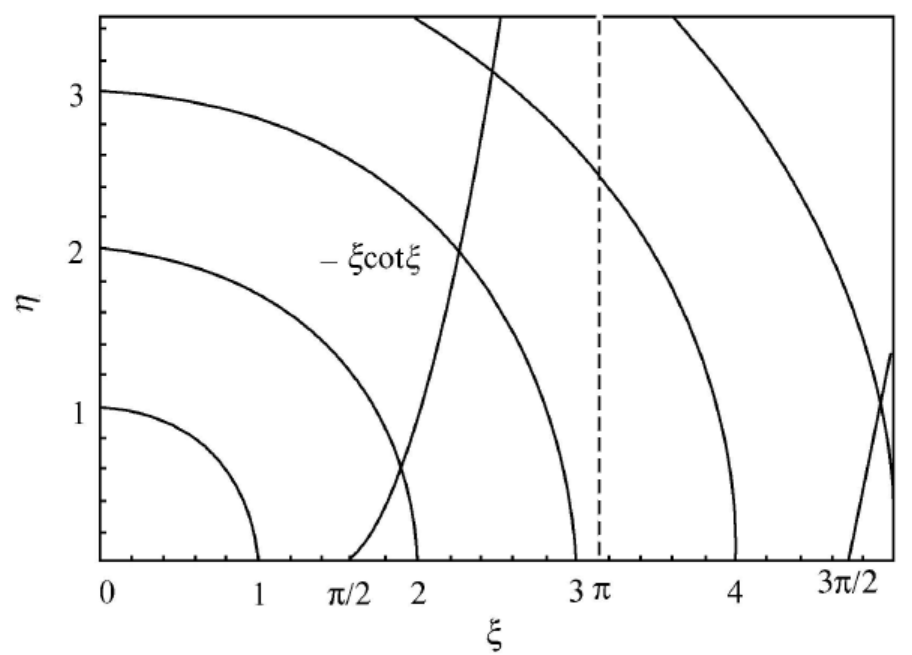
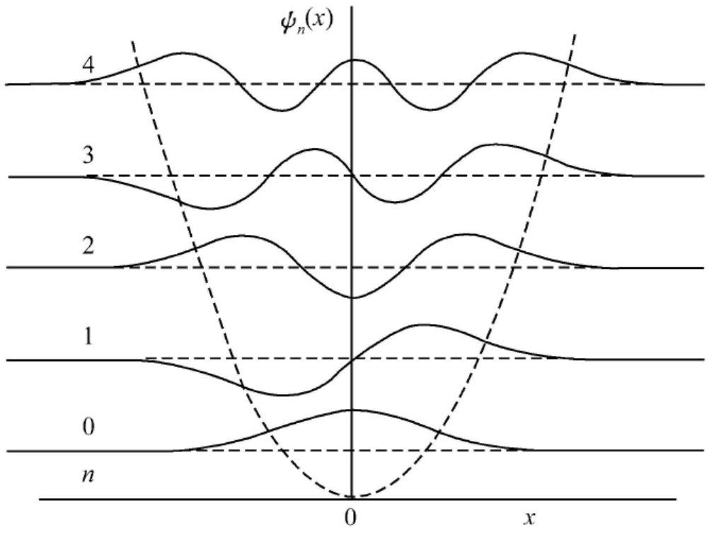
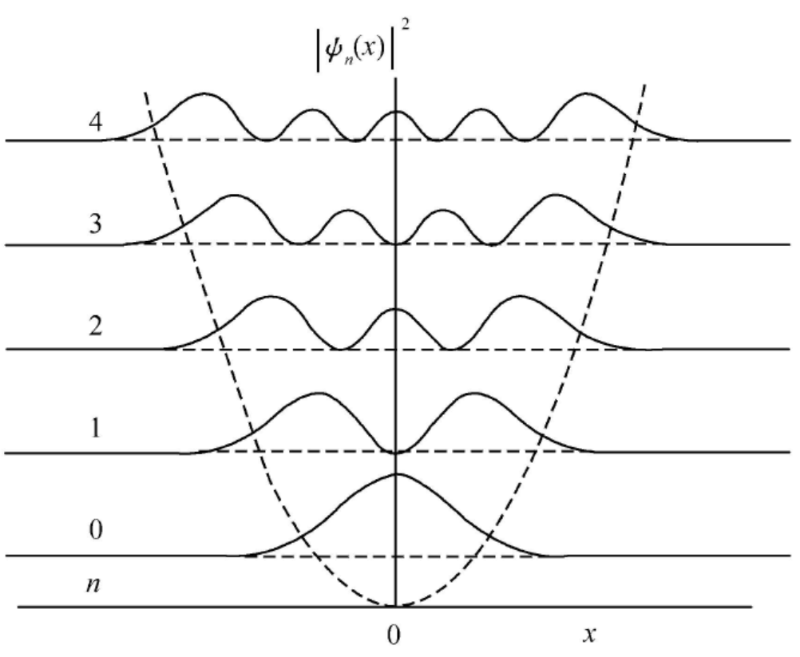
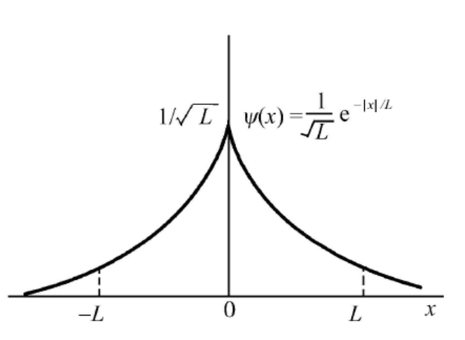
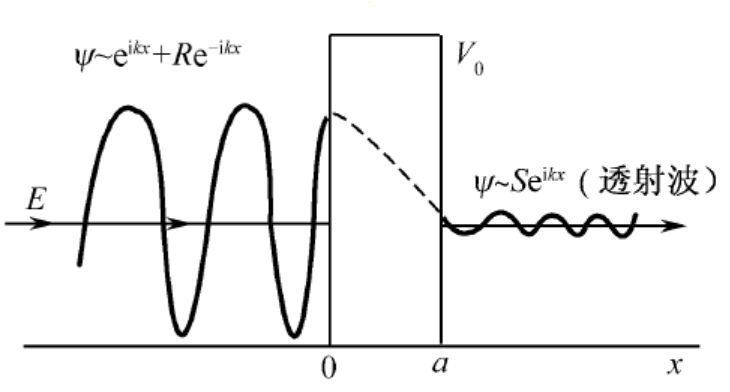

## 第2章 一维势场中的粒子

### 2.1 [一维运动问题的一般分析](https://cloud.tsinghua.edu.cn/d/20694cb9c0fb44e6894a/files/?p=%2F%E4%B8%93%E4%B8%9A%E5%9F%BA%E7%A1%80%E8%AF%BE%E7%A8%8B%2F%E9%87%8F%E5%AD%90%E5%8A%9B%E5%AD%A6%2F%EF%BC%88%E9%83%AD%E6%B0%B8%EF%BC%89%2F%E8%AF%BE%E4%BB%B6%2F%E7%AC%AC5%E8%AE%B2.pdf)

#### 问题分类与基本概念

##### 一维定态的分类：束缚态与非束缚态

本章主要是用Schrödinger方程来处理**一维粒子**的能量本征态问题，一般分为两类问题：

* **束缚态问题**：**束缚态**(bound state)是指粒子局限在有限的空间中，即粒子在无穷远处出现的概率等于零的状态，即当 $x\to\pm\infty$ 时，有 $\psi(x)\to0$ ；而**非束缚态**(或称**散射态**)指粒子可以出现在无穷远处的状态，即当 $x\to+\infty$ 或 $x\to-\infty$ 时， $\psi(x)\ne0$ 。束缚态问题会给出势场函数 $V(x)$ ，需要求出波函数 $\psi(x)$ 以及能量本征值 $E$ （通常是离散的 $E_n$ ）。

* **散射问题**：会给出势场函数 $V(x)$ 与能量 $E$ ，需要求出波函数 $\psi(x)$ 。

在求解上述两个问题的能量本征方程时，要根据具体物理问题的**边界条件**来定解。（束缚态问题还有着 $\lim_{x\to\infty}\ \psi(x)=0$ 的无穷远处条件）

##### 简并度

如果对**一个**给定的能量 $E$ ，只有**一个线性独立**的波函数存在，则称该能级是**非简并**的；**否则**称它是**简并**的，其线性独立的波函数的个数称为它的**简并度**。

##### 宇称

定义一维粒子的**空间反射算符** $P$ 为

$$
P \psi(x) = \psi(-x)
$$

其对应的本征方程为

$$
P \psi(x) = \pi \psi(x)
$$

定义**宇称**(parity)为空间反射算符的**本征值** $\pi$ ，可以证明，空间反演算符只有 $\pm1$ 两个本征值，

$$
P\psi(x) = \psi(-x) =
\begin{cases}
 \psi(x), & \pi=+1, & 偶（正）宇称 \\
 -\psi(x), & \pi=-1, & 奇（负）宇称
\end{cases}
$$

即空间反射不变的波函数具有**偶（正）宇称**(even parity)；变号的波函数具有**奇（负）宇称**(odd parity)；还有一些波函数没有确定的宇称，它们不是空间反射算符的本征态。

#### 一维定态Schrödinger方程解的一般性质

质量为 $m$ 的粒子，沿 $x$ 方向运动，势能为 $V(x)$ ，则定态Schrödinger方程表示为

$$
\left[-\frac{\hbar^2}{2m}\frac{\mathrm{d}^2}{\mathrm{d}x^2}+V(x)\right] \psi(x) = E \psi(x)
$$

在量子力学中，如果不作特别的声明，都认为 $V(x)$ 取实值，即 $V(x) = V^*(x)$ 。

##### 定理1 共轭定理

设 $\psi(x)$ 是定态Schrödinger方程的一个解，对应的能量本征值为 $E$ ，则 $\psi^*(x)$ 也是该方程的一个解，对应的能量也是 $E$ 。

###### 证明

对定态Schrödinger方程取复共轭，可得

$$
\left[-\frac{\hbar^2}{2m}\frac{\mathrm{d}^2}{\mathrm{d}x^2}+V(x)\right] \psi^*(x) = E \psi^*(x)
$$

显然 $\psi^*(x)$ 也是定态Schrödinger方程的解，且对应的能量本征值为 $E$ 。

###### 推论

假设对应于能量的某个本征值 $E$ ，定态Schrödinger方程的解**无简并**，则可取为**实解**（除了一个无关紧要的常数因子外）。

##### 定理2

对应于能量的某个本征值 $E$ ，总可以找到定态Schrödinger方程的一组实解，凡属于 $E$ 的任何解，均可表示为这**一组实解的线性叠加**。

*对于能级**有简并**的情况，要用到此定理；通过定理1和定理2，可以说明定态Schrödinger方程的基本解组可全取为实解。*

###### 证明

假设 $\psi(x)$ 是定态Schrödinger方程的一个解：

如果 $\psi(x)$ 是实解，则可把它归入实解的集合中去；

如果 $\psi(x)$ 是复解，则由定理1可知， $\psi^*(x)$ 也是方程的解，且同属于能量本征值 $E$ 。根据线性微分方程解的叠加性定理，

$$
\varphi(x) = \psi(x) + \psi^*(x),
\kern 1em
\chi(x) = -\mathrm{i} [\psi(x) - \psi^*(x)]
$$

也是方程同属于能量 $E$ 的解，且彼此独立。 $\varphi(x)$ 和 $\chi(x)$ 均为实解, 而 $\psi(x)$ 和 $\psi^*(x)$ 均可表示为其线性叠加，即

$$
\psi = \frac12 (\varphi + \mathrm{i} \chi),
\kern 1em
\psi^* = \frac12 (\varphi - \mathrm{i} \chi)
$$

##### 定理3 反射定理

设势能函数 $V(x)$ 具有空间反射不变性，即 $V(x)=V(-x)$，那么若 $\psi(x)$ 是定态Schrödinger方程对应于能量本征值 $E$ 的解，则 $\psi(-x)$ 也是该方程对应于能量 $E$ 的解。

###### 证明

当 $x\longrightarrow -x$ 时，有

$$
\frac{\mathrm{d}^2}{\mathrm{d}x^2} \longrightarrow \frac{\mathrm{d}^2}{\mathrm{d}(-x)^2} = \frac{\mathrm{d}^2}{\mathrm{d}x^2},
\kern 1em
V(x) \longrightarrow V(-x) = V(x)
$$

则定态Schrödinger方程转化为

$$
\left[-\frac{\hbar^2}{2m}\frac{\mathrm{d}^2}{\mathrm{d}x^2}+V(x)\right] \psi(-x) = E \psi(-x)
$$

显然 $\psi(-x)$ 也是定态Schrödinger方程的解，且对应的能量本征值为 $E$ 。

###### 推论

如果对应于某能量 $E$ ，定态Schrödinger方程的解无简并，则解必有确定的**宇称**。

因为此时 $\psi(x)$ 与 $\psi(-x)$ 代表同一个解，它们最多可以差一个常数因子 $\pi$ ，即 $P\psi(x) = \psi(-x) = \pi\psi(x)$ 。

##### 定理4

设势能函数 $V(x)$ 具有空间反射不变性，即 $V(x)=V(-x)$，则对应于任何一个能量本征值 $E$ ，总可以找到定态Schrödinger方程的一组解 (每个解都有确定的宇称)，而属于能量本征值 $E$ 的任何解，都可用它们来展开.

*对于能级**有简并**的情况，能量本征态并不一定就具有确定宇称，此时，可以用该定理来处理；通过定理3和定理4，可以说明定态Schrödinger方程的基本解组可全取为具有确定宇称的解。*

###### 证明

假设 $\psi(x)$ 是定态Schrödinger方程的一个解：

如果 $\psi(x)$ 有确定的宇称，则可把它归入有确定的宇称的解集中去；

如果 $\psi(x)$ 无确定的宇称，则由定理3可知， $\psi(-x)$ 也是方程的解，且同属于能量本征值 $E$ ，但不同于 $\psi(x)$ 。根据线性微分方程解的叠加性定理，

$$
f(x) = \psi(x) + \psi(-x),\kern 1em g(x) = \psi(x) - \psi(-x)
$$

也是方程同属于能量 $E$ 的解，且彼此独立。 $f(x)$ 和 $g(x)$ 均具有确定宇称： $f(-x)=f(x)$ , $g(-x)=-g(-x)$ ；而 $\psi(x)$ 和 $\psi(-x)$ 均可表示为其线性叠加，即

$$
\psi(x) = \frac12[f(x)+g(x)], \kern 1em \psi(-x) = \frac12[f(x)-g(x)]
$$

##### 定理5

对于阶梯方位势

$$
V(x) =
\begin{cases}
 V_1, & x<a \\
 V_2, & x>a
\end{cases}
$$

若 $(V_2-V_1)$ 有限，则能量本征函数 $\psi$ 及其导数 $\psi'(x)$ 必定是连续的；但若 $|V_2-V_1|\to\infty$ ，则该定理不成立。

###### 证明

根据定态Schrödinger方程

$$
\psi''(x) = -\frac{2m}{\hbar^2} \left[E-V(x)\right] \psi(x)
$$

在 $V(x)$ 连续的区域，由 $\psi''(x)$ 存在可以推出 $\psi(x)$ 与 $\psi'(x)$ 是连续的。

在 $V(x)$ 发生阶梯形跳跃处， $V(x)\psi(x)$ 发生跃变，但变化是有限的，在 $x\sim a$ 邻域对上述方程积分，得

$$
\lim_{\varepsilon\to0^+} \int_{a-\varepsilon}^{a+\varepsilon} \psi''(x) \mathrm{d}x
= \psi'(a+0^+) - \psi'(a-0^+)
= -\frac{2m}{\hbar^2} \lim_{\varepsilon\to0^+} \int_{a-\varepsilon}^{a+\varepsilon} \mathrm{d}x [E-V(x)] \psi(x)
$$

由于 $[E-V(x)]\psi(x)$ 是有限的，当 $\varepsilon\to0^+$ 时，上式右边积分趋于零，因此

$$
\psi'(a+0^+) = \psi'(a-0^+)
$$

即 $\psi'(x)$ 在 $V(x)$ 的跳跃点 $x=a$ 处是连续的，因而 $\psi(x)$ 也是连续的。

##### 定理6 Wronskian定理

若 $\psi_1(x)$ 与 $\psi_2(x)$ 均为定态Schrödinger方程属于同一能量 $E$ 的解，则

$$
\psi_1\psi'_2 - \psi_2\psi'_1 = \mathrm{Const}(与x无关)
$$

其中 $\psi_1\psi'_2 - \psi_2\psi'_1$ 称为 $\psi_1(x)$ 与 $\psi_2(x)$ 的Wronskian行列式，即

$$
W[\psi_1,\psi_2](x) =
\begin{vmatrix}
 \psi_1(x)  & \psi_2(x)  \\
 \psi'_1(x) & \psi'_2(x)
\end{vmatrix}
$$

###### 证明

由定态Schrödinger方程可得

$$
\psi''_1 = -\frac{2m}{\hbar^2} \left[E-V(x)\right] \psi_1
\\ \kern1em \\
\psi''_2 = -\frac{2m}{\hbar^2} \left[E-V(x)\right] \psi_2
$$

 $\psi_1$ $\times$ 下式 $-$ $\psi_2$ $\times$ 上式，可得 

$$
\psi_1\psi''_2 - \psi_2\psi''_1 = 0
$$

即

$$
\psi_1\psi''_2 - \psi_2\psi''_1 = \psi_1\psi''_2 + \psi'_1\psi'_2 - \psi'_1\psi'_2 - \psi_2\psi''_1 = (\psi_1\psi'_2 - \psi_2\psi_1)' = 0
$$

积分，得

$$
\psi_1\psi'_2 - \psi_2\psi'_1 = \mathrm{Const}(与x无关)
$$

###### 推论

对于**束缚态**，当 $x\to\infty$ 时， $\psi\to0$ ，所以该定理中的常数必为 $0$ ，因此对于同属于能量 $E$ 的任何两个束缚态波函数 $\psi_1$ 与 $\psi_2$ ，

$$
\psi_1\psi'_2 = \psi_2\psi'_1
$$

##### 定理7 不简并定理

设粒子在规则势场 $V(x)$ （无奇点）中运动，如存在**束缚态**，则必定是**非简并**的。

注：对于常见的不规则势阱，在绝大多数情况下（如无限深方势阱、 $\delta$ 势阱等），该定理也成立；但对于某些不规则势阱，如一维氢原子（ $V(x) \propto -\frac{1}{|x|}$），除基态外，其他束缚态简并度均为 $2$ ，其特征是波函数的节点（指 $\psi(x)=0$ 的点）出现在 $V(x)$ 的奇异点处，两个简并态具有不同宇称。

###### 证明

设 $\psi_1$ 与 $\psi_2$ 是定态Schrödinger方程属于同一能量 $E$ 的两个束缚态解，则

$$
\psi_1\psi'_2 = \psi_2\psi'_1
$$

在不包含 $\psi_1(x)$ 和 $\psi_2(x)$ 节点的区域中，等式左右两边同除以 $\psi_1\psi_2$ ，得

$$
\frac{\psi'_2}{\psi_2} = \frac{\psi'_1}{\psi_1}
$$

即

$$
\left(\ln{\frac{\psi_1}{\psi_2}}\right)' = 0
$$

积分得

$$
\ln{\frac{\psi_1}{\psi_2}} = \ln C \kern 1em (C是与x无关的常数)
$$

故

$$
\psi_1 = C \psi_2
$$

这表明 $\psi_1$ 与 $\psi_2$ 代表同一个量子态，即能级不简并。

### 2.2 束缚态问题：[一维无限深势阱和有限深势阱](https://cloud.tsinghua.edu.cn/d/20694cb9c0fb44e6894a/files/?p=%2F%E4%B8%93%E4%B8%9A%E5%9F%BA%E7%A1%80%E8%AF%BE%E7%A8%8B%2F%E9%87%8F%E5%AD%90%E5%8A%9B%E5%AD%A6%2F%EF%BC%88%E9%83%AD%E6%B0%B8%EF%BC%89%2F%E8%AF%BE%E4%BB%B6%2F%E7%AC%AC6%E8%AE%B2.pdf)、一维谐振子

#### 一维无限深方势阱

##### 模型描述与结论

一维无限深方势阱表示为

$$
V(x) =
\begin{cases}
 0, & 0<x<a \\
 \infty, & 0<x,x>a
\end{cases}
$$

在该势阱中的质量为 $m$ 的粒子，**能量是量子化**的，即构成的能谱是**离散**的，体系的能量本征值

$$
E_n = \frac{\hbar^2\pi^2n^2}{2ma^2} \kern 1em (n=1,2,3,\cdots)
$$

对应的能量本征函数为

$$
\psi_n(x) =
\begin{cases}
 \sqrt{\frac{2}{a}} \sin\left(\frac{n\pi x}{a}\right), & 0<x<a \\
 0, & x<0,x>a
\end{cases}
$$

注：若将一维无限深方势阱表示为

$$
V(x) =
\begin{cases}
 0, & |x|<\frac{a}{2} \\
 \infty, & |x|>\frac{a}{2}
\end{cases}
$$

则能量本征值不变，能量本征函数变为

$$
\psi_n(x) =
\begin{cases}
    \begin{cases}
     \sqrt{\frac{a}{2}} \cos\left(\frac{n\pi x}{a}\right) , & n=1,3,5,\cdots,(偶宇称) \\
     \sqrt{\frac{a}{2}} \sin\left(\frac{n\pi x}{a}\right) , & n=2,4,6,\cdots,(奇宇称)
    \end{cases}
  & |x|<\frac{a}{2} \\
 0, & |x|<\frac{a}{2}
\end{cases}
$$

##### 模型求解

在势阱内 $(0<x<a)$ ，能量本征方程为

$$
\frac{\mathrm{d}^2}{\mathrm{d}x^2} \psi(x) + \frac{2mE}{\hbar^2} \psi(x) = 0
$$

其中粒子的能量 $E>0$ ，令

$$
k = \frac{\sqrt{2mE}}{\hbar} > 0
$$

则能量本证方程可表示为

$$
\frac{\mathrm{d}^2}{\mathrm{d}x^2} \psi(x) + k^2 \psi(x) = 0
$$

解得

$$
\psi(x) = A\sin(kx+\delta)
$$

其中 $A$ 与 $\delta$ 为待定常数。因为势壁无限高，从物理上考虑，粒子不能透过势壁；按波函数的统计诠释，要求**在阱壁上及阱外波函数为** $0$ 。这样就得到了边界条件 

$$
\psi(0) = 0, \kern 1em \psi(a) = 0
$$

由 $\psi(0) = A\sin(\delta) = 0 $ ，可取 $\delta = 0$ ，则 $\psi(x) = A\sin(kx)$ ，由 $\psi(a) = A\sin(ka) = 0$ ，可知

$$
ka = n\pi \Longrightarrow k = \frac{n\pi}{a} \kern 1em (n=1,2,3,\cdots)
$$

*注： $n=0$ 给出的波函数 $\psi(x)=0$ ，无物理意义；而 $n$ 取负值与 $n$ 取对应的正值得到的波函数只相差一个常数 $-1$ ，描述的是同一个量子态。*

$$
k = \frac{\sqrt{2mE}}{\hbar} = \frac{n\pi}{a} \Longrightarrow
E_n = \frac{\hbar^2\pi^2n^2}{2ma^2}
\kern 1em (n=1,2,3,\cdots)
$$

则能量本征函数

$$
\psi_n(x) = A\sin\left(\frac{n\pi}{a}x\right)
$$

归一化后可得

$$
\psi_n(x) = \sqrt{\frac{2}{a}}\sin(\frac{n\pi}{a}x)
$$

##### 讨论

###### 能量本征值

$$
E_n = \frac{\hbar^2\pi^2n^2}{2ma^2} \propto n^2 \kern 1em (n=1,2,3,\cdots)
$$

能级的分布是不均匀的，能级越高，密度越小

$$
\Delta E_n \approx \frac{\hbar^2\pi^2}{ma^2} n, \kern 1em \frac{\Delta E_n}{E_n} = \frac{2}{n} \overset{n\to\infty}{\longrightarrow} 0
$$

当 $n$ 充分大时，可以认为能量连续。

最低能级不为零：

$$
E_1 = \frac{\hbar^2\pi^2}{2ma^2} > 0 
$$

这可以用**不确定性关系**来解释：

粒子局限在无限深方势阱中，位置不确定度 $\Delta x \sim a$ ，则动量不确定度 $\Delta p \sim \frac{\hbar}{\Delta x} \sim \frac{\hbar}{a}$ ，故能量不能为零，

$$
E \sim \frac{p^2}{2m} \sim \frac{(\Delta p)^2}{2m} \sim \frac{\hbar^2}{2ma^2} \ne 0
$$

###### 概率密度

$$
\rho_n(x) = |\psi_n(x)|^2 = \frac{2}{a}\sin^2\left(\frac{n\pi}{a}x\right)
$$

由该图也可以看出，除端点 $(x=0,a)$ 外，**基态**（能量最低态， $n=1$ ）波函数无节点，第 $k$ 激发态（ $k=n-1$ ）有 $k$ 个节点。

#### 一维有限深对称方势阱

##### 模型描述与结论

一维有限深对称方势阱表示为

$$
V(x) =
\begin{cases}
 0, & |x|<\frac{a}{2} \\
 V_0, & |x|>\frac{a}{2}
\end{cases}
$$

在该势阱中的质量为 $m$ 的粒子，讨论其处于**束缚态** $(0<E<V_0)$ 的情况。

令

$$
k = \frac{\sqrt{2mE}}{\hbar}\ , \kern 1em \beta = \frac{\sqrt{2m(V_0-E)}}{\hbar}
$$

引入无量纲参数

$$
\xi = \frac{ka}{2}\ , \kern 1em \eta = \frac{\beta a}{2}
$$

这两个无量纲参数满足一定的方程组，使得其取值是离散的，对应的能量本征态为

$$
E_n = \frac{2\hbar^2}{ma^2} \xi^2_n
$$

对于**偶宇称态**：

波函数形式为（可利用波函数连续性与归一化进一步求出 $A$ 与 $C$ ）

$$
\psi(x) =
\begin{cases}
 C\mathrm{e}^{\beta x}, & x<-\frac{a}{2} \\
 A\cos(kx), & -\frac{a}{2}<x<\frac{a}{2} \\
 C\mathrm{e}^{-\beta x}, & x>\frac{a}{2} 
\end{cases}
$$

无量纲参数满足方程组

$$
\left\{\begin{matrix}
 \xi\tan\xi = \eta \\
 \xi^2+\eta^2 = \frac{mV_0a^2}{2\hbar^2}
\end{matrix}\right.
$$

对于**奇宇称态**：

波函数形式为（可利用波函数连续性与归一化进一步求出 $B$ 与 $C$ ）

$$
\psi(x) =
\begin{cases}
 C\mathrm{e}^{\beta x}, & x<-\frac{a}{2} \\
 B\sin(kx), & -\frac{a}{2}<x<\frac{a}{2} \\
 -C\mathrm{e}^{-\beta x}, & x>\frac{a}{2} 
\end{cases}
$$

无量纲参数满足方程组

$$
\left\{\begin{matrix}
 -\xi\cot\xi = \eta \\
 \xi^2+\eta^2 = \frac{mV_0a^2}{2\hbar^2}
\end{matrix}\right.
$$

##### 模型求解

先考虑势阱外的情况，能量本征方程为

$$
\frac{\mathrm{d}^2}{\mathrm{d}x^2} \psi(x) - \beta^2 \psi(x) = 0
$$

其中 $\beta = \frac{\sqrt{2m(V_0-E)}}{\hbar}$ ，解得

$$
\psi(x) = C\mathrm{e}^{\beta x} + D\mathrm{e}^{-\beta x}
$$

考虑束缚态边界条件，即在 $x\to\infty$ 处，要求 $\psi(x)\to0$ ，则

$$
\psi(x) =
\begin{cases}
 C\mathrm{e}^{\beta x}, & x<-\frac{a}{2} \\
 D\mathrm{e}^{-\beta x}, & x>\frac{a}{2}
\end{cases}
$$

再考虑势阱内的情况，能量本征方程为

$$
\frac{\mathrm{d}^2}{\mathrm{d}x^2} \psi(x) + k^2 \psi(x) = 0
$$

其中 $k = \frac{\sqrt{2mE}}{\hbar}$ ，解得

$$
\psi(x) = A\cos(kx) + B\sin(kx)
$$

考虑到势阱具有空间反射不变性 $V(-x)=V(x)$ ，由定理3推论可知，束缚态能量本征函数（由定理7知其不简并）必具有确定的宇称，因此只能单独取 $\cos(kx)$ 或 $\sin(kx)$ 形式，以下分别讨论。

对于**偶宇称态**：

在势阱内 $(|x|<\frac{a}{2})$ ， $B=0$ ， 

$$
\psi(x) = A\cos(kx) \kern 2em 
$$

在势阱外 $(|x|>\frac{a}{2})$ ， $C=D$ ,

$$
\psi(x) =
\begin{cases}
 C\mathrm{e}^{\beta x}, & x<-\frac{a}{2} \\
 C\mathrm{e}^{-\beta x}, & x>\frac{a}{2}
\end{cases}
$$

由定理5可知，波函数 $\psi(x)$ 及导数 $\psi'(x)$ 在 $|x|=\frac{a}{2}$ 处是连续的，由于波函数具有偶宇称，在 $-\frac{a}{2}$ 与 $\frac{a}{2}$ 处的情况实际上是等效的，这里只用分析 $x=\frac{a}{2}$ 的情况。

$$
\psi(x) =
\begin{cases}
 A\cos(kx), & -\frac{a}{2}<x<\frac{a}{2} \\
 C\mathrm{e}^{-\beta x}, & x>\frac{a}{2}
\end{cases}
\\ \kern 1em \\
\psi'(x) =
\begin{cases}
 -Ak\sin(kx), & -\frac{a}{2}<x<\frac{a}{2} \\
 -C\beta\mathrm{e}^{-\beta x}, & x>\frac{a}{2}
\end{cases}
$$

则

$$
A\cos(k\frac{a}{2}) = C\mathrm{e}^{-\beta\frac{a}{2}}
\\ \kern 1em \\
-Ak\sin(k\frac{a}{2}) = -C\beta\mathrm{e}^{-\beta\frac{a}{2}}
$$

两式相除，可消去 $A,C$ ，得

$$
k\tan(k\frac{a}{2}) = \beta
$$

*注：也可以直接考虑 $(\ln\psi)'$ 的连续性，从而直接消去 $A,C$ 这两个常数。*

引入无量纲参数

$$
\xi = \frac{ka}{2}\ , \kern 1em \eta = \frac{\beta a}{2}
$$

可得

$$
\xi\tan\xi = \eta
$$

同时， $\xi$ 与 $\eta$ 还满足

$$
\xi^2+\eta^2 =
\frac{a^2}{4}(k^2+\beta^2) =
\frac{a^2}{4}\left[\frac{2mE}{\hbar^2} + \frac{2m(V_0-E)}{\hbar^2}\right] =
\frac{mV_0a^2}{2\hbar^2}
$$

整理即得 $\xi$ 与 $\eta$ 满足方程组

$$
\left\{\begin{matrix}
 \xi\tan\xi = \eta \\
 \xi^2+\eta^2 = \frac{mV_0a^2}{2\hbar^2}
\end{matrix}\right.
$$

对于**奇宇称态**：

在势阱内 $(|x|<\frac{a}{2})$ ， $A=0$ ，

$$
\psi(x) = B\sin(kx) \kern 2em 
$$

在势阱外 $(|x|>\frac{a}{2})$ ， $C=-D$ ,

$$
\psi(x) =
\begin{cases}
 C\mathrm{e}^{\beta x}, & x<-\frac{a}{2} \\
 -C\mathrm{e}^{-\beta x}, & x>\frac{a}{2}
\end{cases}
$$

波函数 $\psi(x)$ 及导数 $\psi'(x)$ 在 $x=\frac{a}{2}$ 处是连续的，

$$
\psi(x) =
\begin{cases}
 B\sin(kx), & -\frac{a}{2}<x<\frac{a}{2} \\
 -C\mathrm{e}^{-\beta x}, & x>\frac{a}{2}
\end{cases}
\\ \kern 1em \\
\psi'(x) =
\begin{cases}
 Bk\cos(kx), & -\frac{a}{2}<x<\frac{a}{2} \\
 C\beta\mathrm{e}^{-\beta x}, & x>\frac{a}{2}
\end{cases}
$$

则

$$
B\sin(k\frac{a}{2}) = -C\mathrm{e}^{-\beta\frac{a}{2}}
\\ \kern 1em \\
Bk\cos(k\frac{a}{2}) = C\beta\mathrm{e}^{-\beta\frac{a}{2}}
$$

两式相除，可消去 $B,C$ ，得

$$
-k\cot(k\frac{a}{2}) = \beta
$$

引入无量纲参数

$$
\xi = \frac{ka}{2}\ , \kern 1em \eta = \frac{\beta a}{2}
$$

可得

$$
\xi\tan\xi = \eta
$$

同时， $\xi$ 与 $\eta$ 还满足

$$
\xi^2+\eta^2 =\frac{mV_0a^2}{2\hbar^2}
$$

整理即得 $\xi$ 与 $\eta$ 满足方程组

$$
\left\{\begin{matrix}
 -\xi\cot\xi = \eta \\
 \xi^2+\eta^2 = \frac{mV_0a^2}{2\hbar^2}
\end{matrix}\right.
$$

##### 讨论

###### 无量纲参数满足的方程组的解

对于 $\xi$ 与 $\eta$ 满足的方程组，可以采用图解法近似求解，无论是奇宇称态还是偶宇称态，方程组中的第二个方程的图象都是圆弧，半径为 $\sqrt{\frac{mV_0a^2}{2\hbar^2}}$ 。对于**偶宇称态**，图为：

对于**奇宇称态**，图为：

*注：实际上对于确定的 $m,a,V_0$ ，图中的圆弧应该只有一条。*

在一维有限深对称方势阱问题中，无论势阱多浅或多窄（即无论 $V_0a^2$ 的值多小），偶宇称态的方程组都至少有一个根，这表明至少存在一个束缚态（即基态），其宇称为偶。

而对于奇宇称态的方程组，只有当

$$
\xi^2+\eta^2 = \frac{mV_0a^2}{2\hbar^2} \ge \left(\frac{\pi}{2}\right)^2
$$

即

$$
V_0a^2 \ge \frac{\pi^2\hbar^2}{2m}
$$

方程组才会有解，即才可能出现最低的奇宇称能级。

随着 $V_0a^2$ 的增大，方程组的解的个数会逐渐增多，出现更高的激发态能级，宇称奇偶相间。由图可得，圆弧的半径 $\sqrt{\frac{mV_0a^2}{2\hbar^2}}$ 每增大 $\frac{\pi}{2}$ ，两图中交点的总个数会增加一个，由此可以推得束缚态能级总数为

$$
N = 1+\left\lfloor\frac{a}{\hbar\pi}\sqrt{2mV_0}\right\rfloor 
$$

###### 能量本征值

$$
\xi = \frac{ka}{2} = \frac{a}{2}\frac{\sqrt{2mE}}{\hbar}
\Longrightarrow
E_n = \frac{2\hbar^2}{ma^2} \xi_n^2
$$

由上图可得

$$
0<\xi_1<\frac{\pi}{2}<\xi_2<\pi<\cdots<\frac{\pi}{2}(n-1)<\xi_n<\frac{\pi}{2}n<\cdots
$$

故有限深方势阱每个能级都比无限深方势阱的相应能级低一些：

$$
E_n = \frac{2\hbar^2}{ma^2} \xi_n^2 < \frac{\pi^2\hbar^2}{2ma^2} n^2
$$

当 $V_0\to+\infty$ 时，有 $\xi_n\to\frac{\pi}{2}n$ ，则 $E_n\to\frac{\pi^2\hbar^2}{2ma^2}n^2$ ，即趋向于无限深方势阱的能级。

#### [一维谐振子](https://cloud.tsinghua.edu.cn/d/20694cb9c0fb44e6894a/files/?p=%2F%E4%B8%93%E4%B8%9A%E5%9F%BA%E7%A1%80%E8%AF%BE%E7%A8%8B%2F%E9%87%8F%E5%AD%90%E5%8A%9B%E5%AD%A6%2F%EF%BC%88%E9%83%AD%E6%B0%B8%EF%BC%89%2F%E8%AF%BE%E4%BB%B6%2F%E7%AC%AC8%E8%AE%B2.pdf)

##### 模型描述与结论

取谐振子的平衡位置为坐标原点，并选原点为势能的零点，则以为谐振子的势能可以表示为

$$
V(x) = \frac12m\omega^2x^2
$$

其中 $m$ 为谐振子的质量， $\omega$ 为经典谐振子的自然频率。理想的谐振子势是一个无限深势阱，只存在**束缚态**，谐振子的**能量本征值**为

$$
E_n = (n+\frac12)\hbar\omega \kern 2em (n=0,1,2,\cdots)
$$

正交归一化的**能量本征函数**为

$$
\psi_n(x) = A_n \mathrm{e}^{-\frac{\alpha^2x^2}{2}} \mathrm{H}_n(\alpha x)
$$

其中 $\alpha=\sqrt{\frac{m\omega}{\hbar}}$ ， $\mathrm{H}_n(x)$ 为Hermite多项式，归一化系数为

$$
A_n = \sqrt{\frac{\alpha}{\sqrt{\pi}2^n\cdot n!}}
$$

##### 模型求解

一维谐振子的能量本征方程为

$$
\left[-\frac{\hbar^2}{2m}\frac{\mathrm{d}^2}{\mathrm{d}x^2}+\frac12m\omega^2x^2\right] \psi(x) = E \psi(x)
$$

令 $\alpha=\sqrt{\frac{m\omega}{\hbar}}$ ，并引进无量纲参量

$$
\xi = \alpha x , \kern 1em \lambda = \frac{E}{\frac12\hbar\omega}
$$

则方程可整理为

$$
\frac{\mathrm{d}^2}{\mathrm{d}\xi^2} \psi + (\lambda-\xi^2) \psi = 0
$$

设解的形式为

$$
\psi = \mathrm{e}^{-\frac{\xi^2}{2}} u(\xi)
$$

*之所以这么设，可以按如下方式考虑：当 $\xi\to\infty$ 时，方程近似表示为 $\frac{\mathrm{d}^2}{\mathrm{d}\xi^2} \psi -\xi^2 \psi = 0$ ，当  $\psi = \mathrm{e}^{\pm\frac{\xi^2}{2}}$ 时， $\psi' = \pm\xi \mathrm{e}^{\pm\frac{\xi^2}{2}}$ ， $\psi'' = (\xi^2\pm1) \mathrm{e}^{\pm\frac{\xi^2}{2}} \approx \xi^2 \mathrm{e}^{\pm\frac{\xi^2}{2}} = \xi^2\psi$ ，故方程的近似解为 $\psi \sim \mathrm{e}^{\pm\frac{\xi^2}{2}}$ ，而根据束缚态边界条件，即 $\xi\to\infty$ 时 $\psi\to0$ ，应舍去 $\psi \sim \mathrm{e}^{\frac{\xi^2}{2}}$ 。*

将上述解的形式代入原方程，可得到 $u(\xi)$ 满足的方程

$$
\frac{\mathrm{d}^2}{\mathrm{d}\xi^2} u + 2\xi \frac{\mathrm{d}}{\mathrm{d}\xi} u + (\lambda-1) u = 0
$$

此即**Hermite方程**，可以通过级数解法求解：在 $\xi=0$ 附近，用幂级数展开

$$
u(\xi) = \sum_{k=0}^{+\infty} c_k \xi^k
$$

代入Hermite方程，比较同幂项的系数，可得

$$
c_{k+2} = \frac{2k-(\lambda-1)}{(k+2)(k+1)} c_k \kern 2em (k=0,1,2,\cdots)
$$

故所有的偶次项系数都可以用 $c_0$ 来表示，所有的奇次项系数都可以用 $c_1$ 来表示，把 $c_0$ 与 $c_1$ 作为两个任意常数，就可以得到Hermite方程两个线性无关的解，即级数的偶次项部分与奇次项部分 

$$
u_1(\xi) = \sum_{m=0}^{+\infty} c_{2m} \xi^{2m} = c_0 + c_2\xi^2 + c_4\xi^4 + \cdots
\\ \kern 1em \\
u_2(\xi) = \sum_{m=0}^{+\infty} c_{2m+1} \xi^{2m+1} = c_1\xi + c_3\xi^3 + c_5\xi^5 + \cdots
$$

考虑当 $\xi\to\infty$ 时的情况，当 $k\to+\infty$ 时，

$$
\frac{c_{k+2}}{c_k} = \frac{2k-(\lambda-1)}{(k+2)(k+1)} \to \frac{2}{k} 
$$

对于偶数的情况，即 $k=2m$ ，有 $c_{2m+2}/c_{2m} \sim 1/m$ ，这与 $\mathrm{e}^{\xi^2}$ 的Taylor展开 

$$
\mathrm{e}^{\xi^2} = \sum_{m=0}^{+\infty} \frac{\xi^{2m}}{m!}
$$

相邻两项的系数比相同，因此，

$$
u_1(\xi) \sim \mathrm{e}^{\xi^2}
$$

同理可得

$$
u_2(\xi) \sim \xi\mathrm{e}^{\xi^2}
$$

代回到波函数可得

$$
\psi_1 = \mathrm{e}^{-\frac{\xi^2}{2}} u_1(\xi) \sim \mathrm{e}^{\frac{\xi^2}{2}}
\\ \kern 1em \\
\psi_2 = \mathrm{e}^{-\frac{\xi^2}{2}} u_2(\xi) \sim \xi\mathrm{e}^{\frac{\xi^2}{2}}
$$

这不满足束缚态的边界条件（当 $\xi\to\infty$ 时 $\psi\to0$ ），故 $u_1$ 和 $u_2$ 两个无穷级数解中，必须至少有一个**中断为多项式**，也就是要找到合适的 $\lambda$ ，使得存在 $k\in\mathbb{N}$ 满足 $\frac{2k-(\lambda-1)}{(k+2)(k+1)} = 0$ ，故当

$$
\lambda-1 = 2n \kern 2em (n=0,1,2,\cdots)
$$

时，级数将中断一个多项式（ $c_{n+2} = c_{n+4} = c_{n+6} = \cdots = 0$ ）。当 $n$ 为偶时， $u_1$ 中断为Hermite多项式 $\mathrm{H}_n(\xi)$ ，$u_2$ 仍为无穷级数；当 $n$ 为奇时， $u_2$ 中断为Hermite多项式 $\mathrm{H}_n(\xi)$ ，$u_1$ 仍为无穷级数。其中**Hermite多项式**表示为

$$
\mathrm{H}_n(\xi) = (-1)^n \mathrm{e}^{\xi^2} \frac{\mathrm{d}^n }{\mathrm{d}\xi^n} \mathrm{e}^{-\xi^2}
\\
= (2\xi)^n + n(n-1)(2\xi)^{n-2} + \cdots + (-1)^{\left\lfloor \frac{n}{2} \right\rfloor} \frac{n!}{\left\lfloor \frac{n}{2} \right\rfloor!} (2\xi)^{n-2\left\lfloor \frac{n}{2} \right\rfloor}
$$

例如

$$
\mathrm{H}_0(\xi) = 1 \\
\mathrm{H}_1(\xi) = 2\xi \\
\mathrm{H}_2(\xi) = 4\xi^2 -2
$$

Hermite多项式的带权正交归一性表示为

$$
\int_{-\infty}^{+\infty} \mathrm{H}_m(\xi) \mathrm{H}_n(\xi) \mathrm{e}^{-\xi^2} \mathrm{d}\xi
= \sqrt{\pi} 2^n \cdot n! \delta_{mn}
$$

根据 $\lambda$ 满足的离散化条件，可以求出一维谐振子的**能量本征值**

$$
\lambda = \frac{E}{\frac12\hbar\omega} = 2n+1
\Longrightarrow
E_n = (n+\frac12)\hbar\omega
\kern 2em (n=0,1,2,\cdots)
$$

借助Hermite多项式，并把 $\xi=\alpha x$ 代入，可以表示出一维谐振子的**能量本征函数**

$$
\psi_n \propto \mathrm{e}^{-\frac{\xi^2}{2}} \mathrm{H}_n(\xi)
\Longrightarrow
\psi_n(x) = A_n \mathrm{e}^{-\frac{\alpha^2x^2}{2}} \mathrm{H}_n(\alpha x)
$$

根据Hermite多项式的带权正交归一性，

$$
(\psi_m,\psi_n) = A_mA_n \int_{-\infty}^{+\infty} \mathrm{H}_m(\xi) \mathrm{H}_n(\xi) \mathrm{e}^{-\xi^2} \mathrm{d}\xi
= A_mA_n\sqrt{\pi} 2^n \cdot n! \delta_{mn}
$$

可得归一化系数

$$
A_n = \sqrt{\frac{\alpha}{\sqrt{\pi}2^n\cdot n!}}
$$

这样波函数就满足了正交归一化条件

$$
(\psi_m,\psi_n) = \delta_{mn}
$$

##### 讨论

###### 能量本征值

$$
E_n = (n+\frac12)\hbar\omega \kern 2em (n=0,1,2,\cdots)
$$

一维谐振子的能量是**均匀分布**的，相邻的两条能级间距为 $E_{n+1} - E_n = \hbar\omega$ 。

###### 波函数与能级宇称

最低的三条能级上的谐振子波函数如下：

$$
\psi_0(x) = \frac{\sqrt{\alpha}}{\pi^{\frac{1}{4}}} \mathrm{e}^{-\frac{\alpha^2x^2}{2}}
\\ \kern 1em \\
\psi_1(x) = \frac{\sqrt{2\alpha}}{\pi^{\frac{1}{4}}}  \alpha x\ \mathrm{e}^{-\frac{\alpha^2x^2}{2}}
\\ \kern 1em \\
\psi_2(x) = \frac{1}{\pi^{\frac{1}{4}}} \sqrt{\frac{\alpha}{2}} (2\alpha^2x^2-1) \mathrm{e}^{-\frac{\alpha^2x^2}{2}}
$$

其中 $\psi_n(x)$ 有 $n$ 个节点。 

由于一维谐振子势具有空间反射不变性（ $V(-x)=V(x)$ ），根据定理3推论， $\psi_n(x)$ 必有确定的宇称，事实上，可以证明

$$
\psi_n(-x) = (-1)^n \psi_n(x) 
$$

能级的宇称偶奇相间，基态是偶宇称。

###### 基态能量与概率分布

一维谐振子基态能量为

$$
E_0 = \frac12 \hbar\omega
$$

其并不为零（可以用不确定性关系解释），称为**零点能**。

处于基态的谐振子在空间的概率分布为

$$
|\psi_0(x)|^2 = \frac{\alpha}{\sqrt{\pi}} \mathrm{e}^{-\alpha^2x^2}
$$

这是一个Gauss型分布，在原点 $(x=0)$ 处找到粒子的概率最大。

##### 补充（二维、三维谐振子）

对于一维谐振子，其Hamilton算符

$$
\hat{H} = -\frac{\hbar^2}{2m} \frac{\partial^2}{\partial x^2} + \frac12m\omega^2x^2
$$

###### 二维谐振子

二维谐振子的势能可以表示为

$$
V(x,y) = \frac12m\omega^2r^2 = \frac12m\omega^2(x^2+y^2) 
$$

其Hamilton算符可以表示为

$$
\hat{H} = -\frac{\hbar^2}{2m} \left(\frac{\partial^2}{\partial x^2}+\frac{\partial^2}{\partial y^2}\right) + \frac12m\omega^2(x^2+y^2) = \hat{H}_x + \hat{H}_y
$$

对于二维谐振子的能量本征方程

$$
\hat{H} \psi(x,y) = E \psi(x,y)
$$

由于 $x,y$ 相独立，可以使用分离变量法求解，令 $\psi(x,y)=\psi_x(x)\psi_y(y)$ ,则能量本征方程可表示为

$$
(\hat{H}_x + \hat{H}_y)\psi_x\psi_y = E\psi_x\psi_y
\\ \Downarrow \\
\psi_y\hat{H}_x\psi_x + \psi_x\hat{H}_y\psi_y = E\psi_x\psi_y
\\ \Downarrow \\
\frac{\hat{H}_x\psi_x}{\psi_x} + \frac{\hat{H}_y\psi_y}{\psi_y} = E
$$

这样，能量本征方程就可以分离为 $x,y$ 两个方向上的方程：

$$
\hat{H}_x\psi_x = E_x\psi_x\ , \kern 1em \hat{H}_y\psi_y = E_y\psi_y
$$

则二维谐振子的**能量本征函数**为

$$
\psi_{n_xn_y}(x,y) = \psi_{n_x}(x) \psi_{n_y}(y) \kern 2em (n_x,n_y=0,1,2,\cdots)
$$

其中 $\psi_{n_x},\psi_{n_y}$ 与一维谐振子的 $\psi_n$ 函数相同。

二维谐振子的**能量本征值**为

$$
E_{n_xn_y} = E_{n_x} + E_{n_y} = (\frac12+n_x)\hbar\omega + (\frac12+n_y)\hbar\omega = (1+n_x+n_y)\hbar\omega
\kern 2em (n_x,n_y=0,1,2,\cdots)
$$

其中 $E_{n_x},E_{n_y}$ 与一维谐振子的 $E_n$ 表达式相同，记 $N=n_x+n_y$ ，则

$$
E_{n_xn_y} = (1+N)\hbar\omega \kern 2em (N=0,1,2,\cdots)
$$

对于给定的 $N$ ， $(n_x,n_y)$ 的可能取值共有 $N+1$ 种（即 $(0,N),(1,N-1),\cdots,(N,0)$ ），故能级**简并度**

$$
f_N = N+1
$$

###### 三维谐振子

三维谐振子的结论与二维谐振子类似，**能量本征函数**为

$$
\psi_{n_xn_yn_y}(x,y,z) = \psi_{n_x}(x) \psi_{n_y}(y) \psi_{n_z}(z) \kern 2em (n_x,n_y,n_z=0,1,2,\cdots)
$$

**能量本征值**为

$$
E_{n_xn_yn_y} = E_{n_x} + E_{n_y} + E_{n_z} = (\frac12+n_x)\hbar\omega + (\frac12+n_y)\hbar\omega + (\frac12+n_z)\hbar\omega
\\ = (\frac32+n_x+n_y+n_z)\hbar\omega\kern 2em (n_x,n_y,n_y=0,1,2,\cdots)
$$

记 $N=n_x+n_y+n_z$ ，则

$$
E_{n_xn_yn_z} = (\frac32+N)\hbar\omega \kern 2em (N=0,1,2,\cdots)
$$

对于给定的 $N$ ， $(n_x,n_y,n_z)$ 的可能取值共有

$$
\sum_{n_x=0}^{N} (N+1-n_x) = \sum_{k=1}^{N+1} k = \frac12(N+1)(N+2)
$$

故能级**简并度**

$$
f_N = \frac12(N+1)(N+2)
$$

#### $\delta$ 势阱

 $\delta$ 势阱表示为

$$
V(x) = -\gamma \delta(x) \kern 2em (\gamma > 0)
$$

质量为 $m$ 的粒子在 $\delta$ 势阱中运动：在 $x\ne0$ 处有 $V(x)=0$ ，所以 $E>0$ 为游离态， $E$ 可以取一切正实数值，是连续变化的；而 $E<0$ 时，则可能存在**束缚**能量本征态， $E$ 只能取离散值。以下讨论束缚态，即 $E<0$ 的情况。

能量本征方程为

$$
\psi''(x) = -\frac{2m}{\hbar^2} \left[E+\gamma\delta(x)\right] \psi(x)
$$

左右两边同时积分可以得到 $\delta$ 势阱中 $\psi'$ 的**跃变条件**：

$$
\lim_{\varepsilon\to0^+} \int_{-\varepsilon}^{\varepsilon} \psi''(x) \mathrm{d}x =
\lim_{\varepsilon\to0^+} \int_{-\varepsilon}^{\varepsilon} -\frac{2m}{\hbar^2} \left[E+\gamma\delta(x)\right] \psi(x) \mathrm{d}x
\\ \Downarrow \\
\psi'(0^+) - \psi'(0^-) =
-\frac{2m\gamma}{\hbar^2} \psi(0)
$$

令

$$
\beta = \frac{\sqrt{-2mE}}{\hbar} > 0
$$

则在 $x\ne0$ 的区域，能量本征方程可化为

$$
\psi''(x) - \beta^2\psi(x) = 0
$$

解得

$$
\psi(x) = A\mathrm{e}^{\beta x} + B\mathrm{e}^{-\beta x}
$$

考虑到束缚态边界条件，即在 $x\to\infty$ 处，要求 $\psi(x)\to0$ ，则

$$
\psi(x) =
\begin{cases}
 A\mathrm{e}^{\beta x}, & x<0 \\
 B\mathrm{e}^{-\beta x}, & x>0
\end{cases}
$$

考虑到势阱具有空间反射不变性 $V(-x)=V(x)$ ，由定理3推论可知，束缚态能量本征函数（由定理7知其不简并）必具有确定的宇称，以下分别讨论：

对于**偶宇称态**：

波函数应表示为

$$
\psi(x) =
\begin{cases}
 A\mathrm{e}^{\beta x}, & x<0 \\
 A\mathrm{e}^{-\beta x}, & x>0
\end{cases}
$$

按照 $\psi'$ 跃变条件

$$
\psi'(0^+) - \psi'(0^-) =
-\frac{2m\gamma}{\hbar^2} \psi(0)
\\ \Downarrow \\
-A\beta - A\beta =
-\frac{2m\gamma}{\hbar^2}A
$$

可得

$$
\beta = \frac{m\gamma}{\hbar^2}
$$

则可得出粒子的能量本征值

$$
\beta = \frac{m\gamma}{\hbar^2} = \frac{\sqrt{-2mE}}{\hbar}
\Longrightarrow
E = -\frac{m\gamma^2}{2\hbar^2}
$$

由归一化条件可得

$$
(\psi,\psi) = 2\int_{0}^{+\infty} |A|^2\mathrm{e}^{-2\beta x} \mathrm{d}x = \frac{|A|^2}{\beta} = 1
$$

取 $\delta$ 势的特征长度

$$
L = \frac{1}{\beta} =\frac{\hbar^2}{m\gamma}
$$

则

$$
|A| = \sqrt{\beta} = \frac{1}{\sqrt{L}}
$$

这样归一化的束缚能量本征态波函数可表示为

$$
\psi(x) = \frac{1}{\sqrt{L}} \mathrm{e}^{-\frac{|x|}{L}}
$$

对于**奇宇称态**：

波函数应表示为

$$
\psi(x) =
\begin{cases}
 A\mathrm{e}^{\beta x}, & x<0 \\
 -A\mathrm{e}^{-\beta x}, & x>0
\end{cases}
$$

由波函数在 $x=0$ 点连续，可以得到

$$
\psi(0^-) = \psi(0^+) \Longrightarrow A = -A \Longrightarrow A = 0 
$$

所以不可能存在奇宇称束缚能量本征态。

*从物理上考虑，奇宇称波函数在 $x=0$ 点必为零，而 $\delta$ 势又恰好只在 $x=0$ 点其作用，所以 $\delta$ 势阱对奇宇称态没有影响，因而不可能形成束缚态。*

### 2.3 散射问题：[量子隧穿(隧道)效应](https://cloud.tsinghua.edu.cn/d/20694cb9c0fb44e6894a/files/?p=%2F%E4%B8%93%E4%B8%9A%E5%9F%BA%E7%A1%80%E8%AF%BE%E7%A8%8B%2F%E9%87%8F%E5%AD%90%E5%8A%9B%E5%AD%A6%2F%EF%BC%88%E9%83%AD%E6%B0%B8%EF%BC%89%2F%E8%AF%BE%E4%BB%B6%2F%E7%AC%AC7%E8%AE%B2.pdf)

#### 方势垒的反射与透射

##### 模型描述与结论

设具有一定能量 $E$ 的质量为 $m$ 的粒子沿 $x$ 轴正方向射向方势垒

$$
V(x) =
\begin{cases}
 V_0\ , & 0<x<a \\
 0\ , & x<0,x>a
\end{cases} 
$$

无论粒子能量 $E>V_0$ 还是 $E<V_0$ ，都有一定概率穿透势垒，也有一定概率被反射回去。主要考虑 $0<E<V_0$ 的情况，令

$$
k = \frac{\sqrt{2mE}}{\hbar}, \kern 1em \kappa = \frac{\sqrt{2m(V_0-E)}}{\hbar}
$$

则波函数为

$$
\psi(x) =
\begin{cases}
 \mathrm{e}^{\mathrm{i}kx}+R\mathrm{e}^{-\mathrm{i}kx}\ , & x<0 \\
 A\mathrm{e}^{\kappa x}+B\mathrm{e}^{-\kappa x}\ , & 0<x<a \\
 S\mathrm{e}^{\mathrm{i}kx}\ , & x>a
\end{cases}
$$

其中 $R\mathrm{e}^{-\mathrm{i}kx}$ 为反射波， $S\mathrm{e}^{\mathrm{i}kx}$ 为透射波

**透射系数**为

$$
T = |S|^2 = \frac{4k^2\kappa^2}{(k^2+\kappa^2)^2\sinh^2(\kappa a)+4k^2\kappa^2}
= \left[1+\frac{1}{\frac{4E}{V_0}(1-\frac{E}{V_0})}\sinh^2(\kappa a)\right]^{-1}
$$

**反射系数**为

$$
|R|^2 = \frac{(k^2+\kappa^2)^2\sinh^2(\kappa a)}{(k^2+\kappa^2)^2\sinh^2(\kappa a)+4k^2\kappa^2}
$$

##### 模型求解

在势垒外 $(x<0,x>a)$ ，能量本征方程表示为

$$
\psi''(x) + \frac{2mE}{\hbar^2}\psi(x) = 0
$$

令 $k=\frac{\sqrt{2mE}}{\hbar}$ ，该方程的两个线性无关解可取为 $\psi(x) \sim \mathrm{e}^{\pm\mathrm{i}kx}$ 。粒子是从左入射，由于势垒的存在，在 $x<a$ 的区域中，既有**入射波** $\mathrm{e}^{\mathrm{i}kx}$ ，也有**反射波** $\mathrm{e}^{-\mathrm{i}kx}$ ；而在 $x>a$ 的区域中，则只有**透射波** $\mathrm{e}^{\mathrm{i}kx}$ ，所以

$$
\psi(x) =
\begin{cases}
 \mathrm{e}^{\mathrm{i}kx}+R\mathrm{e}^{-\mathrm{i}kx}\ , & x<0 \\
 S\mathrm{e}^{\mathrm{i}kx}\ , & x>a
\end{cases}
$$

*这里把入射波的波幅任意地取为 $1$ ，只是为了方便求解，由于还没有归一化，只要相对比例一定，对透射和反射系数都没有影响。*

在势垒内部 $(0<x<a)$ ，能量本征方程表示为

$$
\psi''(x) - \frac{2m(V_0-E)}{\hbar^2}\psi(x) = 0
$$

令 $\kappa=\frac{\sqrt{2m(V_0-E)}}{\hbar}$ ，解得

$$
\psi(x) = A\mathrm{e}^{\kappa x}+B\mathrm{e}^{-\kappa x} \kern 2em (0<x<a)
$$

根据 $\psi$ 与 $\psi'$ 分别在 $x=0$ 与 $x=a$ 处连续，可以得到如下关于 $R,S,A,B$ 的方程组

$$
\left\{\begin{matrix}
 1+R = A+B \\
 \mathrm{i}k(1-R) = \kappa(A-B) \\
 S\mathrm{e}^{\mathrm{i}ka} = A\mathrm{e}^{\kappa a}+B\mathrm{e}^{-\kappa a} \\
 \mathrm{i}kS\mathrm{e}^{\mathrm{i}kx} = \kappa(A\mathrm{e}^{\kappa a}-B\mathrm{e}^{-\kappa a})
\end{matrix}\right.
$$

*为了求解该方程组，可由前两个方程用 $R$ 表示 $A,B$ ，再由后两个方程用 $S$ 表示 $A,B$ ，两种表示对比可得到关于 $S,R$ 的方程组，进一步求出 $S$ 与 $R$ ，回代得到 $A,B$ ；或者使用线性代数的知识求解也可。完整的解较为复杂，这里不再展示。*

入射的粒子流密度为

$$
j_i = -\frac{\mathrm{i}\hbar}{2m} (\psi_i^* \frac{\mathrm{d}}{\mathrm{d}x} \psi_i - \psi_i \frac{\mathrm{d}}{\mathrm{d}x} \psi_i^*)
= -\frac{\mathrm{i}\hbar}{2m} (\mathrm{e}^{-\mathrm{i}kx} \frac{\mathrm{d}}{\mathrm{d}x} \mathrm{e}^{\mathrm{i}kx} - \mathrm{e}^{\mathrm{i}kx} \frac{\mathrm{d}}{\mathrm{d}x} \mathrm{e}^{-\mathrm{i}kx}) 
= \frac{\hbar k}{m}
= v
$$

类似的，可以计算出反射流密度 $j_r$ 和透射流密度 $j_t$ 分别为

$$
j_r = -|R|^2v , \kern 1em j_t = |S|^2v
$$

所以

$$
反射系数 = \frac{|j_r|}{|j_i|} = |R|^2
\\ \kern 1em \\
透射系数 = \frac{|j_t|}{|j_i|} = |S|^2
$$

代入求解方程组得到的 $R,S$ ，得

**透射系数**为

$$
T = |S|^2 = \frac{4k^2\kappa^2}{(k^2+\kappa^2)^2\sinh^2(\kappa a)+4k^2\kappa^2}
$$

**反射系数**为

$$
|R|^2 = \frac{(k^2+\kappa^2)^2\sinh^2(\kappa a)}{(k^2+\kappa^2)^2\sinh^2(\kappa a)+4k^2\kappa^2}
$$

##### 讨论

###### 概率守恒

$$
|R|^2 + |S|^2 = 1
$$

###### 隧道效应

通过整理，透射系数还可以表示为

$$
T = \left[1+\frac{1}{\frac{4E}{V_0}(1-\frac{E}{V_0})}\sinh^2(\kappa a)\right]^{-1}
$$

当 $0<E<V_0$ 时，透射系数 $T\ne0$ ，这种粒子能穿透比它动能更高的势垒的现象，称为**量子隧穿效应**（或称**隧道效应**(tunnel effect)、**势垒贯穿**），它是粒子具有波动性的表现。当然，这种现象一般概率较低，只有在一定的条件下才比较显著。

###### 近似公式

设 $\kappa a\gg1$ ，则 $\sinh(\kappa a) = \frac12(\mathrm{e}^{\kappa a}-\mathrm{e}^{-\kappa a}) \approx \frac12\mathrm{e}^{\kappa a} \gg 1$ ，则透射系数可近似表示为

$$
T \approx \frac{4k^2\kappa^2}{(k^2+\kappa^2)^2\sinh^2(\kappa a)}
\approx \frac{4k^2\kappa^2}{(k^2+\kappa^2)^2(\frac12\mathrm{e}^{\kappa a})^2}
= \frac{16k^2\kappa^2}{(k^2+\kappa^2)^2}\mathrm{e}^{-2\kappa a}
= \frac{16E(V_0-E)}{V_0^2}\mathrm{e}^{-\frac{2a}{\hbar}\sqrt{2m(V_0-E)}}
$$

若记

$$
T_0 = 16 \frac{E}{V_0} \left(1-\frac{E}{V_0}\right)
$$

则

$$
T \approx T_0 \exp\left(-\frac{2a}{\hbar}\sqrt{2m(V_0-E)}\right)
$$

可以看出 $T$ 灵敏地依赖于粒子的质量 $m$ 、势垒宽度 $a$ 以及 $(V_0-E)$ 。

对于一般形状的势垒，可以将其视为许多方势垒相邻排布，若透射系数 $T\ll1$ ，则对于在 $a\le x\le b$ 之间的势垒，有 WKB准经典近似公式

$$
T \approx T_0 \exp\left\{ -\frac{2}{\hbar} \int_a^b \sqrt{2m[V(x)-E]}\ \mathrm{d}x \right\} 
$$

#### 方势阱的反射、透射与共振

首先考虑方势垒中 $E>V_0$ 的情况，令

$$
k' = \frac{\sqrt{2m(E-V_0)}}{\hbar}
$$

只需要将 $\kappa \longrightarrow \mathrm{i}k'$ ，可得透射系数

$$
T = \frac{4k^2k'^2}{(k^2-k'^2)^2\sin^2(k'a)+4k^2k'^2}
= \left[1+\frac14 \left(\frac{k}{k'}-\frac{k'}{k}\right)^2 \sin^2(k'a)\right]^{-1}
$$

当 $k'a=n\pi$ 时， $\sin(k'a)=0$ ，故 $T=1$ ，称为**共振透射**。

而对于方势阱的透射，上述理论仍然适用，只需要把 $V_0 \longrightarrow -V_0$ ，则相应的

$$
k' = \frac{\sqrt{2m(E+V_0)}}{\hbar} \ge \frac{\sqrt{2mE}}{\hbar} = k
$$

此时透射系数

$$
T = \left[1+\frac14 \left(\frac{k}{k'}-\frac{k'}{k}\right)^2 \sin^2(k'a)\right]^{-1}
= \left[1 + \frac{\sin^2(k'a)}{4\frac{E}{V_0}\left(1+\frac{E}{V_0}\right)}\right]^{-1}
$$

可以看出，若 $V_0=0$ ，则 $T=1$ ；若 $V_0\ne0$ ，则一般情况下 $T<1,|R|^2\ne0$ ，即粒子有一定概率被势阱弹回。

对于给定势阱，透射系数 $T$ 完全依赖于入射粒子的能量 $E$ ，透射系数 $T(E)$ 随 $E$ 的变化如图所示

.png)

如果 $E \ll V_0$ ，则一般来说 $T$ 值很小，除非入射粒子的能量 $E$ 合适，使 $\sin(k'a)=0$ ，此时 $T=1$ （反射系数 $|R|^2=0$ ），这种现象被称为**共振透射**，它出现的条件是

$$
k'a = n\pi \kern 2em (n=1,2,3,\cdots)
$$

可以得到**共振能级** $E_n$ 的表达式为

$$
k' = \frac{\sqrt{2m(E+V_0)}}{\hbar} = \frac{n\pi}{a}
\Longrightarrow
E_n = -V_0 + \frac{n^2\pi^2\hbar^2}{2ma^2}
$$

与此相对，反射最强的条件是

$$
k'a = (n+\frac12)\pi \kern 2em (n=0,1,2,\cdots)
$$

#### $\delta$ 势的穿透

##### 模型建立与求解

设具有一定能量 $E$ 的质量为 $m$ 的粒子沿 $x$ 轴正方向射向 $\delta$ 势垒

$$
V(x) = \gamma\delta(x) \kern 2em (\gamma>0)
$$

能量本征方程为

$$
\psi''(x) = -\frac{2m}{\hbar^2} \left[E-\gamma\delta(x)\right] \psi(x)
$$

左右两边同时积分可以得到 $\delta$ 势阱中 $\psi'$ 的**跃变条件**：

$$
\lim_{\varepsilon\to0^+} \int_{-\varepsilon}^{\varepsilon} \psi''(x) \mathrm{d}x =
\lim_{\varepsilon\to0^+} \int_{-\varepsilon}^{\varepsilon} -\frac{2m}{\hbar^2} \left[E-\gamma\delta(x)\right] \psi(x) \mathrm{d}x
\\ \Downarrow \\
\psi'(0^+) - \psi'(0^-) =
\frac{2m\gamma}{\hbar^2} \psi(0)
$$

令

$$
k = \frac{\sqrt{2mE}}{\hbar} > 0
$$

则在 $x\ne0$ 的区域，能量本征方程可化为

$$
\psi''(x) + k^2\psi(x) = 0
$$

该方程的两个线性无关解可取为 $\psi(x) \sim \mathrm{e}^{\pm\mathrm{i}kx}$ 。粒子是从左入射，由于势垒的存在，在 $x<0$ 的区域中，既有**入射波** $\mathrm{e}^{\mathrm{i}kx}$ ，也有**反射波** $\mathrm{e}^{-\mathrm{i}kx}$ ；而在 $x>0$ 的区域中，则只有**透射波** $\mathrm{e}^{\mathrm{i}kx}$ ，所以解得

$$
\psi(x) =
\begin{cases}
 \mathrm{e}^{\mathrm{i}kx}+R\mathrm{e}^{-\mathrm{i}kx}\ , & x<0 \\
 S\mathrm{e}^{\mathrm{i}kx}\ , & x>0
\end{cases}
$$

根据在 $x=0$ 处 $\psi$ 连续与 $\psi'$ 的跃变条件，可以得到如下关于 $R,S$ 的方程组

$$
\left\{\begin{matrix}
 1+R = S \\
 \mathrm{i}kS - \mathrm{i}k(1-R) = \frac{2m\gamma}{\hbar^2}S
\end{matrix}\right.
$$

解得

$$
S = \frac{1}{1+\frac{\mathrm{i}m\gamma}{\hbar^2k}}
\\ \kern 1em \\
R = \frac{-\frac{\mathrm{i}m\gamma}{\hbar^2k}}{1+\frac{\mathrm{i}m\gamma}{\hbar^2k}}
$$

则**透射系数**为

$$
T = |S|^2 = \frac{1}{1+\frac{m^2\gamma^2}{\hbar^4k^2}}
= \frac{1}{1+\frac{m\gamma^2}{2\hbar^2E}}
$$

**反射系数**为

$$
|R|^2 = \frac{\frac{m^2\gamma^2}{\hbar^4k^2}}{1+\frac{m^2\gamma^2}{\hbar^4k^2}}
= \frac{\frac{m\gamma^2}{2\hbar^2E}}{1+\frac{m\gamma^2}{2\hbar^2E}}
$$

##### 讨论

###### 概率守恒

$$
|R|^2 + |S|^2 = 1
$$

###### $\delta$ 势阱的穿透

如果把 $\delta$ 势垒换为 $\delta$ 势阱（ $\gamma\longrightarrow-\gamma$ ），透射系数与反射系数的值均不变。

###### 特征长度与特征能量

 $\delta$ 势的特征长度 $L=\frac{\hbar^2}{m\gamma}$ ，特征能量为 $\frac{m\gamma^2}{\hbar^2}$ 。

透射波的波幅 $S$ 只依赖于 $\frac{m\gamma}{\hbar^2k} = \frac{1}{k} / \frac{\hbar^2}{m\gamma}$ ，即入射粒子波长与 $\delta$ 势特征长度之比；而透射系数 $T$ 只依赖于 $\frac{m\gamma^2}{\hbar^2E} = \frac{m\gamma^2}{\hbar^2} / E$ ，即特征能量与入射粒子能量之比。当 $E \gg \frac{m\gamma^2}{\hbar^2}$ 时， $T\approx1$ ，即高能极限下粒子将完全穿透 $\delta$ 势垒。
