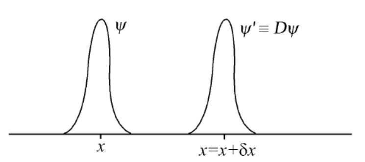
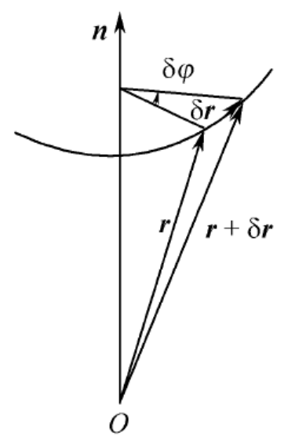

## 第5章 守恒量与对称性

### 5.1 [守恒量](https://cloud.tsinghua.edu.cn/d/20694cb9c0fb44e6894a/files/?p=%2F%E4%B8%93%E4%B8%9A%E5%9F%BA%E7%A1%80%E8%AF%BE%E7%A8%8B%2F%E9%87%8F%E5%AD%90%E5%8A%9B%E5%AD%A6%2F%EF%BC%88%E9%83%AD%E6%B0%B8%EF%BC%89%2F%E8%AF%BE%E4%BB%B6%2F%E7%AC%AC17%E8%AE%B2.pdf)

#### 力学量随时间的演化与守恒量

##### 力学量随时间的演化

对于任意已归一化的波函数 $\psi(\vec{r},t)$ ，力学量 $A$ 的平均值 $\bar{A} = (\psi , \hat{A}\psi)$ ，结合Schrödinger方程 $\hat{H} \psi = \mathrm{i}\hbar \frac{\partial}{\partial t} \psi$ ，可得其随时间的变化

$$
\frac{\mathrm{d}}{\mathrm{d}t} \bar{A}(t)
= \left( \frac{\partial \psi}{\partial t} , \hat{A} \psi \right) + \left( \psi , \hat{A} \frac{\partial \psi}{\partial t} \right) + \left( \psi , \frac{\partial \hat{A}}{\partial t} \psi \right)
\\ \ \\
= \left( \frac{\hat{H} \psi}{\mathrm{i}\hbar} , \hat{A} \psi \right) + \left( \psi , \hat{A} \frac{\hat{H} \psi}{\mathrm{i}\hbar} \right) + \left( \psi , \frac{\partial \hat{A}}{\partial t} \psi \right)
\\ \ \\
= -\frac{1}{\mathrm{i}\hbar} \left( \psi , \hat{H} \hat{A} \psi \right) + \frac{1}{\mathrm{i}\hbar} \left( \psi , \hat{A} \hat{H} \psi \right) + \left( \psi , \frac{\partial \hat{A}}{\partial t} \psi \right)
\\ \ \\
= \frac{1}{\mathrm{i}\hbar} \left( \psi , [\hat{A} , \hat{H}] \psi \right) + \left( \psi , \frac{\partial \hat{A}}{\partial t} \psi \right)
\\ \ \\
= \frac{1}{\mathrm{i}\hbar} \overline{[\hat{A} , \hat{H}]} + \overline{\frac{\partial \hat{A}}{\partial t}}
$$

如果 $\hat{A}$ 不显含 $t$ （以后如不特殊声明，都是指这种力学量），即 $\frac{\partial \hat{A}}{\partial t} = 0$ ，则

$$
\frac{\mathrm{d}}{\mathrm{d}t} \bar{A} = \frac{1}{\mathrm{i}\hbar} \overline{[\hat{A} , \hat{H}]} 
$$

因此，若

$$
[\hat{A} , \hat{H}] = 0
$$

则

$$
\frac{\mathrm{d}}{\mathrm{d}t} \bar{A} = 0
$$

即这种力学量在任何态 $\psi(\vec{r},t)$ 之下的**平均值都不随时间改变**。进一步考虑其概率分布，因为 $[\hat{A} , \hat{H}] = 0$ ，可选择包括 $\hat{H}$ 与 $\hat{A}$ 在内的一组力学量完全集，其共同本征态为 $\psi_k$ ，即

$$
\hat{H} \psi_k = E_k \psi_k
\ , \kern 1em
\hat{A} \psi_k = A_k \psi_k
$$

这样，体系的任何（已归一化的）态 $\psi(\vec{r},t)$ 均可用 $\psi_k$ 展开，即

$$
\psi(\vec{r},t) = \sum_k a_k(t)\psi_k(\vec{r})
$$

展开系数 $a_k(t) = (\psi_k , \psi)$ ，在 $\psi$ 态下， $t$ 时刻测量 $A$ 得 $A_k$ 的概率为 $|a_k(t)|^2$ ，其随时间的变化

$$
\frac{\mathrm{d}}{\mathrm{d}t} |a_k(t)|^2
= \frac{\mathrm{d}}{\mathrm{d}t} [a_k^*(t) a_k(t)]
= a_k(t) \frac{\mathrm{d}a_k^*(t)}{\mathrm{d}t} + a_k^*(t) \frac{\mathrm{d}a_k(t)}{\mathrm{d}t}
\\ \ \\
= (\psi_k , \psi) \left( \frac{\partial \psi}{\partial t} , \psi_k \right)  + 复共轭项
\\ \ \\
= (\psi_k , \psi) \left( \frac{\hat{H} \psi}{\mathrm{i}\hbar} , \psi_k \right)  + 复共轭项
\\ \ \\
= -\frac{1}{\mathrm{i}\hbar} (\psi_k , \psi) (\hat{H} \psi , \psi_k)  + 复共轭项
\\ \ \\
= -\frac{1}{\mathrm{i}\hbar} (\psi_k , \psi) (\psi , \hat{H} \psi_k)  + 复共轭项
\\ \ \\
= -\frac{E_k}{\mathrm{i}\hbar} (\psi_k , \psi) (\psi , \psi_k)  + 复共轭项
\\ \ \\
= -\frac{E_k}{\mathrm{i}\hbar} \left| (\psi_k , \psi) \right|^2  + 复共轭项
\\ \ \\
= 0
$$

故 $A$ 的**概率分布不随时间改变**。

对于Hamilton量 $\hat{H}$ 不含时的量子体系，若 $[\hat{A},\hat{H}]=0$ ，即 $\hat{A}$ 与 $\hat{H}$ **对易**，则在体系的任意态(定态或非定态)上， $A$ 的**平均值及其取值概率分布都不随时间改变**。量子力学把这些在体系的任意状态上的平均值和取值概率分布都不随时间改变的力学量，称为该体系的**守恒量**。

##### 对于守恒量的讨论

###### 对易守恒量完全集

如果体系的Hamilton量不显含时间 $t$ （ $\frac{\partial \hat{H}}{\partial t} = 0$ ），则 $\hat{H}$ 为守恒量，即能量守恒。在这种情况下，若对易力学量完全集中包含有体系的Hamilton量，则完全集中各力学量都是守恒量，称为**对易守恒量完全集**（a complete set of commuting conserved observables，简记为CSCCO）。

包括 $\hat{H}$ 在内的守恒量完全集的共同本征态，当然是**定态**，所相应的量子数为**好量子数**，任意波函数 $\psi$ 在这种展开中，展开系数的模方 $|a_\alpha|^2$ 是不随时间改变的。

*以三维各向同性谐振子为例，CSCCO可取为 $\{ \hat{H} , \hat{L}^2 , \hat{L}_z \}$ （ $\hat{L}_z$ 可用 $\hat{L}_x$ 或 $\hat{L}_y$ 替代）、 $\{ \hat{H}_x , \hat{H}_y , \hat{H}_z \}$ 等。*

###### 守恒量不一定取确定值

与经典力学守恒量不同，量子体系的守恒量并不一定取确定值，即体系的状态并不一定就是某个守恒量的本征态，可以保证的只是守恒量的平均值及其取值概率分布都不随时间改变。

*即使是在定态（能量本征态）上，守恒量也不一定取确定值，定态只能保证能量取确定值。*

若初始时刻体系处于守恒量 $\hat{A}$ 的本征态，则体系将**保持在该本征态**，守恒量将取确定值。由于守恒量具有此特点，它的量子数称为**好量子数**。

若初始时刻体系并不处于守恒量 $\hat{A}$ 的本征态，则以后的状态也不是 $\hat{A}$ 的本征态，但 $\hat{A}$ 的平均值和测值概率的分布不随时间变化。

*量子力学中习惯用描述力学量本征值的量子数来标志状态，但非守恒量的量子数不适合描述状态，只有守恒量的量子数才是描述状态的好量子数。*

###### 体系各守恒量不一定可同时取确定值

由于量子体系的各守恒量只要求与Hamilton量 $\hat{H}$ 对易，而各守恒量之间的对易关系并没有要求，故可能某些守恒量之间不对易，则他们一般来说不能同时取确定值。

###### 定态与守恒量的区别

**定态**是体系的一种特殊的状态，即**能量本征态**；而**守恒量**则是体系的一种特殊的力学量，它与体系的Hamilton量对易。

在**定态**上，**一切力学量**（只要不显含时间 $t$ ，不管是否是守恒量）的平均值和取值概率分布都不随时间变化。

而**守恒量**在**一切状态**上（不管是否是定态）的平均值和取值概率分布都不随时间变化。

#### 能级简并与守恒量的关系

##### 定理

如果体系具有两个互相**不对易的守恒量** $\hat{F},\hat{G}$ ，即 $[\hat{F},\hat{H}] = [\hat{G},\hat{H}] = 0$ 但 $[\hat{F},\hat{G}] \ne 0$ ，那么体系的能级一般是**简并**的。

*在一般情况下，当能级出现简并时，可以根据对体系对称性的分析，找出其守恒量。然后要求能量本征态同时又是包含 $\hat{H}$ 在内的对易守恒量完全集的共同本征态，就可把能级的各简并态标记清楚。*

##### 证明

由于 $[\hat{F},\hat{H}] = 0$ ，则 $\hat{F}$ 与 $\hat{H}$ 可以有共同本征函数 $\psi$ ，

$$
\hat{H} \psi = E \psi
\ , \kern 1em
\hat{F} \psi = \lambda \psi
$$

考虑到 $[\hat{G},\hat{H}] = 0$ ，

$$
\hat{H} (\hat{G} \psi) = \hat{H} \hat{G} \psi = \hat{G} \hat{H} \psi = \hat{G} E \psi = E (\hat{G} \psi)
$$

即 $\hat{G}\psi$ 也是 $\hat{H}$ 对应于本征值 $E$ 的本征态。考虑到 $[\hat{F},\hat{G}] \ne 0$ ，一般说来，

$$
\hat{F} (\hat{G} \psi) = \hat{F} \hat{G} \psi \ne \hat{G} \hat{F} \psi = \hat{G} \lambda \psi = \lambda \hat{G} \psi
$$

即 $\hat{G}\psi$ 不是 $\hat{F}$ 的本征态，而 $\psi$ 是 $\hat{F}$ 的本征态，则 $\hat{G}\psi$ 与 $\psi$ 不是同一个量子态，但他们又同为 $\hat{H}$ 对应于本征值 $E$ 的本征态，故能级是简并的。

##### 推论

如果体系有一个守恒量 $\hat{F}$ ，而体系的某条能级不简并（即对应于某能量本征值 $E$ 只有一个本征态 $\psi_E$ ），则 $\psi_E$ 必为 $\hat{F}$ 的本征态。

这是因为

$$
\hat{H} (\hat{F} \psi_E) = \hat{H} \hat{F} \psi_E = \hat{F} \hat{H} \psi_E = \hat{F} E \psi_E = E (\hat{F} \psi_E)
$$

即 $\psi_E$ 也是 $\hat{H}$ 对应于本征值 $E$ 的本征态，但按假定能级 $E$ 无简并，故 $\hat{F}\psi_E$ 与 $\psi_E$ 为同一个量子态，最多相差一个常数因子 $\lambda$ ，即 $\hat{F} \psi_E = \lambda \psi_E$ ，所以 $\psi_E$ 也是 $\hat{F}$ 的本征态。

##### 特殊情况

对于上述的“一般”，虽然 $[\hat{F},\hat{G}] \ne 0$，但如果 $\hat{F}$ 和 $\hat{G}$ 具有使 $[\hat{F},\hat{G}]\psi_0 = 0$ 的特殊的共同本征态 $\psi_0$ ，则 $\hat{G}\psi_0$ 与 $\psi_0$ 是同一态，与 $\psi_0$ 对应的能级的简并也可消除。（这种情况只有当 $[\hat{F},\hat{G}]$ 不为常数时才有可能发生）

例如：中心力场下， $\hat{\vec{L}}$ 的三个分量 $\hat{L}_x , \hat{L}_y , \hat{L}_z$ 是不对易的，但都是守恒量，所以能级一般是简并的。但对于 $s$ 态（ $l=0$ ）， $L_x , L_y , L_z$ 都取确定值 $0$ ，即 $\hat{L}_x \psi_s = \hat{L}_y \psi_s = \hat{L}_z \psi_s = 0$ ，这样就有 $[\hat{L}_x , \hat{L}_y] \psi_s = [\hat{L}_y , \hat{L}_z] \psi_s = [\hat{L}_z , \hat{L}_x] \psi_s = 0$ ， $\psi_s$ 即为上述的特殊的共同本征态，对应的角动量量子数 $l=0$ 的本征态是非简并的。

#### 位力(virial)定理

位力定理可以描述当体系处于**定态**下时平均值关于时间的变化。

##### 定理

设粒子处于势场 $V(\vec{r})$ 中，Hamilton量为

$$
\hat{H} = \frac{\hat{\vec{p}}^2}{2m} + V(\vec{r})
$$

则粒子的动能算符 $\hat{T} = \hat{\vec{p}}^2 /(2m)$ 在**定态**上的平均值为

$$
\bar{T} = \frac12 \overline{\vec{r} \cdot \nabla V }
$$

##### 证明

先考虑 $\vec{r} \cdot \vec{p}\,$ 的平均值随时间的变化，因 $\frac{\partial}{\partial t} (\hat{\vec{r}}\cdot\hat{\vec{p}})=0$ （这一个假定实际上并不严谨，因为 $\hat{\vec{r}} \cdot \hat{\vec{p}}\,$ 并不是厄米算符，应考虑将其厄米化为 $\frac12(\hat{\vec{r}}\cdot\hat{\vec{p}} + \hat{\vec{p}}\cdot\hat{\vec{r}})$ ，这里为了简化而直接这样假定），借助力学量 $\hat{A}$ 满足的关系式

$$
\frac{\mathrm{d}}{\mathrm{d}t} \bar{A} = \frac{1}{\mathrm{i}\hbar} \overline{[\hat{A} , \hat{H}]} 
$$

可知

$$
\frac{\mathrm{d}}{\mathrm{d}t} \overline{\vec{r}\cdot\vec{p}} = \frac{1}{\mathrm{i}\hbar} \overline{[\hat{\vec{r}}\cdot\hat{\vec{p}} , \hat{H}]}
$$

其中

$$
\overline{[\hat{\vec{r}}\cdot\hat{\vec{p}} , \hat{H}]}
= \overline{[\hat{\vec{r}}\cdot\hat{\vec{p}} , \frac{\hat{\vec{p}}^2}{2m} + V(\vec{r})]}
\\ \ \\
= \frac{1}{2m} \overline{[\hat{\vec{r}}\cdot\hat{\vec{p}} , \hat{\vec{p}}^2]} + \overline{[\hat{\vec{r}}\cdot\hat{\vec{p}} , V(\vec{r})]}
$$

其中的第一个对易关系可通过分量展开考虑

$$
[\hat{\vec{r}}\cdot\hat{\vec{p}} , \hat{\vec{p}}^2]
= \hat{\vec{r}}\cdot [\hat{\vec{p}} , \hat{\vec{p}}^2] + [\hat{\vec{r}} , \hat{\vec{p}}^2] \cdot\hat{\vec{p}}
= [\hat{\vec{r}} , \hat{\vec{p}}^2] \cdot\hat{\vec{p}}
\\ \ \\
= \left( [\hat{x},\hat{p_x^2}] \vec{i} + [\hat{y},\hat{p_y^2}] \vec{j} + [\hat{z},\hat{p_z^2}] \vec{k} \right) \cdot\hat{\vec{p}}
\\ \ \\
= \left\{ \left( \hat{p}_x [\hat{x},\hat{p}_x] + [\hat{x},\hat{p}_x] \hat{p}_x \right)  \vec{i} + \left( \hat{p}_y [\hat{y},\hat{p}_y] + [\hat{y},\hat{p}_y] \hat{p}_y \right) \vec{j} + \left( \hat{p}_z [\hat{z},\hat{p}_z] + [\hat{z},\hat{p}_z] \hat{p}_z \right) \vec{k} \right\} \cdot\hat{\vec{p}}
\\ \ \\
= 2\mathrm{i} \hbar \left( \hat{p}_x \vec{i} + \hat{p}_y \vec{j} + \hat{p}_z \vec{k} \right) \cdot\hat{\vec{p}}
\\ \ \\
= 2\mathrm{i} \hbar \hat{\vec{p}}^2
$$

第二个对易关系可通过在坐标表象下作用波函数考虑

$$
[\hat{\vec{r}}\cdot\hat{\vec{p}} , V(\vec{r})] \psi
= -\mathrm{i} \hbar [\vec{r}\cdot\nabla , V(\vec{r})] \psi
\\ \ \\
= -\mathrm{i} \hbar \vec{r}\cdot [\nabla , V(\vec{r})] \psi -\mathrm{i} \hbar [\vec{r} , V(\vec{r})] \cdot\nabla \psi
\\ \ \\
= -\mathrm{i} \hbar \vec{r}\cdot \left\{ \nabla\left(V(\vec{r})\psi\right) - V(\vec{r}) \nabla\psi \right\}
\\ \ \\
= -\mathrm{i} \hbar \vec{r}\cdot \left( \nabla V(\vec{r}) \right) \psi
$$

故

$$
\overline{[\hat{\vec{r}}\cdot\hat{\vec{p}} , \hat{H}]}
= \frac{1}{2m} \overline{[\hat{\vec{r}}\cdot\hat{\vec{p}} , \hat{\vec{p}}^2]} + \overline{[\hat{\vec{r}}\cdot\hat{\vec{p}} , V(\vec{r})]}
\\ \ \\
= \frac{1}{2m} \overline{2\mathrm{i} \hbar \vec{p}^2} + \overline{-\mathrm{i} \hbar \vec{r}\cdot \nabla V(\vec{r})}
\\ \ \\
= \mathrm{i} \hbar \left[ 2 \overline{\frac{\vec{p}^2}{2m}} - \overline{\vec{r}\cdot\nabla V(\vec{r})} \right]
\\ \ \\
= \mathrm{i} \hbar \left[ 2 \overline{T} - \overline{\vec{r}\cdot\nabla V(\vec{r})} \right]
$$

对于定态，有

$$
\frac{\mathrm{d}}{\mathrm{d}t} \overline{\vec{r}\cdot\vec{p}} = 0
$$

故

$$
2 \overline{T} - \overline{\vec{r}\cdot\nabla V(\vec{r})} = 0
$$

##### 推论

若 $V(\vec{r})$ 是 $x,y,z$ 的 $n$ 次齐次函数，即 $V(cx,cy,cz) = c^n V(x,y,z)$  ， $c$ 为常数，则

$$
\vec{r}\cdot\nabla V(\vec{r}) = n V(\vec{r})
$$

*证明可见[杨利军老师微积分A2第二次习题课](https://cloud.tsinghua.edu.cn/d/20694cb9c0fb44e6894a/files/?p=%2F%E6%95%B0%E5%AD%A6%E4%B8%8E%E8%87%AA%E7%84%B6%E7%A7%91%E5%AD%A6%E5%9F%BA%E7%A1%80%E8%AF%BE%2F%E5%BE%AE%E7%A7%AF%E5%88%86A(2)%2F%E4%B9%A0%E9%A2%98%E8%AF%BE%EF%BC%88%E6%9D%A8%E5%88%A9%E5%86%9B%EF%BC%89%2F%E7%AC%AC%E4%BA%8C%E6%AC%A1%E4%B9%A0%E9%A2%98%E8%AF%BE%E8%AE%A8%E8%AE%BA%E9%A2%98%E8%A7%A3%E7%AD%94.pdf)第6题。*

故

$$
2 \bar{T} = n \bar{V}
$$

如对于谐振子势 $V(\vec{r}) = \frac12 m\omega^2 r^2 $ ， $n=2$ ，则 $\bar{T} = \bar{V}$ ；对于库仑势 $V(\vec{r}) = -\frac{kZe^2}{r}$ ， $n=-1$ ，则 $\bar{T} = -\frac12 \bar{V}$ ， $\bar{E} = \bar{T} + \bar{V} = \frac12 \bar{V}$ 。

### 5.2 [Schrödinger图像、Heisenberg图像与相互作用图像](https://cloud.tsinghua.edu.cn/d/20694cb9c0fb44e6894a/files/?p=%2F%E4%B8%93%E4%B8%9A%E5%9F%BA%E7%A1%80%E8%AF%BE%E7%A8%8B%2F%E9%87%8F%E5%AD%90%E5%8A%9B%E5%AD%A6%2F%EF%BC%88%E9%83%AD%E6%B0%B8%EF%BC%89%2F%E8%AF%BE%E4%BB%B6%2F%E7%AC%AC18%E8%AE%B2.pdf)

这里的**图像**(picture)也叫**绘景**，亦称**表象**(representation)。由于状态和力学量本身并不能直接测量，能直接测量的是力学量的平均值，因此可以用不同方式描述**状态和力学量随时间的演化**，只要保证力学量的平均值不因描述方式的不同而改变取值即可。

#### Schrödinger图像

##### 描述方式

**态矢** $\psi(t)$ **随时间演化**，其变化遵守Schrödinger方程，**力学量算符**（不显含时间 $t$ ）**与时间无关**，即把力学量平均值及测值概率分布随时间的演化完全归之于波函数的演化，这种描述方式称为**Schrödinger图像**。即

$$
\bar{A}(t) = (\psi(t) , \hat{A} \psi(t))
$$

其中 $\psi(t)$ 满足Schrödinger方程

$$
\mathrm{i}\hbar \frac{\partial}{\partial t} \psi(t) = \hat{H} \psi(t)
$$

由此可以得到

$$
\frac{\mathrm{d}}{\mathrm{d}t} \bar{A}(t) = \frac{1}{\mathrm{i}\hbar} \overline{[\hat{A},\hat{H}]}
$$

##### 特点

* 力学量完全集的共同本征态不随时间变化，即有不变的基矢；

* 任何一个力学量（不显含时间）在这组基矢之间的矩阵元也不随时间变化；

* 态矢在这些基矢方向的投影随时间变化。
  
  

#### Heisenberg图像

##### 描述方式

**态矢** $\psi$ **不随时间变化**，而**力学量算符随时间变化**，其变化遵守Heisenberg方程，即把力学量平均值及测值概率分布随时间的演化完全归之于算符的演化，这种描述方式称为**Heisenberg图像**。即

$$
\bar{A}(t) = (\psi(0) , \hat{A}(t) \psi(0))
$$

其中 $\hat{A}(t)$ 满足**Heisenberg方程**

$$
\frac{\mathrm{d}}{\mathrm{d}t} \hat{A}(t) = \frac{1}{\mathrm{i}\hbar} [\hat{A}(t) , \hat{H}]
$$

引入时间演化算符 $\hat{U}(t,0) = \exp(-\frac{\mathrm{i}}{\hbar}\hat{H}t)$ ，表示时间从 $0$ 变为 $t$ 时状态的变化，即 $\hat{U}(t,0) \psi(0) = \psi(t)$ ，则 $\hat{A}(t)$ 可表示为

$$
\hat{A}(t)
= \hat{U}(t,0)^+\ \hat{A}\ \hat{U}(t,0)
= \mathrm{e}^{\frac{\mathrm{i}}{\hbar}\hat{H}t}\ \hat{A}\ \mathrm{e}^{-\frac{\mathrm{i}}{\hbar}\hat{H}t}
$$

##### 特点

* 力学量完全集的共同本征态随时间变化，即有变化的基矢；

* 任何一个力学量在这组基矢之间的矩阵元一般也随时间变化。

##### 表达式的推导

对于Schrödinger方程

$$
\mathrm{i}\hbar \frac{\partial}{\partial t} \psi(t) = \hat{H} \psi(t)
$$

当 $\hat{H}$ 不显含 $t$ 时，考虑到解 $\psi(t)$ 可以形式上表示为

$$
\psi(t) = \hat{U}(t,0) \psi(0)
$$

其中 $\hat{U}(t_2,t_1)$ 称为时间演化算符，表示从 $t_1$ 时刻的状态变化为 $t_2$ 时刻的状态，易知 $\hat{U}(0,0) = 1$ 。将上式代入Schrödinger方程，得

$$
\mathrm{i}\hbar \frac{\partial}{\partial t} \hat{U}(t,0) \psi(0) = \hat{H} \hat{U}(t,0) \psi(0)
$$

由于 $\psi(0)$ 是任意的，故可以从上式两侧除去，则

$$
\mathrm{i}\hbar \frac{\partial}{\partial t} \hat{U}(t,0) = \hat{H} \hat{U}(t,0)
$$

结合初始条件 $\hat{U}(0,0) = 1$ ，解得

$$
\hat{U}(t,0) = \mathrm{e}^{-\frac{\mathrm{i}}{\hbar}\hat{H}t}
$$

可以验证 $\hat{U}(t,0)$ 是幺正算符，即

$$
\hat{U}(t,0)^+ \hat{U}(t,0) = \hat{U}(t,0) \hat{U}(t,0)^+ = I
$$

从而可以保证概率守恒

$$
(\ \psi(t) , \psi(t)\ )
= (\ \hat{U}(t,0)\psi(0) , \hat{U}(t,0)\psi(0)\ )
= (\ \psi(0) , \hat{U}(t,0)^+\hat{U}(t,0)\psi(0)\ )
= (\ \psi(0) , \psi(0)\ )
$$

考虑力学量 $A$ 的平均值，从Schrödinger图像中的表达式开始推导，即

$$
\bar{A}(t)
= (\ \psi(t) , \hat{A} \psi(t)\  )
\\ \ \\
= (\ \hat{U}(t,0)\psi(0) , \hat{A}\hat{U}(t,0)\psi(0)\  )
\\ \ \\
= (\ \psi(0) , \hat{U}(t,0)^+\hat{A}\hat{U}(t,0)\psi(0)\  )
\\ \ \\
= (\ \psi(0) , \hat{A}(t)\psi(0)\  )
$$

其中

$$
\hat{A}(t)
= \hat{U}(t,0)^+\ \hat{A}\ \hat{U}(t,0)
= \mathrm{e}^{\frac{\mathrm{i}}{\hbar}\hat{H}t}\ \hat{A}\ \mathrm{e}^{-\frac{\mathrm{i}}{\hbar}\hat{H}t}
$$

考虑其随时间的变化（在下式推导中，用到了 $\hat{U}\hat{U}^+ = I\ ,\ \hat{U}^+\hat{H}\hat{U} = \hat{H}\ ,\ \hat{U}^+\hat{A}\hat{U} = \hat{A}(t)$ ）

$$
\frac{\mathrm{d}}{\mathrm{d}t} \hat{A}(t)
= \left[ \frac{\mathrm{d}}{\mathrm{d}t} \hat{U}(t,0)^+ \right] \hat{A}\ \hat{U}(t,0) + \hat{U}(t,0)^+\ \hat{A} \left[ \frac{\mathrm{d}}{\mathrm{d}t} \hat{U}(t,0) \right]
\\ \ \\
= \frac{1}{\mathrm{i}\hbar} \left( -\hat{U}^+\hat{H}\hat{A}\hat{U} + \hat{U}^+\hat{A}\hat{H}\hat{U} \right)
\\ \ \\
= \frac{1}{\mathrm{i}\hbar} \left( -\hat{U}^+\hat{H}\hat{U}\hat{U}^+\hat{A}\hat{U} + \hat{U}^+\hat{A}\hat{U}\hat{U}^+\hat{H}\hat{U} \right)
\\ \ \\
= \frac{1}{\mathrm{i}\hbar} \left( -\hat{H}\hat{A}(t) + \hat{A}(t)\hat{H} \right)
\\ \ \\
= \frac{1}{\mathrm{i}\hbar} [\hat{A}(t) , \hat{H}]
$$

##### Heisenberg图像与Schrödinger图像的关系

将Schrödinegr图像中的态与算符分别用 $\psi^{(S)},\hat{A}^{(S)}$ 表示，将Heisenberg图像中的态与算符分别用 $\psi^{(H)},\hat{A}^{(H)}$ 表示，则

$$
\psi^{(H)} = \mathrm{e}^{\frac{\mathrm{i}}{\hbar}\hat{H}t}\ \psi^{(S)}(t) = \psi^{(S)}(0)
\\ \ \\
\hat{A}^{(H)}(t) = \mathrm{e}^{\frac{\mathrm{i}}{\hbar}\hat{H}t}\ \hat{A}^{(S)}\ \mathrm{e}^{-\frac{\mathrm{i}}{\hbar}\hat{H}t}
$$

在Schrödinegr图像与Heisenberg图像中守恒量算符的形式相同，如 $\hat{H}^{(S)} = \hat{H}^{(H)}$ 。

#### 相互作用图像(interaction picture)

##### 描述方式

将Hamilton算符表示为两个算符之和，即

$$
\hat{H} = \hat{H}_0 + \hat{H}_I(t)
$$

其中 $\hat{H}_0$ 为体系本身（与外界无相互作用情况下）的Hamilton量，不显含时间； $\hat{H}_I(t)$ 表示体系与外界的相互作用。此时的时间演化算符可表示为 $\hat{U}_0(t,0) = \exp(-\frac{\mathrm{i}}{\hbar}\hat{H}_0t)$ 。

与Schrödinger图像相比，相互作用图像中的态与算符分别表示为

$$
\psi^{(I)}(t)
= \hat{U}_0^+(t,0)\ \psi^{(S)}(t)
= \mathrm{e}^{\frac{\mathrm{i}}{\hbar}\hat{H}_0t}\ \psi^{(S)}(t)
\\ \ \\
\hat{A}^{(I)}(t)
= \hat{U}_0^+(t,0)\ \hat{A}^{(S)}\ \hat{U}_0(t,0)
= \mathrm{e}^{\frac{\mathrm{i}}{\hbar}\hat{H}_0t}\ \hat{A}^{(S)}\ \mathrm{e}^{-\frac{\mathrm{i}}{\hbar}\hat{H}_0t}
$$

态 $\psi^{(I)}(t)$ 满足方程

$$
\mathrm{i}\hbar \frac{\partial}{\partial t} \psi^{(I)}(t) = \hat{H}_I^{(I)}(t) \psi^{(I)}(t)
$$

算符 $\hat{A}^{(I)}(t)$ 满足方程

$$
\frac{\mathrm{d}}{\mathrm{d}t} \hat{A}^{(I)}(t) = \frac{1}{\mathrm{i}\hbar} [\hat{A}^{(I)}(t) , \hat{H}_0]
$$

力学量 $A$ 的平均值表示为

$$
\bar{A}(t) = (\ \psi^{(I)}(t) , \hat{A}^{(I)}(t) \psi^{(I)}(t)\ )
$$

##### 特点

* 态矢 $\psi^{(I)}(t)$ 和力学量算符 $\hat{A}^{(I)}(t)$ 都随时间演化，力学量平均值及测值概率分布随时间的演化受到二者的共同影响；

* 态矢的演化由相互作用 $\hat{H}_I(t)$ 来支配，而力学量算符随时间的演化由 $\hat{H}_0$ 支配；

* 相互作用图像介于Schrödinger图像和Heisenberg图像之间，在用微扰论来处理问题时有广泛的应用。

##### 表达式的推导

首先考虑态 $\psi^{(I)}(t)$ ，有

$$
\mathrm{i}\hbar \frac{\partial}{\partial t} \psi^{(I)}(t)
= \mathrm{i}\hbar \frac{\partial}{\partial t} \left[ \hat{U}_0^+(t,0)\ \psi^{(S)}(t) \right]
\\ \ \\
= \left( \mathrm{i}\hbar \frac{\partial}{\partial t} \mathrm{e}^{\frac{\mathrm{i}}{\hbar}\hat{H}_0t} \right) \psi^{(S)}(t) + \hat{U}_0^+(t,0) \left[ \mathrm{i}\hbar \frac{\partial}{\partial t} \psi^{(S)}(t) \right]
\\ \ \\
= -\left( \mathrm{e}^{\frac{\mathrm{i}}{\hbar}\hat{H}_0t} \hat{H}_0 \right) \psi^{(S)}(t) + \hat{U}_0^+(t,0) \left[ \hat{H} \psi^{(S)}(t) \right]
\\ \ \\
= \hat{U}_0^+(t,0) \left( \hat{H} - \hat{H}_0 \right) \psi^{(S)}(t)
\\ \ \\
= \hat{U}_0^+(t,0) \hat{H}_I(t) \psi^{(S)}(t)
\\ \ \\
= \hat{U}_0^+(t,0) \hat{H}_I(t) \hat{U}_0(t,0)\ \hat{U}_0^+(t,0) \psi^{(S)}(t)
\\ \ \\
= \hat{H}_I^{(I)}(t) \psi^{(I)}(t)
$$

对于力学量算符 $\hat{A}^{(I)}(t)$ ，有

$$
\frac{\mathrm{d}}{\mathrm{d}t} \hat{A}^{(I)}(t)
= \left[ \frac{\mathrm{d}}{\mathrm{d}t} \hat{U}_0(t,0)^+ \right] \hat{A}\ \hat{U}_0(t,0) + \hat{U}_0(t,0)^+\ \hat{A} \left[ \frac{\mathrm{d}}{\mathrm{d}t} \hat{U}_0(t,0) \right]
\\ \ \\
= \frac{1}{\mathrm{i}\hbar} \left( -\hat{U}_0^+\hat{H}_0\hat{A}\hat{U}_0 + \hat{U}_0^+\hat{A}\hat{H}_0\hat{U}_0 \right)
\\ \ \\
= \frac{1}{\mathrm{i}\hbar} \left( -\hat{U}_0^+\hat{H}_0\hat{U}_0\hat{U}_0^+\hat{A}\hat{U}_0 + \hat{U}_0^+\hat{A}\hat{U}_0\hat{U}_0^+\hat{H}_0\hat{U}_0 \right)
\\ \ \\
= \frac{1}{\mathrm{i}\hbar} \left( -\hat{H}_0\hat{A}^{(I)}(t) + \hat{A}^{(I)}(t)\hat{H}_0 \right)
\\ \ \\
= \frac{1}{\mathrm{i}\hbar} [\hat{A}^{(I)}(t) , \hat{H}_0]
$$

对于力学量 $A$ 的平均值，有

$$
\bar{A}(t)
= (\ \psi^{(S)}(t) , \hat{A} \psi^{(S)}(t)\  )
\\ \ \\
= (\ \hat{U}_0(t,0)\psi^{(I)}(t) , \hat{A}\hat{U}_0(t,0)\psi^{(I)}(t)\  )
\\ \ \\
= (\ \psi^{(I)}(t) , \hat{U}_0(t,0)^+\hat{A}\hat{U}_0(t,0)\psi^{(I)}(t)\  )
\\ \ \\
= (\ \psi^{(I)}(t) , \hat{A}^{(I)}(t)\psi^{(I)}(t)\  )
$$

### 5.3 [时空对称性](https://cloud.tsinghua.edu.cn/d/20694cb9c0fb44e6894a/files/?p=%2F%E4%B8%93%E4%B8%9A%E5%9F%BA%E7%A1%80%E8%AF%BE%E7%A8%8B%2F%E9%87%8F%E5%AD%90%E5%8A%9B%E5%AD%A6%2F%EF%BC%88%E9%83%AD%E6%B0%B8%EF%BC%89%2F%E8%AF%BE%E4%BB%B6%2F%E7%AC%AC19%E8%AE%B2.pdf)

#### 守恒量与对称性的关系

##### 不变性的数学表达

设体系的状态用 $\psi$ 描述， $\psi$ 随时间的演化遵守Schrödinger方程

$$
\mathrm{i}\hbar \frac{\partial}{\partial t} \psi = \hat{H} \psi
$$

考虑某种不显含 $t$ 的可逆线性变换 $\hat{Q}$ ，在此变换下有

$$
\psi' = \hat{Q} \psi
$$

**体系对于变换的不变性**表现为 $\psi$ 与 $\psi'$ 遵守**相同形式的运动方程**，即要求 $\psi'$ 也遵守

$$
\mathrm{i}\hbar \frac{\partial}{\partial t} \psi' = \hat{H} \psi'
$$

即

$$
\mathrm{i}\hbar \frac{\partial}{\partial t} \hat{Q}\psi = \hat{H} \hat{Q}\psi
$$

两边同时用 $\hat{Q}^{-1}$ 作用，可得

$$
\mathrm{i}\hbar \frac{\partial}{\partial t} \psi = \hat{Q}^{-1}\hat{H}\hat{Q} \psi
$$

与Schrödinger方程相比较，可知 $\hat{Q}^{-1}\hat{H}\hat{Q} = \hat{H}$ ，即 $\hat{H}\hat{Q} = \hat{Q}\hat{H}$ ，或表示成

$$
[ \hat{Q} , \hat{H} ] = 0
$$

这就是体系（Hamilton量）在变换 $\hat{Q}$ 下的**不变性**的数学表达（若 $\hat{Q}$ 为厄米算符，即表示一个力学量，就可以得到力学量 $Q$ 为守恒量），凡满足该式的变换，称为体系的**对称性变换**。

考虑到概率守恒，即 $(\psi',\psi') = (\psi,\psi)$ ，而

$$
(\psi',\psi') = (\hat{Q}\psi,\hat{Q}\psi) = (\psi,\hat{Q}^+\hat{Q}\psi)
$$

故 $\hat{Q}$ 应为**幺正算符**，即

$$
\hat{Q}^+\hat{Q} = \hat{Q}^+\hat{Q} = \hat{I}
$$

##### 连续变换的无穷小算符

对于连续变换，可以考虑其为连续的无穷小变换，令

$$
\hat{Q} = \hat{I} + \mathrm{i}\varepsilon\hat{F}
$$

其中 $\varepsilon \to 0^+$ ，是刻画无穷小变化的实参量，因为 $Q$ 为幺正算符，故

$$
\hat{Q}^+\hat{Q}
= \left( \hat{I} - \mathrm{i}\varepsilon\hat{F}^+ \right) \left( \hat{I} + \mathrm{i}\varepsilon\hat{F} \right)
\\ \ \\
= \hat{I} + \mathrm{i}\varepsilon \left( \hat{F} - \hat{F}^+ \right) + O(\varepsilon^2)
= \hat{I}
$$

即要求

$$
\hat{F} = \hat{F}^+
$$

则 $\hat{F}$ 为**厄米算符**，称为变换 $\hat{Q}$ 的**无穷小算符**(infinitesimal operator)，由于其为厄米算符，可用它来定义一个与 $\hat{Q}$ 变换相联系的力学量。将体系在 $\hat{Q}$ 变换下的不变性的数学表达 $[\hat{Q},\hat{H}] = 0$ 应用到无穷小变换，可得

$$
[ \hat{F} , \hat{H} ] = 0
$$

由此可知 $F$ 为体系的一个**守恒量**。

##### 注：对称性变换更普遍的理解

*此部分仅为注解。*

更普遍来讲，如果一个变换不改变体系的各物理量的相互关系，则称为体系的一个对称性变换。

设体系的某一状态用 $\psi$ 描述，经过某变换后用 $\psi'$ 来描述，同样，体系的另一个状态 $\phi$ 经过同样的变换变为了 $\phi'$ ，如果该变换是对称性变换，按量子力学统计诠释，必须要求

$$
|(\psi,\phi)| = |(\psi',\phi')|
$$

基于此要求，Winger指出：对称性变换只能是幺正变换或反幺正变换。对于连续变换，它们总可以从恒等变换出发，连续地经历无穷小变换来实现，这种变换只能是幺正变换。

一个体系若存在一个守恒量，则反映体系有某种对称性，反之，不一定成立。Winger还指出：对于幺正变换对称性，的确存在相应的守恒量，但对于反幺正变换对称性，如时间反演不变性，并不存在相应的守恒量。

#### 时空变换对称性与守恒量

##### 空间反射对称性与宇称守恒

*这里使用一维的情形进行讨论，对应的坐标算符为 $\hat{x}$ ，动量算符为 $\hat{p}$ 。*

###### 变换对态与算符的作用

空间反射算符为 $\hat{P}$ ，对态的空间反射变换为

$$
\hat{P} \psi(x) = \psi(-x)
$$

对算符 $\hat{F}(\hat{x},\hat{p})$ 的作用为

$$
\hat{P} \hat{F}(\hat{x},\hat{p}) \hat{P}^+ = \hat{F}(-\hat{x},-\hat{p})
$$

证明如下：

设算符 $\hat{F}(\hat{x},\hat{p})$ 对态 $\psi(x)$ 的作用为

$$
\hat{F}(\hat{x},\hat{p}) \psi(x) = \phi(x)
$$

做空间反射变换可得

$$
\hat{P} \hat{F}(\hat{x},\hat{p}) \psi(x) = \hat{P} \phi(x)
$$

其中

$$
\hat{P} \hat{F}(\hat{x},\hat{p}) \psi(x) = \hat{F}(-\hat{x},-\hat{p}) \psi(-x)
$$

已知 $\hat{P}$ 为幺正算符，故又有

$$
\hat{P} \hat{F}(\hat{x},\hat{p}) \psi(x)
= \hat{P} \hat{F}(\hat{x},\hat{p}) \hat{P}^+ \hat{P} \psi(x)
= \hat{P} \hat{F}(\hat{x},\hat{p}) \hat{P}^+ \psi(-x)
$$

两者对比有

$$
\hat{P} \hat{F}(\hat{x},\hat{p}) \hat{P}^+ = \hat{F}(-\hat{x},-\hat{p})
$$

###### 守恒量与对称性的关系

如果Hamilton量空间反射不变，即

$$
[ \hat{P} , \hat{H} ] = 0
$$

则体系具有**空间反射对称性**，此时体系的**宇称守恒**。

##### 空间平移对称性与动量守恒

*这里使用一维的情形进行讨论，对应的坐标算符为 $\hat{x}$ ，动量算符为 $\hat{p}$ 。*

###### 变换的数学表示

考虑体系沿 $x$ 方向的无穷小平移，即 $x \to x' = x + \delta x$ ，描述体系的波函数 $\psi$ 变换如下

$$
\psi' = \hat{D}(\delta x) \psi
$$

无穷小平移变换 $\hat{D}(\delta x)$ 为幺正变换，即 $\hat{D}^+(\delta x) = \hat{D}^{-1}(\delta x)$ ，其数学表示与动量 $\hat{p}$ 相联系，为

$$
\hat{D}(\delta x) = \mathrm{e}^{-\frac{\mathrm{i}}{\hbar}\delta x \hat{p}}
$$

证明如下：

对任意态 $\psi$ 做平移得到 $\psi'$ ，物理上对 $x$ 的平均值有以下要求

$$
\int_{-\infty}^{+\infty} \psi'^*(x) x \psi'(x) \mathrm{d}x
= \int_{-\infty}^{+\infty} \psi^*(x) x \psi(x) \mathrm{d}x + \delta x
\\ \ \\
= \int_{-\infty}^{+\infty} \psi^*(x) (x+\delta x) \psi(x) \mathrm{d}x
\\ \ \\
= \int_{-\infty}^{+\infty} \psi^*(x-\delta x) x \psi(x-\delta x) \mathrm{d}x
$$

由此可知

$$
\psi'(x) = \psi(x-\delta x)
$$

即 $\hat{D}(\delta x) \psi(x) = \psi(x-\delta x)$ ，对其在 $x$ 处做泰勒展开可得

$$
\hat{D}(\delta x) \psi(x)
= \sum_{n=0}^{+\infty} \frac{(-\delta x)^n}{n!} \frac{\partial^n \psi(x)}{\partial x^n}
= \mathrm{e}^{-\delta x \frac{\partial}{\partial x}} \psi(x)
$$

因为 $\psi(x)$ 是任意的，结合 $\hat{p} = -\mathrm{i}\hbar \frac{\partial}{\partial x}$ ，可得

$$
\hat{D}(\delta x) = \mathrm{e}^{-\frac{\mathrm{i}}{\hbar}\delta x \hat{p}}
$$

取厄米共轭可得

$$
\hat{D}^+(\delta x) = \left( \mathrm{e}^{-\frac{\mathrm{i}}{\hbar}\delta x \hat{p}} \right)^+
\\ \ \\
= \left[ \sum_{n=0}^{+\infty} \frac{1}{n!} ( -\frac{\mathrm{i}}{\hbar}\delta x )^n \hat{p}^n \right]^+
\\ \ \\
= \sum_{n=0}^{+\infty} \frac{1}{n!} ( \frac{\mathrm{i}}{\hbar}\delta x )^n \hat{p}^n
\\ \ \\
= \mathrm{e}^{\frac{\mathrm{i}}{\hbar}\delta x \hat{p}}
\\ \ \\
= \hat{D}^{-1}(\delta x)
$$

即 $\hat{D}(\delta x)$ 为幺正变换。

###### 变换对态与算符的作用

$$
\hat{D}(\delta x) \psi(x) = \mathrm{e}^{-\frac{\mathrm{i}}{\hbar}\delta x \hat{p}}\psi(x) = \psi(x-\delta x)
$$

$$
\hat{D}(\delta x)\hat{F}\hat{D}^+(\delta x) = \mathrm{e}^{-\frac{\mathrm{i}}{\hbar}\delta x \hat{p}} \hat{F} \mathrm{e}^{\frac{\mathrm{i}}{\hbar}\delta x \hat{p}}
$$

###### 守恒量与对称性的关系

如果Hamilton量空间平移不变，即

$$
[ \hat{D} , \hat{H} ] = 0
$$

则体系具有**空间平移对称性**，此时体系的**动量守恒**。

这是因为

$$
\ [ \hat{D} , \hat{H} ] = 0
\\ \Downarrow \\
\ [ \sum_{n=0}^{+\infty} \frac{1}{n!} ( -\frac{\mathrm{i}}{\hbar}\delta x )^n \hat{p}^n , \hat{H} ] = 0
\\ \Downarrow \\
\ \sum_{n=0}^{+\infty} \frac{1}{n!} ( -\frac{\mathrm{i}}{\hbar}\delta x )^n [ \hat{p}^n , \hat{H} ] = 0
\\ \Downarrow \\
\ [ \hat{p} , \hat{H} ] = 0
$$

##### 空间转动对称性与角动量守恒

###### 变换的数学表示

考虑体系绕 $\vec{n}\,$ 方向的无穷小转动，即 $\varphi \to \varphi' = \varphi + \delta \varphi$ ，描述体系的波函数 $\psi$ 变换如下

$$
\psi' = \hat{R}(\delta \varphi\ \vec{n}) \psi
$$

无穷小转动变换 $\hat{R}(\delta \varphi\ \vec{n})$ 为幺正变换，即 $\hat{R}^+(\delta \varphi\ \vec{n}) = \hat{R}^{-1}(\delta \varphi\ \vec{n})$ ，其数学表示与角动量 $\hat{L}$ 相联系，为

$$
\hat{R}(\delta \varphi\ \vec{n}) = \mathrm{e}^{-\frac{\mathrm{i}}{\hbar}\delta \varphi\ \vec{n} \cdot \hat{\vec{L}}}
$$

如果 $\vec{n}\,$ 取为 $z$ 轴方向，则无限小转动变换的算符为

$$
\hat{R}(\delta \varphi) = \mathrm{e}^{-\frac{\mathrm{i}}{\hbar}\delta \varphi \hat{L}_z}
$$

###### 变换对态与算符的作用

以 $\vec{n}\,$ 取为 $z$ 轴方向为例：

$$
\hat{R}(\delta \varphi) \psi(\varphi) = \mathrm{e}^{-\frac{\mathrm{i}}{\hbar}\delta \varphi \hat{L}_z} \psi(\varphi) = \psi(\varphi-\delta \varphi)
$$

$$
\hat{R}(\delta \varphi) \hat{F}(\varphi) \hat{R}^+(\delta \varphi) = \mathrm{e}^{-\frac{\mathrm{i}}{\hbar}\delta \varphi \hat{L}_z} \hat{F}(\varphi) \mathrm{e}^{\frac{\mathrm{i}}{\hbar}\delta \varphi \hat{L}_z}
$$

###### 守恒量与对称性的关系

如果Hamilton量空间转动不变，即

$$
[ \hat{R} , \hat{H} ] = 0
$$

则体系具有**空间转动对称性**，此时体系的**角动量守恒**，即

$$
[ \hat{\vec{L}} , \hat{H} ] = 0
$$

##### 时间平移不变性与能量守恒

考虑将时间停滞一段 $\tau$ 的变换

$$
\hat{D}(\tau) \psi(t) = \psi(t+\tau)
$$

这称为**时间平移变换**（属于连续变换），算符

$$
\hat{D}(\tau) = \mathrm{e}^{\tau \frac{\partial}{\partial t}}
$$

如果Hamilton量时间平移不变，即

$$
\hat{D}(\tau) \hat{H} \hat{D}^+(\tau) = \hat{H}
$$

此即 $[\hat{D}(\tau) , \hat{H}] = 0$ ，则Hamilton量不显含时间，即体系的**能量守恒**。证明如下：

$$
\left[ \hat{D}(\tau) , \hat{H} \right] = 0
\\ \Downarrow \\
\left[ \mathrm{e}^{\tau \frac{\partial}{\partial t}} , \hat{H} \right] = 0
\\ \Downarrow \\
\left[ \sum_{n=0}^{+\infty} \frac{\tau^n}{n!} \frac{\partial^n}{\partial t^n} , \hat{H} \right] = 0
\\ \Downarrow \\
\sum_{n=0}^{+\infty} \frac{\tau^n}{n!} \left[ \frac{\partial^n}{\partial t^n} , \hat{H} \right] = 0
\\ \Downarrow \\
\left[ \frac{\partial}{\partial t} , \hat{H} \right] = 0
\\ \Downarrow \\
\left[ \frac{\partial}{\partial t} , \hat{H} \right] \psi
= \frac{\partial}{\partial t} (\hat{H} \psi) - \hat{H} \frac{\partial}{\partial t} \psi
= \psi \frac{\partial \hat{H}}{\partial t}
= 0
\\ \Downarrow \\
\frac{\partial \hat{H}}{\partial t} = 0
$$

此时可以证明时间平移变换可以表示为

$$
\hat{D}(\tau) = \mathrm{e}^{-\frac{\mathrm{i}}{\hbar} \tau \hat{H}}
$$

即与时间平移变换相联系的力学量是能量。证明如下

根据Schrödinger方程

$$
\mathrm{i}\hbar \frac{\partial}{\partial t} \psi = \hat{H} \psi
$$

可知

$$
\frac{\partial}{\partial t} \psi = \frac{1}{\mathrm{i}\hbar} \hat{H} \psi
$$

归纳可得

$$
\frac{\partial^n}{\partial t^n} \psi = \left( \frac{1}{\mathrm{i}\hbar} \hat{H} \right)^n \psi
$$

这是因为在已知对 $n-1$ 成立的条件下，有

$$
\frac{\partial^n}{\partial t^n} \psi
= \frac{\partial}{\partial t} \left[ \left( \frac{1}{\mathrm{i}\hbar} \hat{H} \right)^{n-1} \psi \right]
\\ \ \\
= \left( \frac{1}{\mathrm{i}\hbar} \hat{H} \right)^{n-1} \frac{\partial \psi}{\partial t} + \psi \frac{\partial}{\partial t} \left( \frac{1}{\mathrm{i}\hbar} \hat{H} \right)^{n-1}
\\ \ \\
= \left( \frac{1}{\mathrm{i}\hbar} \hat{H} \right)^{n-1} \frac{1}{\mathrm{i}\hbar} \hat{H} \psi + \psi \left( \frac{1}{\mathrm{i}\hbar}\right)^{n-1}  (n-1) \hat{H}^{n-2} \frac{\partial \hat{H}}{\partial t}
\\ \ \\
= \left( \frac{1}{\mathrm{i}\hbar} \hat{H} \right)^n \psi
$$

### 5.4 [全同粒子体系](https://cloud.tsinghua.edu.cn/d/20694cb9c0fb44e6894a/files/?p=%2F%E4%B8%93%E4%B8%9A%E5%9F%BA%E7%A1%80%E8%AF%BE%E7%A8%8B%2F%E9%87%8F%E5%AD%90%E5%8A%9B%E5%AD%A6%2F%EF%BC%88%E9%83%AD%E6%B0%B8%EF%BC%89%2F%E8%AF%BE%E4%BB%B6%2F%E7%AC%AC20%E8%AE%B2.pdf)

#### 全同粒子体系的交换对称性

##### 全同粒子

###### 全同粒子的定义

在量子力学中，把属于同一类的例子成为**全同**(identical)**粒子**，它们具有完全相同的内禀属性，包括静质量、电荷、自旋、磁矩、寿命等。

###### 全同粒子的说明

- 量子力学中，由于**态的量子化**，两个量子态要么完全相同，要么完全不同，中间无连续过度，因此与经典力学的连续变化不同，具有全同粒子的问题。

- 当两个全同粒子的波函数在空间中发生重叠的时候，我们无法区分哪个是“第一个”粒子，哪个是“第二个”粒子。所以全同粒子是**不可分辨**的，即不能“标记”、“跟踪”，此时经典统计被量子统计取代。

- 全部量子力学实验表明，如果让两个全同粒子处于相同的物理条件下，它们将有完全相同的实验表现，故从**原理上**（永远的、非技术性的）看将无法区分它们谁是谁。

##### 全同性假设

全同粒子体系中任意两个全同粒子的交换，都不改变体系的物理状态，即所处的量子态是不变的，故可观测量（尤其是Hamilton量）是不变的。

###### 全同性假设对波函数的要求

考虑 $N$ 个全同粒子组成的体系，其量子态用波函数 $\psi(q_1,\cdots,q_i,\cdots,q_j,\cdots,q_N)$ 描述，其中 $q_i\ (i=1,2,\cdots,N)$ 表示每一个粒子的全部坐标（例如，包含空间坐标与自旋坐标）。引入**交换算符** $\hat{P}_{ij}$ ，表示把第 $i$ 个粒子与第 $j$ 个粒子的全部坐标交换，即

$$
\hat{P}_{ij} \psi(q_1,\cdots,q_i,\cdots,q_j,\cdots,q_N) = \psi(q_1,\cdots,q_j,\cdots,q_i,\cdots,q_N)
$$

而根据全同性假设， $\psi(q_1,\cdots,q_i,\cdots,q_j,\cdots,q_N)$ 与 $\psi(q_1,\cdots,q_j,\cdots,q_i,\cdots,q_N)$ 应表示同一个量子态，故最多只能相差一个常数，即

$$
\hat{P}_{ij} \psi = C \psi
\\ \Downarrow \\
\hat{P}_{ij}^2 \psi = C^2 \psi = \psi
\\ \Downarrow \\
C^2 = 1
\\ \Downarrow \\
C = \pm 1
$$

即 $\hat{P}_{ij}$ 有且只有两个本征值，即 $C = \pm 1$ ，故全同粒子体系的波函数必须满足

$$
\hat{P}_{ij} \psi =
\begin{cases}
+ \psi & ,交换对称波函数 \\
- \psi & ,交换反对称波函数 \\
\end{cases}
$$

所以全同粒子体系的全同性假设给了波函数一个很强的限制，即要求它们对于任意两个粒子交换，或者**对称**(symmetric)，或者**反对称**(anti-symmetrix)。

注：交换算符是厄米算符、幺正算符，这是因为：

$$
\int_{(全)} \psi(q_1,\cdots,q_i,\cdots,q_j,\cdots,q_N) \hat{P}_{ij} \psi(q_1,\cdots,q_i,\cdots,q_j,\cdots,q_N) \mathrm{d}\tau
\\ \ \\
= \int_{(全)} \psi(q_1,\cdots,q_i,\cdots,q_j,\cdots,q_N) \psi(q_1,\cdots,q_j,\cdots,q_i,\cdots,q_N) \mathrm{d}\tau
\\ \ \\
(令 \mathrm{d}\tau' = \mathrm{d}q_1\cdots\mathrm{d}q_j\cdots\mathrm{d}q_i\cdots\mathrm{d}q_N = \mathrm{d}\tau)
\\ \ \\
= \int_{(全)} \psi(q_1,\cdots,q_i,\cdots,q_j,\cdots,q_N) \psi(q_1,\cdots,q_j,\cdots,q_i,\cdots,q_N) \mathrm{d}\tau'
\\ \ \\
= \int_{(全)} \left[ \hat{P}_{ij}\psi(q_1,\cdots,q_j,\cdots,q_i,\cdots,q_N) \right] \psi(q_1,\cdots,q_j,\cdots,q_i,\cdots,q_N) \mathrm{d}\tau'
\\ \Downarrow \\
\hat{P}_{ij}^+ = \hat{P}_{ij}
$$

$$
\hat{P}_{ij}\hat{P}_{ij} = \hat{I}
\Longrightarrow
\hat{P}_{ij} = \hat{P}_{ij}^{-1}
\Longrightarrow
\hat{P}_{ij}^+ = \hat{P}_{ij}^{-1}
$$

###### 全同性假设对Hamilton量的要求

对于全同粒子体系，

$$
[\hat{P}_{ij} , \hat{H}] = 0
\kern 2em
(i \ne j = 1,2,3,\cdots,N)
$$

即所有的 $\hat{P}_{ij}$ 都是守恒量。任意交换两个全同粒子，体系的Hamilton量不变，即

$$
\hat{P}_{ij} \hat{H} \hat{P}_{ij}^+ = \hat{H}
$$

证明如下：

记 $(q_i,q_j) = (q_1,\cdots,q_i,\cdots,q_j,\cdots,q_N)$ ，根据定态Schrödinger方程

$$
\hat{H} (q_i,q_j) \psi(q_i,q_j) = E \psi(q_i,q_j)
$$

两边同时用 $\hat{P}_{ij}$ 作用，可得

$$
\hat{P}_{ij} \left[ \hat{H} (q_i,q_j) \psi(q_i,q_j) \right] = \hat{P}_{ij} \left[ E \psi(q_i,q_j) \right]
\\ \Downarrow \\
\hat{H} (q_j,q_i) \psi(q_j,q_i) = E \psi(q_j,q_i)
$$

考虑到波函数的交换对称性，即 $\psi(q_j,q_i) = C \psi(q_i,q_j)$ ，则

$$
\hat{H} (q_j,q_i) C \psi(q_i,q_j) = E C \psi(q_i,q_j)
\\ \Downarrow \\
\hat{H} (q_j,q_i) \psi(q_i,q_j) = E \psi(q_i,q_j) = \hat{H} (q_i,q_j) \psi(q_i,q_j)
\\ \Downarrow \\
\hat{H} (q_j,q_i) = \hat{H} (q_i,q_j)
\\ \Downarrow \\
\hat{P}_{ij} \hat{H} (q_i,q_j) \hat{P}_{ij}^+ = \hat{H} (q_i,q_j)
\\ \Downarrow \\
\ [\hat{P}_{ij} , \hat{H}] = 0
$$

###### Bose子与Fermi子

凡自旋为 $\hbar$ **整数倍** $(s=0,1,2,\cdots)$ 的粒子，波函数对于两个粒子交换总是**对称**的，如 $\pi$ 介子 $(s=0)$ 、光子 $(s=1)$ ，在统计方法上，它们遵守**Bose-Einstein统计**，故称为**Bose子**。

凡自旋为 $\hbar$ **半整数倍** $(s=\frac12,\frac32,\cdots)$ 的粒子，波函数对于两个粒子交换总是**反对称**的，如电子、质子、中子 $(均s=\frac12)$ 等，它们遵守**Fermi-Dirac统计**，故称为**Fermi子**。

由基本粒子所组成的复合粒子，若在讨论的问题或过程中其内部状态保持不变，即内部自由度完全被冻结，则全同性概念仍然使用，也可以当成一类全同粒子来处理，其统计性质按如下规则确定：

- 若复合粒子由Bose子组成，则为Bose子；
- 若复合粒子由偶数个Fermi子组成，则为Bose子；
- 若复合粒子由奇数个Fermi子组成，则为Fermi子。

#### 交换对称或反对称波函数的构成

若 $\psi(q_1,\cdots,q_i,\cdots,q_j,\cdots,q_N)$ 是Schrödinger方程的解，则交换后的波函数 $\psi(q_1,\cdots,q_j,\cdots,q_i,\cdots,q_N)$ 也是Schrödinger方程的解，且对定态Schrödinger方程而言，两个解对应的能量本征值相同。

*由上述定理可得：把全同粒子体系的波函数和其交换项进行叠加，叠加后的波函数仍满足Schrödinger方程， 这是我们能够将波函数对称化或反对称化的理论依据。*

一般地说，一个全同粒子体系的波函数是解Schrödinger方程得到的，但未必有确定的交换对称性，而交换算符与Hamilton量的共同本征函数是完全对称波函数或完全反对称波函数，所以我们要对解得的波函数进行“**对称化**”或“**反对称化**”。

##### 单粒子近似

忽略全同粒子体系中各粒子之间的相互作用，可以将其视为无耦合体系，此时体系的总波函数是各个粒子波函数的乘积，Hamilton量是各个粒子Hamilton量的和

$$
\Psi(q_1,q_2\cdots,q_N) = \psi_1(q_1) \psi_2(q_2) \cdots \psi_N(q_N)
$$

$$
\hat{H} = \sum_i \hat{H}_i
$$

##### 两个全同粒子组成的体系

二粒子体系进行单粒子近似后得到的波函数为

$$
\Psi(q_1,q_2) = \psi_1(q_1) \psi_2(q_2)
$$

进行**对称化**后，归一化的波函数为

$$
\Psi^S(q_1,q_2) = \frac{1}{\sqrt{2}} \left[ \psi_1(q_1)\psi_2(q_2) + \psi_1(q_2)\psi_2(q_1) \right] 
$$

进行**反对称化**后，归一化的波函数为

$$
\Psi^A(q_1,q_2) = \frac{1}{\sqrt{2}} \left[ \psi_1(q_1)\psi_2(q_2) - \psi_1(q_2)\psi_2(q_1) \right] 
$$

###### 两个全同Bose子组成的体系

对于两个全同**Bose子**组成的体系，应该满足**交换对称**，即

$$
\hat{P}_{12} \Psi^S_{k_1k_2} (q_1,q_2) = \Psi^S_{k_1k_2} (q_1,q_2)
$$

当 $k_1 \ne k_2$ 时，归一化波函数为

$$
\Psi^S_{k_1k_2} (q_1,q_2) = \frac{1}{\sqrt{2}} \left[ \psi_{k_1}(q_1)\psi_{k_2}(q_2) + \psi_{k_1}(q_2)\psi_{k_2}(q_1) \right]
\\ \ \\
= \frac{1}{\sqrt{2}} \left( 1 + \hat{P}_{12} \right) \psi_{k_1}(q_1)\psi_{k_2}(q_2)
$$

当 $k_1 = k_2 = k$ 时，归一化波函数为

$$
\Psi^S_{kk} (q_1,q_2) = \psi_{k}(q_1)\psi_{k}(q_2)
$$

该波函数不恒为零表明在一个粒子态上可以存在多个Bose子。

###### 两个全同Fermi子组成的体系

对于两个全同**Fermi子**组成的体系，应该满足**交换反对称**，即

$$
\hat{P}_{12} \Psi^A_{k_1k_2} (q_1,q_2) = - \Psi^A_{k_1k_2} (q_1,q_2)
$$

当 $k_1 \ne k_2$ 时，归一化波函数为

$$
\Psi^A_{k_1k_2} (q_1,q_2) = \frac{1}{\sqrt{2}} \left[ \psi_{k_1}(q_1)\psi_{k_2}(q_2) - \psi_{k_1}(q_2)\psi_{k_2}(q_1) \right]
\\ \ \\
= \frac{1}{\sqrt{2}}
\begin{vmatrix}
\psi_{k_1}(q_1) & \psi_{k_1}(q_2) \\
\psi_{k_2}(q_1) & \psi_{k_2}(q_2)
\end{vmatrix}
\\ \ \\
= \frac{1}{\sqrt{2}} \left( 1 - \hat{P}_{12} \right) \psi_{k_1}(q_1)\psi_{k_2}(q_2)
$$

当 $k_1 = k_2 = k$ 时， $\Psi^A_{kk}(q_1q_2) \equiv 0$ ，表明不允许有两个全同的Fermi子处于同一单粒子态，这称为**Pauli不相容原理**。

##### $N$ 个全同粒子组成的体系

###### $N$ 个全同Bose子组成的体系

由于Bose子不受Pauli不相容原理的限制，可以有多个Bose子处在同一量子态上，故设有 $N$ 个Bose子处在 $M$ 个量子态上（ $M \le N$ ），其中有 $n_i$ 个处于 $k_i$ 态上（ $i=0,1,\cdots,M$ ）， $\sum_{i=1}^{M} n_i = N$ ，此时归一化的对称的多粒子波函数可以表示成

$$
\Psi^{S}_{k_1 \cdots k_M} (q_1,\cdots,q_N)
= \sqrt{\frac{\prod_{i=1}^{M}n_i!}{N!}} \sum_{\hat{P}} \hat{P} \prod_{i=1}^{M} \prod_{j=1}^{n_i} \psi_{k_i}(q_{N_{i-1}+j})
$$

式中 $\Psi^S$ 的下标中 $k_i$ 重复 $n_i$ 次，这表示着不同状态的粒子数目； $N_i = \sum_{l=1}^{i} n_l$  ，其表示前 $i$ 个状态的粒子数目和； $\hat{P}$ 是只对处于不同单粒子态上的粒子进行对换而构成的置换，而不对同一单粒子态上的粒子进行对换（*这样其个数就与组合数而非排列数相关*），这样的置换共有

$$
\prod_{i=1}^{M} C^{n_i}_{N_i}
= \prod_{i=1}^{M} \frac{N_i!}{(N_i-n_i)!\ n_i!}
= \prod_{i=1}^{M} \frac{N_i!}{N_{i-1}!\ n_i!}
= N! \prod_{i=1}^{M} \frac{1}{n_i!}
$$

个，此亦即归一化系数的来源。

*这里采用的分析方法是对全同粒子进行人为编号, 写出波函数的每一项, 然后把它们适当线性叠加, 进而构造满足交换对称性要求的波函数。但实际上这一编号没有意义，更简单的做法是使用二次量子化(second quantization)方法，即粒子填布数(occupation number)表象，用单粒子态上的粒子占有数表示， $| n_1n_2 \cdots n_M \rangle = | n_1 \rangle | n_2 \rangle \cdots | n_M \rangle$ ，这表示在 $\psi_1,\psi_2,\cdots,\psi_M$ 上分别有 $n_1,n_2,\cdots,n_M$ 个粒子的态，故也可以使用 $n_1n_2 \cdots n_M$ 作为 $\Psi^S$ 的下标。*

###### $N$ 个全同Fermi子组成的体系

由于Fermi子受Pauli不相容原理的限制，一个量子态上只能有一个Fermi子，故设 $N$ 个Bose子分别处于 $k_1,k_2,\cdots,k_N$ 态上，此时归一化的反对称的多粒子波函数可以表示成

$$
\Psi^A_{k_1k_2 \cdots k_N} (q_1,q_2,\cdots,q_N)
= \frac{1}{\sqrt{N!}}
\begin{vmatrix}
\psi_{k_1}(q_1) & \psi_{k_1}(q_2) & \cdots & \psi_{k_1}(q_N) \\
\psi_{k_2}(q_1) & \psi_{k_2}(q_2) & \cdots & \psi_{k_2}(q_N) \\
\vdots & \vdots & \ddots & \vdots \\
\psi_{k_N}(q_1) & \psi_{k_N}(q_2) & \cdots & \psi_{k_N}(q_N) \\
\end{vmatrix}
$$

此式称为**Slater行列式**，也可以表示为

$$
\Psi^A_{k_1k_2 \cdots k_N} (q_1,q_2,\cdots,q_N)
= \mathcal{A} \psi_{k_1}(q_1) \psi_{k_2}(q_2) \cdots \psi_{k_N}(q_N)
$$

其中**反对称算符**

$$
\mathcal{A} = \frac{1}{\sqrt{N!}} \sum_{\hat{P}} \delta_{\hat{P}} \hat{P}
$$

式中的 $\hat{P}$ 是各种可能的置换，共有 $N!$ 种（包括恒等变换 $\hat{I}$ ），每一个置换可以分解为若干个两粒子对换之积，可以证明，有一半置换可以分解为奇数个对换之积，称为奇置换，此时 $\delta_{\hat{P}} = -1$ ；另一半的有一半置换可以分解为偶数个对换之积，称为偶置换，此时 $\delta_{\hat{P}} = 1$ 。