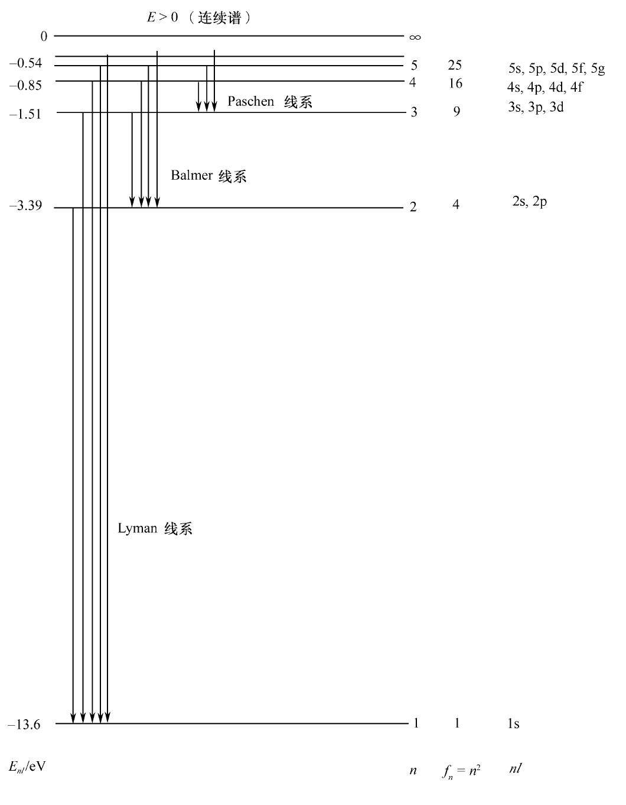
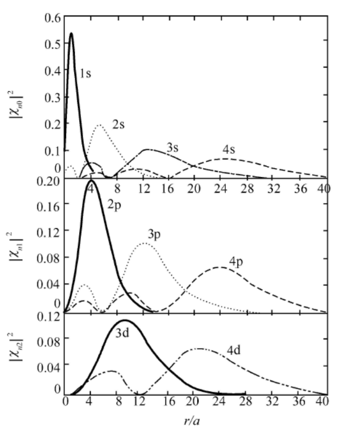
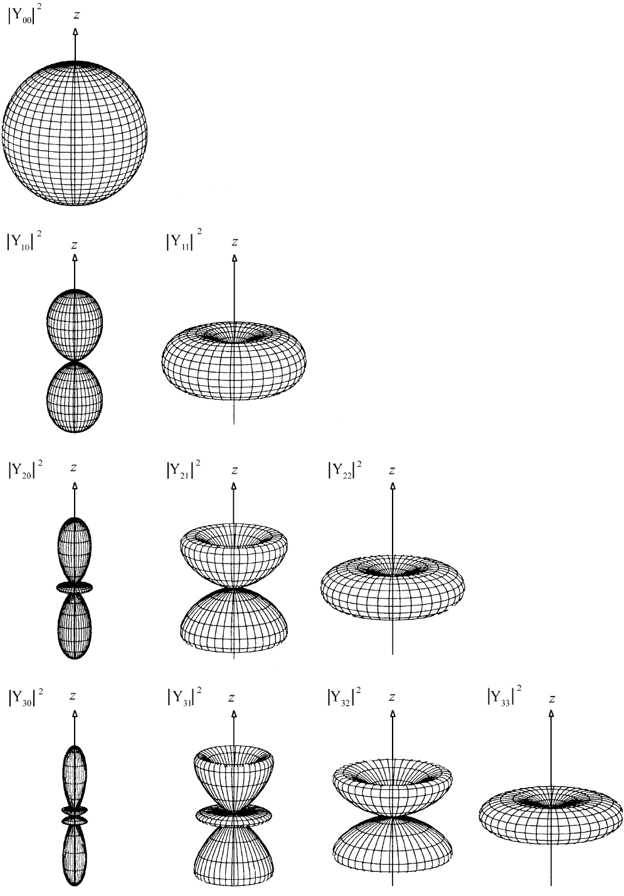
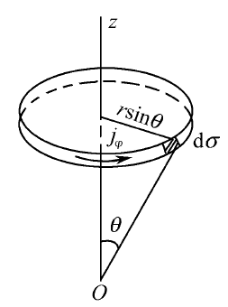

## 第6章 中心力场

### 6.1 [中心力场中粒子运动的一般性质](https://cloud.tsinghua.edu.cn/d/20694cb9c0fb44e6894a/files/?p=%2F%E4%B8%93%E4%B8%9A%E5%9F%BA%E7%A1%80%E8%AF%BE%E7%A8%8B%2F%E9%87%8F%E5%AD%90%E5%8A%9B%E5%AD%A6%2F%EF%BC%88%E9%83%AD%E6%B0%B8%EF%BC%89%2F%E8%AF%BE%E4%BB%B6%2F%E7%AC%AC21%E8%AE%B2.pdf)

#### 中心力场

##### 中心力场的特点

###### 势函数只与 $r$ 有关

中心力场中的问题常使用球坐标系 $(r,\theta,\varphi)$ 来描述，势场 $V$ 只是与原点距离 $r$ 的函数，而与角变量 $\theta,\varphi$ （即方向）无关，具有转动对称性。故体系的Hamilton量为

$$
\hat{H} = \frac{\hat{\vec{p}}^2}{2\mu} + V(r)  
$$

###### 轨道角动量守恒

直接考虑角动量 $\hat{\vec{L}}$ 随时间的演化

$$
\frac{\mathrm{d}}{\mathrm{d}t} \hat{\vec{L}}
= \frac{\mathrm{d}}{\mathrm{d}t} (\hat{\vec{r}} \times \hat{\vec{p}})
\\ \ \\
= \frac{\mathrm{d}\hat{\vec{r}}}{\mathrm{d}t} \times \hat{\vec{p}} + \hat{\vec{r}} \times \frac{\mathrm{d}\hat{\vec{p}}}{\mathrm{d}t}
\\ \ \\
= \frac{\hat{\vec{p}}}{\mu} \times \hat{\vec{p}} + \hat{\vec{r}} \times [-\nabla V(r)]
\\ \ \\
= 0 - \hat{\vec{r}} \times \vec{e}_r \frac{\mathrm{d}V(r)}{\mathrm{d}r}
\\ \ \\
= 0
$$

故**角动量守恒**。同时根据 $\vec{L} \cdot \vec{r} = \vec{L} \cdot \vec{p} = 0$ ，而 $\vec{L}$ 是守恒量，其方向不随时间变化，可知 $\vec{r}\,$ 与 $\vec{p}\,$ 始终在与 $\vec{L}$ 垂直的平面上，故中心力场中的粒子运动必为**平面运动**，平面的法向即为 $\vec{L}$ 的方向。

也可以直接从对易关系来证明角动量守恒：

根据 $[\hat{L}_{\alpha} , \hat{p}_{\beta}] = \varepsilon_{\alpha\beta\gamma} \mathrm{i} \hbar \hat{p}_{\gamma}$ 与 $[\hat{p}_{\alpha},\hat{p}_{\beta}] = 0$ ，可知 $[\hat{L}_{\alpha},\hat{p}_{\beta}^2] = 0$ ，故 $[\hat{\vec{L}},\hat{\vec{p}}^2] = 0$ ；又因为 $\hat{\vec{L}}$ 只与角变量 $(\theta,\varphi)$ 有关，所以 $[\hat{\vec{L}},V(r)] = 0$ 。综上， $[\hat{\vec{L}},\hat{H}] = 0$ 。

##### 常见的中心力场

* 自由粒子： $V(r) = 0$

* 谐振子势： $V(r) \propto r^2$

* 线性中心势： $V(r) \propto r$

* 对数中心势： $V(r) \propto \ln r$

* 球方势： $V(r) = \begin{cases} 0 &, r<a \\ V_0 &, r \ge a \end{cases} \kern 1em (V_0可取+\infty,即无限深球方势阱)$

* 库仑势： $V(r) \propto \frac{1}{r}$

* 汤川势： $V(r) \propto \frac{1}{r} \mathrm{e}^{-\alpha r}$

* Woods-Saxon势： $V(r) \propto V_0 / (1 + \mathrm{e}^{r-\frac{R}{a}})$

##### 中心力场中力学量完全集的选择

中心力场中力学量完全集一般选为 $\{\hat{H},\hat{L}^2,\hat{L}_z\}$ （也是守恒量完全集），用 $\psi_{nlm}$ 代表共同本征态，本征值问题可表示为

$$
\hat{H}\ \psi_{nlm} = E_{nl}\ \psi_{nlm} \\
\hat{L}^2\ \psi_{nlm} = l(l+1)\hbar^2\ \psi_{nlm} \\
\hat{L}_z\ \psi_{nlm} = m\hbar\ \psi_{nlm}
$$

#### 径向方程及其求解

##### 球坐标系中的Hamilton量

设质量为 $\mu$ 的粒子在中心势 $V(r)$ 中运动，则Hamilton量可表示为

$$
\hat{H} = \frac{\hat{\vec{p}}^2}{2\mu} + V(r) = -\frac{\hbar^2}{2\mu} \nabla^2 + V(r)
$$

其中

$$
\nabla^2 = \nabla_r^2 + \frac{1}{r^2} \nabla_{\theta\varphi}^2
$$

$$
\nabla_r^2
= \frac{1}{r^2} \frac{\partial}{\partial r} r^2 \frac{\partial}{\partial r}
= \frac{\partial^2}{\partial r^2} + \frac{2}{r} \frac{\partial}{\partial r}
= \frac{1}{r} \frac{\partial^2}{\partial r^2} r
= -\frac{\hat{p}_r^2}{\hbar^2}
$$

$$
\nabla_{\theta\varphi}^2
= \frac{1}{\sin\theta} \frac{\partial}{\partial\theta} \left( \sin\theta \frac{\partial}{\partial\theta} \right) + \frac{1}{\sin^2\theta}\frac{\partial^2}{\partial\varphi^2} 
= -\frac{\hat{L}^2}{\hbar^2}
$$

故Hamilton算符可表示为

$$
\hat{H} = \frac{\hat{p}_r^2}{2\mu} + \frac{\hat{L}^2}{2\mu r^2} + V(r)
$$

其中等号右侧第一项为**径向动能**，第二项为**离心势能**，后两项之和为**有效势**

$$
V_{eff} = \frac{\hat{L}^2}{2\mu r^2} + V(r)
$$

##### 径向方程

###### 径向方程的导出

能量本征方程可表示为

$$
\left[ -\frac{\hbar^2}{2\mu} \frac{1}{r} \frac{\partial^2}{\partial r^2} r + \frac{\hat{L}^2}{2\mu r^2} + V(r) \right]\ \psi(r,\theta,\varphi) = E\ \psi(r,\theta,\varphi)
$$

选取守恒量完全集为 $\{\hat{H},\hat{L}^2,\hat{L}_z\}$ ，故能量本征方程的解也可选为 $\{\hat{L}^2,\hat{L}_z\}$ 的共同本征态，因为势函数 $V(r)$ 球对称，故可以分离变量，即

$$
\psi(r,\theta,\varphi) = R_l(r) \mathrm{Y}_{lm}(\theta,\phi) 
$$

其中 $l=0,1,2,\cdots;m=-l,-l+1,\cdots,l-1,l$ ，代入能量本征方程，可得

$$
\left[ -\frac{\hbar^2}{2\mu} \frac{1}{r} \frac{\partial^2}{\partial r^2} r + \frac{\hat{L}^2}{2\mu r^2} + V(r) \right]\ R_l(r) \mathrm{Y}_{lm}(\theta,\phi)  = E\ R_l(r) \mathrm{Y}_{lm}(\theta,\phi)
\\ \Downarrow \\
\left[ -\frac{\hbar^2}{2\mu} \frac{1}{r} \frac{\mathrm{d}^2}{\mathrm{d}r^2} r + \frac{l(l+1)\hbar^2}{2\mu r^2} + V(r) \right]\ R_l(r)  = E\ R_l(r)
\\ \Downarrow \\
\frac{1}{r} \frac{\mathrm{d}^2}{\mathrm{d}r^2} \left( r R_l(r) \right) +  \left[\frac{2\mu}{\hbar^2}\left( E - V(r) \right)  -\frac{l(l+1)}{r^2} \right]\ R_l(r) = 0
$$

 令

$$
\chi_l(r) = r R_l(r)
$$

则上述方程可进一步简化为

$$
\chi_l''(r) +  \left[\frac{2\mu}{\hbar^2}\left( E - V(r) \right)  -\frac{l(l+1)}{r^2} \right]\ \chi_l(r) = 0
$$

此即中心力场中粒子需要满足的**径向方程**。

###### 讨论

* 波函数 $\chi_l(r)$ 与轨道角动量量子数 $l$ 有关，故能级与 $l$ 有关，这是在方程中显式出现的，即**离心势能**产生的影响。按原子光谱的习惯，把 $l=0,1,2,3,4,5,6,\cdots$ 的态分别记为 $s,p,d,f,g,h,i,\cdots$ 。

* 波函数 $\chi_l(r)$ 及能级与磁量子数 $m$ 无关，表明能级一般是有简并的，对于给定的 $l$ ，有 $2l+1$ 个可能的 $m$ 取值，因此中心力场中粒子能级的**简并度**一般为 $2l+1$ 。

* 与一维势 $V(x)$ 相比，中心势 $V(r)$ 的**定义域**为 $r \ge 0$ 而非 $-\infty < x < +\infty$ 。 

##### 解在 $r\to0$ 的渐进行为

假定势函数 $V(r)$ 满足

$$
\lim_{r\to0} r^2 V(r) = 0
$$

（通常遇到的中心力场均满足此条件）则波函数应满足

$$
\lim_{r\to0} R_l(r) \propto r^l,
\kern 1em
\lim_{r\to0} \chi_l(r) \propto r^{l+1}
$$

故

$$
\chi_l(0) = 0
$$

###### 证明

首先考虑波函数的统计诠释，粒子出现在半径为 $r\to0$ 的球体内的概率

$$
\int_0^r R_l^2(r) r^2 \mathrm{d}r \sim r^3 R_l^2(r) \to 0
$$

故若 $R_l(r) \propto r^s$ ，则有 $s>-\frac32$ 。

当 $r\to0$ 时， $(E-V_0)$ 项绝对值要远小于其他项，此时径向方程可渐进的表示为

$$
\frac{\mathrm{d}^2}{\mathrm{d}r^2} R_l(r) + \frac{2}{r} \frac{\mathrm{d}}{\mathrm{d}r} R_l(r) -\frac{l(l+1)}{r^2}  R_l(r) = 0
$$

此方程为欧拉方程，将 $R_l(r) \propto r^s$ 代入可解得

$$
R_l(r) \propto r^l \kern 1em 或 \kern 1em R_l(r) \propto r^{-(l+1)}
$$

当 $l\ge1$ 时， $-(l+1) \le -2 < -\frac32$ ，显然不满足条件；当 $l=0$ 时，因为 $\nabla^2 \frac{1}{r} = -4\pi\delta(\vec{r})$ ，$R_l(r) \propto \frac{1}{r}$ 对应的解在 $r=0$ 处并不满足薛定谔方程。故只有

$$
\lim_{r\to0} R_l(r) \propto r^l
$$

的解才可以接受。

#### 两体问题化为单体问题

考虑两个质量分别为 $m_1,m_2$ 的粒子，其相互作用 $V(|\vec{r}_1-\vec{r}_2|) = V(r)$ 只依赖于二者的相对距离，此时该体系的Schrödinger方程为

$$
\mathrm{i}\hbar \frac{\partial}{\partial t} \psi(\vec{r}_1,\vec{r}_2,t)
= \left[ -\frac{\hbar^2}{2m_1} \nabla_1^2 - \frac{\hbar^2}{2m_2} \nabla_2^2 + V(|\vec{r}_1-\vec{r}_2|) \right] \psi(\vec{r}_1,\vec{r}_2,t)
$$

引入**质心坐标**

$$
\vec{R} = \frac{m_1\vec{r}_1 + m_2\vec{r}_2}{m_1 + m_2} = [X,Y,Z]^T
$$

**相对坐标**

$$
\vec{r} = \vec{r}_1 - \vec{r}_2 = [x,y,z]^T
$$

**质心质量**

$$
M = m_1 + m_2
$$

**约化质量**

$$
\mu = \frac{m_1m_2}{m_1+m_2}
$$

此时有

$$
\nabla_R^2 = \frac{\partial^2}{\partial X^2} + \frac{\partial^2}{\partial Y^2} + \frac{\partial^2}{\partial Z^2}
,\kern 1em
\nabla^2 = \frac{\partial^2}{\partial x^2} + \frac{\partial^2}{\partial y^2} + \frac{\partial^2}{\partial z^2}
\\ \ \\
\frac{1}{m_1} \nabla_1^2 + \frac{1}{m_2} \nabla_2^2 = \frac{1}{M} \nabla_R^2 + \frac{1}{\mu} \nabla^2
$$

故Schrödinger方程可化为

$$
\mathrm{i}\hbar \frac{\partial}{\partial t} \psi(\vec{R},\vec{r},t)
= \left[ -\frac{\hbar^2}{2M} \nabla_R^2 - \frac{\hbar^2}{2\mu} \nabla^2 + V(r) \right] \psi(\vec{R},\vec{r},t)
$$

该方程可分离变量，设

$$
\psi(\vec{R},\vec{r},t) = \phi(\vec{R})\ \varphi(\vec{r})\ T(t)
$$

则原方程可分解为三个方程

$$
\mathrm{i}\hbar \frac{\partial}{\partial t} T(t)
= E_T\ T(t)
\\ \ \\
-\frac{\hbar^2}{2M} \nabla_R^2\ \phi(\vec{R}) = E_C\ \phi(\vec{R})
\\ \ \\
\left[ -\frac{\hbar^2}{2\mu} \nabla^2\ + V(r) \right] \varphi(\vec{r}) = E\ \varphi(\vec{r})
$$

其中 $E_T$ 为总能量， $E_C$ 为质心运动能量， $E$ 为相对运动能量，三者满足 $E_T = E_C + E$ 。

第一个方程可求出含时间部分的解为 $T(t) = C \mathrm{e}^{-\frac{\mathrm{i}}{\hbar}E_T\ t}$ 。

第二个方程为质心运动状态的波函数所满足的方程，质心以质量 $M$ 、能量为 $E_C$ 的自由粒子的方式运动，即平面波，与内部性质无关。

第三个方程为**相对运动方程**，其求解可参照上述对中心力场问题的分析。

#### 自然单位

采用自然单位，就是以体系的几个基本的特征量作为相应的物理量的单位。在具体的计算中，可令相应的物理量或参数为 $1$ ，因而在运算过程中这些参数不再出现。我们只需在最后的计算结果中按照各物理量的量纲添上相应的单位即可。

*自然单位的优点是，一方面运算过程的书写可以简化，另一方面是使人对体系的各种特征量的数量级有清楚的印象。此外，使用自然单位还便于研究不同体系的数学处理之间可能存在的密切关系，例如，研究各向同性谐振子势和Coulomb势中粒子的能量本征值和本征函数的关系。*

常见的自然单位如下表所示：

|                                                                                    | $\delta$ 势  $V(x)=\gamma\delta(x)$                                                                                                       | 谐振子势 一维 $V(x)=\frac12\mu\omega^2x^2$  二维 $V(\rho)=\frac12\mu\omega^2\rho^2$  三维 $V(r)=\frac12\mu\omega^2r^2$                          | 类氢原子(Coulomb势) （ $\kappa=Ze^2$ ）  $V(r)=-\frac{\kappa}{r}$                                                                           | 氢原子(Coulomb势) （ $\kappa=e^2$ ）  $V(r)=-\frac{e^2}{r}$                                                                 |
|:----------------------------------------------------------------------------------:|:--------------------------------------------------------------------------------------------------------------------------------------------:|:-------------------------------------------------------------------------------------------------------------------------------------------------:|:--------------------------------------------------------------------------------------------------------------------------------------------:|:-----------------------------------------------------------------------------------------------------------------------------:|
| 自然单位                                                                               | $\mu=\hbar=\gamma=1$                                                                                                                         | $\mu=\hbar=\omega=1$                                                                                                                              | $\mu=\hbar=\kappa=1$                                                                                                                         | $\mu=\hbar=e=1$                                                                                                               |
| 能量 $[E]$  长度 $[L]$   时间 $[T]$   速度 $[v]$  动量 $[p]$ | $\mu\gamma^2/\hbar^2$    $\hbar^2/\mu\gamma$    $\hbar^3/\mu\gamma^2$    $\gamma/\hbar$    $\mu\gamma/\hbar$ | $\hbar\omega$    $\sqrt{\hbar/\mu\omega}$    $\omega^{-1}$    $\sqrt{\hbar\omega/\mu}$    $\sqrt{\mu\hbar\omega}$ | $\mu\kappa^2/\hbar^2$    $\hbar^2/\mu\kappa$    $\hbar^3/\mu\kappa^2$    $\kappa/\hbar$    $\mu\kappa/\hbar$ | $\mu e^4/\hbar^2$    $\hbar^2/\mu e^2$    $\hbar^3/\mu e^3$    $e^2/\hbar$    $\mu e^2/\hbar$ |

### 6.2 [无限深球方势阱](https://cloud.tsinghua.edu.cn/d/20694cb9c0fb44e6894a/files/?p=%2F%E4%B8%93%E4%B8%9A%E5%9F%BA%E7%A1%80%E8%AF%BE%E7%A8%8B%2F%E9%87%8F%E5%AD%90%E5%8A%9B%E5%AD%A6%2F%EF%BC%88%E9%83%AD%E6%B0%B8%EF%BC%89%2F%E8%AF%BE%E4%BB%B6%2F%E7%AC%AC22%E8%AE%B2.pdf)

#### 模型描述与结论

##### 模型描述

考虑质量为 $\mu$ 的粒子在半径为 $a$ 的球形匣子中运动，相当于粒子在一个无限深球方势阱中运动，即

$$
V(r)=\begin{cases}
0, & r<a \\
\infty, & r>a
\end{cases}
$$

##### 一般结论

该势阱中只存在**束缚态**，粒子的**能量本征值**为

$$
E_{n_rl} = \frac{\hbar^2}{2\mu a^2} \xi_{n_rl}^2 \kern 2em (n_r=0,1,2,\cdots)
$$

相应的**径向本征函数**为

$$
R_{n_rl}(r) = \begin{cases}
C_{n_rl}\ \mathrm{j}_l(k_{n_rl}\ r) ,& 0\le r<a \\
0, & r>a
\end{cases}
\kern 2em (k_{n_rl} = \xi_{n_rl} / a)
$$

其中 $\mathrm{j}_l$ 是**球Bessel函数**，令 $\mathrm{j}_l(\xi) = 0$ 的根依次记为 $\xi_{n_rl} \kern 1em (n_r=0,1,2,\cdots)$ ，较低的一些能级的 $\xi_{n_rl}$ 如下表所示

|       | $n_r=0$ | $n_r=1$  | $n_r=2$  | $n_r=3$  |
|:-----:|:-------:|:--------:|:--------:|:--------:|
| $l=0$ | $\pi$   | $2\pi$   | $3\pi$   | $4\pi$   |
| $l=1$ | $4.493$ | $7.725$  | $10.904$ | $14.066$ |
| $l=2$ | $5.764$ | $9.095$  | $12.323$ | $15.515$ |
| $l=3$ | $6.988$ | $10.417$ | $13.698$ | $16.924$ |

径向本征函数中归一化系数

$$
C_{n_rl} = \left[ -\frac{2}{a^3 \mathrm{j}_{l-1}(k_{n_rl}\ a) \mathrm{j}_{l+1}(k_{n_rl}\ a)} \right]^{\frac{1}{2}}
$$

归一化公式为

$$
\int_0^a R_{n_rl}(r)\ R_{n_r'l}(r)\ r^2 \mathrm{d}r = \delta_{n_rn_r'}
$$

##### $s$ 态的结论

对于 $l=0$ 的情况，即 $s$ 态，结果可以简单的表示为

$$
E_{n_r0} = \frac{\pi^2\hbar^2(n_r+1)^2}{2\mu a^2} \kern 2em (n_r=0,1,2,\cdots)
$$

$$
\chi_{n_r0}(r) = \begin{cases}
\sqrt{\frac{2}{a}} \sin \frac{(n_r+1)\pi r}{a}, & 0\le r <a \\
0, & r>a
\end{cases}
$$

$$
\int_0^a \chi_{n_r0}(r)\ \chi_{n_r'0}(r)\ \mathrm{d}r = \delta_{n_rn_r'}
$$

#### 模型求解

在势阱外（ $r>a$ ），显然有 

$$
R(r) = 0
$$

在势阱内（ $r<a$ ），先考虑 $s$ 态（ $l=0$ ），径向方程为

$$
\chi_0''(r) +  \frac{2\mu E}{\hbar^2} \chi_0(r) = 0
$$

记 $k = \sqrt{\frac{2\mu E}{\hbar^2}} \kern 1em (E>0)$ ，则

$$
\chi_0''(r) + k^2 \chi_0(r) = 0
$$

解得

$$
\chi_{0}(r) = A \sin(kr) + B \cos(kr)
$$

边条件为

$$
\chi_0(0) = \chi_0(a) = 0
$$

则可得

$$
B = 0 \\
ka = (n_r+1)\pi \kern 2em (n_r=0,1,2,\cdots)
$$

故粒子的能量本征值

$$
E_{n_r0} = \frac{\pi^2\hbar^2(n_r+1)^2}{2\mu a^2} \kern 2em (n_r=0,1,2,\cdots)
$$

归一化的波函数为

$$
\chi_{n_r0}(r) = \sqrt{\frac{2}{a}} \sin \frac{(n_r+1)\pi r}{a} \kern 2em (0\le r <a) 
$$

其次考虑 $l\ne0$ 的情况，此时径向方程可表示为

$$
R_l''(r) + \frac{2}{r} R_l'(r) +  \left[k^2  -\frac{l(l+1)}{r^2} \right]\ R_l(r) = 0
$$

边条件为

$$
R_l(a) = 0
$$

引入无量纲变量 $\rho = kr$ ，则方程可化为

$$
\frac{\mathrm{d}^2}{\mathrm{d}\rho^2} R_l + \frac{2}{r} \frac{\mathrm{d}}{\mathrm{d}\rho} R_l +  \left[1 -\frac{l(l+1)}{\rho^2} \right]\ R_l = 0
$$

此即**球Bessel方程**，其解可取为球Bessel函数 $\mathrm{j}_l(\rho)$ 或球Neumann函数 $\mathrm{n}_l(\rho)$ ，它们在 $r\to0$ 时的渐进行为为

$$
\mathrm{j}_l(\rho) \to \frac{\rho^l}{(2l+1)!!}
\\ \ \\
\mathrm{n}_l(\rho) \to -\frac{(2l-1)!!}{\rho^{l+1}}
$$

*关于Bessel方程的相关知识，请参考课本附录A6，亦可参考[陈酌老师的课件](https://cloud.tsinghua.edu.cn/d/20694cb9c0fb44e6894a/files/?p=%2F%E6%95%B0%E5%AD%A6%E4%B8%8E%E8%87%AA%E7%84%B6%E7%A7%91%E5%AD%A6%E5%9F%BA%E7%A1%80%E8%AF%BE%2F%E5%A4%8D%E5%8F%98%E5%87%BD%E6%95%B0%E4%B8%8E%E6%95%B0%E7%90%86%E6%96%B9%E7%A8%8B%2F%E8%AF%BE%E4%BB%B6%EF%BC%88%E9%99%88%E9%85%8C%EF%BC%89%2Fc%E7%89%B9%E6%AE%8A%E5%87%BD%E6%95%B0%E9%83%A8%E5%88%86%2Fc5%E8%B4%9D%E5%A1%9E%E5%B0%94%E5%87%BD%E6%95%B0%2F%E6%95%B0%E7%90%86%E6%96%B9%E7%A8%8B%20%20%E7%AC%AC%E4%BA%94%E7%AB%A0.ppt)，在此不再赘述。*

考虑到 $\rho = 0$ 点， $\mathrm{n}_l(\rho)$ 解是物理上不能接受的，因此该方程的解应取为

$$
R_l(r) \propto \mathrm{j}_l(kr)
$$

根据边条件 $R_l(a) = 0$ ，有

$$
\mathrm{j}_l(ka) = 0
$$

故当 $a$ 取有限值时， $k$ 只能取一系列离散的值，令 $\mathrm{j}_l(\xi) = 0$ 的根依次记为 $\xi_{n_rl} \kern 1em (n_r=0,1,2,\cdots)$ ，则粒子的能量本征值为

$$
E_{n_rl} = \frac{\hbar^2}{2\mu a^2} \xi_{n_rl}^2 \kern 2em (n_r=0,1,2,\cdots)
$$

相应的径向本征函数为

$$
R_{n_rl}(r) = C_{n_rl}\ \mathrm{j}_l(k_{n_rl}\ r) \kern 2em (0\le r<a) 
\kern 2em (k_{n_rl} = \xi_{n_rl} / a)
$$

归一化系数

$$
C_{n_rl} = \left[ -\frac{2}{a^3 \mathrm{j}_{l-1}(k_{n_rl}\ a) \mathrm{j}_{l+1}(k_{n_rl}\ a)} \right]^{\frac{1}{2}}
$$

归一化公式为

$$
\int_0^a R_{n_rl}(r)\ R_{n_r'l}(r)\ r^2 \mathrm{d}r = \delta_{n_rn_r'}
$$

#### $a\to\infty$ 的特殊情况

当 $a\to\infty$ 时，相当于粒子的运动无任何限制，即为自由粒子。考虑到

$$
\lim_{\rho\to\infty} \mathrm{j}_l(\rho) = \frac{1}{\rho} \sin(\rho - \frac{l\pi}{2}) \to 0
$$

故边条件自动满足，所以 $k$ （或 $E$ ）将不再受到限制，即能量连续变化，在此情况下，径向波函数的选择及归一化公式如下

$$
R_{kl}(r) = \sqrt{\frac{2}{\pi}} k\ \mathrm{j}_l(kr)
$$

$$
\int_0^{+\infty} R_{kl}(r)\ R_{k'l}(r)\ r^2 \mathrm{d}r = \delta(k-k')
$$

### 6.3 [三维各向同性谐振子](https://cloud.tsinghua.edu.cn/d/20694cb9c0fb44e6894a/files/?p=%2F%E4%B8%93%E4%B8%9A%E5%9F%BA%E7%A1%80%E8%AF%BE%E7%A8%8B%2F%E9%87%8F%E5%AD%90%E5%8A%9B%E5%AD%A6%2F%EF%BC%88%E9%83%AD%E6%B0%B8%EF%BC%89%2F%E8%AF%BE%E4%BB%B6%2F%E7%AC%AC23%E8%AE%B2.pdf)

#### 模型描述与结论

考虑质量为 $\mu$ 的粒子在三维各向同性谐振子势 $V(r)$ 中运动，

$$
V(r) = \frac12 \mu \omega^2 r^2
$$

该势中只存在**束缚态**，粒子的**能量本征值**为

$$
E_N = (N+\frac32) \hbar\omega \kern 2em (N=0,1,2,\cdots)
\\ \ \\
= (2n_r + l + \frac32) \hbar\omega \kern 2em (n_r,l = 0,1,2,\cdots)
$$

记 $\alpha = \sqrt{\frac{\mu\omega}{\hbar}}$ ，相应的**径向本征波函数**为

$$
R_{n_rl}(r) = \alpha^{\frac32} \left[ \frac{2^{l+2-n_r}(2l+2n_r+1)!!}{\sqrt{\pi}n_r![(2l+1)!!]^2} \right]^{\frac12} (\alpha r)^l\ \mathrm{e}^{-\frac{\alpha^2r^2}{2}}\ \mathrm{F}(-n_r,l+\frac32,\alpha^2r^2)
$$

其中 $\mathrm{F}(\alpha,\gamma,\xi)$ 是**合流超几何函数**。归一化公式为

$$
\int_0^{+\infty} R_{n_rl}(r)\ R_{n_r'l}(r)\ r^2 \mathrm{d}r = \delta_{n_rn_r'}
$$

#### 模型求解

径向方程为

$$
R_l''(r) + \frac{2}{r} R_l'(r) +  \left[\frac{2\mu}{\hbar^2} \left(E-\frac12\mu\omega^2r^2\right) - \frac{l(l+1)}{r^2} \right]\ R_l(r) = 0
$$

采用自然单位，令 $\hbar=\mu=\omega=1$ ，方程化为

$$
R_l''(r) + \frac{2}{r} R_l'(r) +  \left[2E - r^2 - \frac{l(l+1)}{r^2} \right]\ R_l(r) = 0
$$

考虑对方程做渐进分析以求出解的因子：

当 $r\to0$ 时，有

$$
R_l(r) \sim r^l
$$

当 $r\to\infty$ 时，方程可渐进的表示为

$$
R_l''(r) - r^2 R_l(r) = 0
$$

*当 $R_l(r) \sim \mathrm{e}^{\pm r^2/2}$ 时， $R_l'(r) \sim \pm r \mathrm{e}^{\pm r^2/2}$ ， $R_l''(r) \sim r^2 \mathrm{e}^{\pm r^2/2} \pm \mathrm{e}^{\pm r^2/2} \sim r^2 \mathrm{e}^{\pm r^2/2}$ ，故 $R_l''(r) - r^2 R_l(r) \sim 0$ 。* 此时有

$$
R_l(r) \sim \mathrm{e}^{\pm r^2/2}
$$

而 $\mathrm{e}^{r^2/2}$ 不满足束缚态边条件，故

$$
R_l(r) \sim \mathrm{e}^{-r^2/2}
$$

综上，可设

$$
R_l(r) = r^l \mathrm{e}^{-\frac{r^2}{2}} u(r)
$$

代入方程，可得

$$
u'' + \frac{2}{r}(l+1-r^2)u' + [2E-(2l+3)]u = 0
$$

令 $\xi=r^2$ ，上式可化为

$$
\xi \frac{\mathrm{d}^2u}{\mathrm{d}\xi^2} + (\gamma-\xi) \frac{\mathrm{d}u}{\mathrm{d}\xi} - \alpha u = 0
$$

该方程为**合流超几何方程**，其中参数

$$
\alpha = \frac12(l+\frac32-E)
\\ \ \\
\gamma = l + \frac32 \kern 0.5em (\ne\text{整数})
$$

合流超几何方程的求解过程如下：

先考虑方程的解在 $\xi\to0$ 附近的行为，此时方程可近似表示为

$$
\frac{\mathrm{d}^2u}{\mathrm{d}\xi^2} + \frac{\gamma}{\xi} \frac{\mathrm{d}u}{\mathrm{d}\xi} - \frac{\alpha}{\xi} u = 0
$$

将 $u=\xi^s$ 代入，可得

$$
s(s-1) \xi^{s-2} + \gamma s \xi^{s-2} - \alpha \xi^{s-1} = 0
$$

由于 $\xi\to0$ ，故 $\alpha \xi^{s-1}$ 相较于另两项为小量，则

$$
s(s-1) + \gamma s = 0 
$$

解得 $s_1 = 0, s_2 = 1-\gamma$ ，先考虑 $s_1=0$ 对应的级数解，即以 $\xi^0$ 为首项，

$$
u = \sum_{k=0}^{+\infty} c_k \xi^k
$$

代入原方程可得

$$
\sum_{k=0}^{+\infty} \left[ k(k-1) c_k \xi^{k-1} + (\gamma-\xi) k c_k \xi^{k-1} - \alpha c_k \xi^k \right] = 0
\\ \Downarrow \\
\sum_{k=0}^{+\infty} \left[ k(k-1+\gamma) c_k \xi^{k-1} - (\alpha+k) c_k \xi^k \right] = 0
\\ \Downarrow \\
k(k-1+\gamma) c_k = (\alpha+k-1) c_{k-1}
\\ \Downarrow \\
c_k = \frac{\alpha+k-1}{(\gamma+k-1)k} c_{k-1}
$$

通过 $c_0$ ，即可得到所有系数

$$
c_k = \frac{\alpha(\alpha+1)\cdots(\alpha+k-1)}{\gamma(\gamma+1)\cdots(\gamma+k-1)} \frac{1}{k!} c_0
$$

由于 $c_0$ 任意，可取 $c_0=1$ ，则可得到级数解，记为合流超几何函数 $\mathrm{F}(\alpha,\gamma,\xi)$ ：

$$
u_1 = \mathrm{F}(\alpha,\gamma,\xi)
= 1 + \frac{\alpha}{\gamma}\xi + \frac{\alpha(\alpha+1)}{\gamma(\gamma+1)}\frac{\xi^2}{2!} + \cdots
\\ \ \\
= \sum_{k=0}^{+\infty} \frac{(\alpha)_k}{(\gamma)_k} \frac{\xi^k}{k!}
$$

其中

$$
(\alpha)_k = \alpha(\alpha+1)\cdots(\alpha+k-1) \\
(\gamma)_k = \gamma(\gamma+1)\cdots(\gamma+k-1)
$$

显然，此级数解只当参数 $\gamma$ 不为零或负整数时才有意义。

当两根之差 $s_2 - s_1 = 1-\gamma$ 不为整数时，另一个解与上述解是线性无关的，其可表示为

$$
u_2 = \xi^{1-\gamma} y
$$

代入原方程，可得

$$
\xi \frac{\mathrm{d}^2y}{\mathrm{d}\xi^2} + (2-\gamma-\xi) \frac{\mathrm{d}y}{\mathrm{d}\xi} - (\alpha-\gamma+1) y = 0
$$

其仍为合流超几何方程，只是参数不同，其解可表示为 $y=\mathrm{F}(\alpha-\gamma+1,2-\gamma,\xi)$ ，故原方程第二个级数解为

$$
u_2 = \xi^{1-\gamma}\ \mathrm{F}(\alpha-\gamma+1,2-\gamma,\xi)
$$

显然，此级数解只当 $2-\gamma$ 不为零或负整数时才有意义。

回到原问题，由于 $\xi^{1-\gamma} = r^{-2l-1}$ ，故 $u_2$ 解是物理上不能接受的，故解只能取为 $u_1$ 。

当 $k\to\infty$ 时，有 $c_k/c_{k-1} \sim 1/k$ ，该比值与 $e^\xi$ 的幂级数展开系数的比值相同，因此

$$
\lim_{\xi\to\infty} \mathrm{F}(\alpha,\gamma,\xi) \sim e^{\xi}
$$

这不满足束缚态边条件，故该级数必须中断为一个多项式，通过系数的递推关系式，可得要求 $\exist k \in \mathbb{N}_+$ 使得 $\alpha+k-1=0$ ，此即要求 $\alpha$ 为零或负整数，即

$$
\alpha = \frac12(l+\frac32-E) = -n_r \kern 2em (n_r=0,1,2,\cdots)
$$

而这就是要求 $E=(2n_r+l+\frac32)$ ，添上能量的自然单位，得

$$
E=(2n_r+l+\frac32)\hbar\omega \kern 2em (n_r,l = 0,1,2,\cdots)
$$

令 $N=2n_r+l$ ，则得到能量本征值为

$$
E = E_N = (N+\frac32)\hbar\omega \kern 2em (N=0,1,2,\cdots)
$$

与之相应的径向波函数（添上长度单位 $\alpha=\sqrt{\frac{\mu\omega}{\hbar}}$ ，*注意此 $\alpha$ 与上述合流超几何函数中的不是同一个*）为

$$
R_{n_rl}(r) \propto r^l\ \mathrm{e}^{-\frac{\alpha^2r^2}{2}}\ \mathrm{F}(-n_r,l+\frac32,\alpha^2r^2)
$$

经归一化后为

$$
R_{n_rl}(r) = \alpha^{\frac32} \left[ \frac{2^{l+2-n_r}(2l+2n_r+1)!!}{\sqrt{\pi}n_r![(2l+1)!!]^2} \right]^{\frac12} (\alpha r)^l\ \mathrm{e}^{-\frac{\alpha^2r^2}{2}}\ \mathrm{F}(-n_r,l+\frac32,\alpha^2r^2)
$$

归一化公式为

$$
\int_0^{+\infty} R_{n_rl}(r)\ R_{n_r'l}(r)\ r^2 \mathrm{d}r = \delta_{n_rn_r'}
$$

#### 讨论

##### 能级简并度

对于给定的 $N$ 和 $l$ ，有 $2l+1$ 个本征态，

当 $N$ 为偶数时，$l=N-2n_r$ 的取值可为

$$
l = N,N-2,N-4,\cdots,2,0
$$

故能级简并度

$$
f_N = \sum_{l} (2l+1) = \sum_{i=0}^{N/2} (2\times2i+1) = \frac12(N+1)(N+2)
$$

同理，当 $N$ 为奇数时， $l=N-2n_r$ 的取值可为

$$
l = N,N-2,N-4,\cdots,3,1
$$

故能级简并度

$$
f_N = \sum_{l} (2l+1) = \sum_{i=0}^{(N-1)/2} [2(2i+1)+1] = \frac12(N+1)(N+2)
$$

##### 基底的变换

对于三维各项同性谐振子：

- 在球坐标系中求解得出的本征函数 $\psi_{n_rlm}(r,\theta,\varphi)$ 是对易守恒量完全集 $\{\hat{H},\hat{L}^2,\hat{L}_z\}$ 的共同本征态；

- 在直角坐标系中求解得出的本征函数 $\phi_{n_xn_yn_z}(x,y,z)$ 是对易守恒量完全集 $\{\hat{H}_x,\hat{H}_y,\hat{H}_z\}$ 的共同本征态。

它们之间通过一个幺正变换相联系

$$
\psi_{n_rlm} = \sum_{n_xn_yn_z} \phi_{n_xn_yn_z} \int \phi^*_{n_xn_yn_z} \psi_{n_rlm} \mathrm{d}\tau
$$

### 6.4 [氢原子](https://cloud.tsinghua.edu.cn/d/20694cb9c0fb44e6894a/files/?p=%2F%E4%B8%93%E4%B8%9A%E5%9F%BA%E7%A1%80%E8%AF%BE%E7%A8%8B%2F%E9%87%8F%E5%AD%90%E5%8A%9B%E5%AD%A6%2F%EF%BC%88%E9%83%AD%E6%B0%B8%EF%BC%89%2F%E8%AF%BE%E4%BB%B6%2F%E7%AC%AC24%E8%AE%B2.pdf)

#### 模型描述与结论

氢原子是由电子和原子核构成的两体体系，相互作用是Coulomb势（取无穷远为势能零点）

$$
V(r) = -\frac{e^2}{r}
$$

将两体问题化为单体问题，约化质量为 $\mu$ 。Coulomb势中既存在 $E<0$ 的**束缚态**，也存在 $E>0$ 的**游离态**，仅考虑束缚态的解，氢原子的**能量本征值**为

$$
E_n
= -\frac{\mu e^4}{2\hbar^2} \frac{1}{n^2}
= -\frac{e^2}{2an^2}
= -13.6 \frac{1}{n^2} \text{eV}
\kern 2em (n=1,2,3,\cdots)
$$

其中**Borh半径** $a=\frac{\hbar^2}{\mu e^2}$ ，**主量子数**

$$
n = n_r + l + 1 \kern 2em (n_r,l = 0,1,2,\cdots)
$$

记 $\xi = \frac{2r}{na}$ ，则相应的**径向本征波函数**为

$$
R_{nl}(r) = N_{nl}\ \xi^l\ \mathrm{e}^{-\frac{\xi}{2}}\ \mathrm{F}(-n+l+1,2l+2,\xi)
$$

其中 $\mathrm{F}(\alpha,\gamma,\xi)$ 是**合流超几何函数**，归一化系数

$$
N_{nl} = \frac{2}{a^{3/2}n^2(2l+1)!} \sqrt{\frac{(n+l)!}{(n-l-1)!}}
$$

归一化公式为

$$
\int_0^{+\infty} R_{nl}(r)\ R_{n'l}(r)\ r^2 \mathrm{d}r = \delta_{nn'}
$$

**本征波函数**为

$$
\psi_{nlm}(r,\theta,\varphi) = R_{nl}(r) \mathrm{Y}_{lm}(\theta,\varphi)
$$

其中

$$
n = 1,2,3,\cdots \\
l = 0,1,2,\cdots,n-1 \\
m = 0,\pm1,\pm2,\cdots,\pm l
$$

#### 模型求解

以下讨论仅限于束缚态，即 $E<0$ 。径向方程为

$$
\chi_l''(r) + \left[ \frac{2\mu}{\hbar^2} \left( E+\frac{e^2}{r} \right) - \frac{l(l+1)}{r^2} \right] \chi_l(r) = 0
$$

边条件为

$$
\chi_l(0) = 0
$$

采用自然单位，令 $\hbar=e=\mu=1$ ，方程化为

$$
\chi_l''(r) + \left[ 2E + \frac{2}{r} - \frac{l(l+1)}{r^2} \right] \chi_l(r) = 0
$$

考虑对方程做渐进分析以求出解的因子：

当 $r\to0$ 时，有

$$
\chi_l(r) \propto r^{l+1}
$$

当 $r\to\infty$ 时，方程可渐进的表示为

$$
\chi_l''(r) + 2E\ \chi_l(r) = 0
$$

记 $\beta = \sqrt{-2E}$ ，解得

$$
\chi_l(r) = A \mathrm{e}^{-\beta r} + B \mathrm{e}^{\beta r}
$$

由于 $\mathrm{e}^{\beta r}$ 不满足束缚态边条件，所以只能取

$$
\chi_l(r) \propto \mathrm{e}^{-\beta r}
$$

综上，可设

$$
\chi_l(r) = r^{l+1}\ \mathrm{e}^{-\beta r} u(r)
$$

代入方程，可得

$$
ru'' + [2(l+1) - 2\beta r] u' - 2[(l+1)\beta - 1]u = 0
$$

令 $\xi = 2\beta r$ ，上式可化为

$$
\xi \frac{\mathrm{d}^2u}{\mathrm{d}\xi^2} + [2(l+1) - \xi] \frac{\mathrm{d}u}{\mathrm{d}\xi} - \left[ (l+1) - \frac{1}{\beta} \right] u = 0
$$

该方程为**合流超几何方程**，相应的参数为

$$
\alpha = l + 1 - \frac{1}{\beta}
\\ \ \\
\gamma = 2(l+1) \ge 2 \kern 0.5em (=\text{正整数})
$$

该方程有两个解，

$$
\begin{cases}
u_1 = \mathrm{F}(\alpha,\gamma,\xi) \\
u_2 = \xi^{1-\gamma}\ \mathrm{F}(\alpha-\gamma+1,2-\gamma,\xi)
\end{cases}
$$

在 $\xi\sim0$ 邻域， $u_2$解是物理上不能接受的，故只能取 $u_1$ ；而当 $u_1$ 为无穷级数时， $\lim_{\xi\to+\infty} u_1 \sim \mathrm{e}^\xi$ ，其不满足束缚态边条件要求，故 $u_1$ 必须中断为多项式，这就要求 $\alpha$ 为非正整数，即

$$
\alpha = l + 1 - \frac{1}{\beta} = -n_r \kern 2em (n_r=0,1,2,\cdots)
$$

令主量子数

$$
n = n_r + l + 1 \kern 2em (n=1,2,3,\cdots)
$$

则 $\beta=\frac{1}{n}$ ，此时可得

$$
E = -\frac12 \beta^2 = -\frac{1}{2n^2}
$$

添上能量的自然单位 $\mu e^4/\hbar^2$ ，即得能量本征值

$$
E_n = - \frac{\mu e^4}{2\hbar^2} \frac{1}{n^2} \kern 2em (n=1,2,3,\cdots)
$$

添上长度的自然单位，即Bohr半径 $a=\hbar^2/\mu e^2$ ，可得 $\xi=\frac{2r}{na}$ ，进一步可得径向波函数

$$
R_{nl}(r) = \frac{\chi_{nl}(r)}{r} \propto \xi^l\ \mathrm{e}^{-\frac{\xi}{2}} \mathrm{F}(-n+l+1,2l+2,\xi)
$$

#### 讨论

##### 能级简并度

对于给定的 $n$ 值， $l$ 可从 $0$ 取到 $n-1$ ，故

$$
f_n = \sum_{l=0}^{n-1} (2l+1) = n^2
$$

##### 氢原子光谱

氢原子的能谱为混合谱，由 $E<0$ 的分立谱和 $E>0$ 的连续谱构成。

氢原子处于基态 $(n=1,l=m=0)$ 的电子的能量为 $E_1 = -13.6 \text{eV}$ ，即氢原子的离化能（电离能）为 $0 - E_1 = 13.6 \text{eV}$ 。

对于分立谱，随着 $n$ 增大，能级越来越密，在 $E\sim0$ 左邻域，有无限多条离散能级密集；当 $E\ge0$ 后，则过渡到连续区（游离态）。

当氢原子能级从 $n$ 跃迁到 $m$ 时，会放出能量为 $h\mu$ 的光子，即形成氢原子光谱，光子的频率与波数由Rydberg公式给出

$$
\nu = \frac{\mu e^4}{4\pi\hbar^3} \left( \frac{1}{m^2} - \frac{1}{n^2} \right)
\\ \ \\
\tilde{\nu} = \frac{\mu e^4}{4\pi\hbar^3 c} \left( \frac{1}{m^2} - \frac{1}{n^2} \right) = R \left( \frac{1}{m^2} - \frac{1}{n^2} \right)
$$

其中Rydberg常数

$$
R = \frac{\mu e^4}{4\pi\hbar^3 c} = \frac{2 \pi^2 \mu e^4}{h^3 c}
$$

##### 概率密度分布

当氢原子处于 $\psi_{nlm}(r,\theta,\varphi)$ 态时，在 $(r,\theta,\varphi)$ 周围的体积元 $\mathrm{d}\tau = r^2\sin\theta\mathrm{d}r\mathrm{d}\theta\mathrm{d}\varphi$ 内出现的概率为

$$
W_{nlm} \mathrm{d}\tau = |\psi_{nlm}|^2 r^2 \sin\theta \mathrm{d}r \mathrm{d}\theta \mathrm{d}\varphi
$$

###### 径向概率分布

在球壳 $(r,r+\mathrm{d}r)$ 内找到电子的概率

$$
W_{nl} \mathrm{d}r
= r^2 \mathrm{d}r \int_{4\pi} \left|\psi_{nlm}(r,\theta,\varphi)\right|^2 \mathrm{d}\Omega
= \left[R_{nl}(r)\right]^2 r^2 \mathrm{d}r
= \left[\chi_{nl}(r)\right]^2 \mathrm{d}r
$$

$\chi_{nl}$ 或 $R_{nl}$ 的节点数 $n_r = n-l-1$ ；曲线 $|\chi_{nl}(r)|^2$ 的极大值所在的位置为

$$
r_n = n^2 a \kern 2em (n=1,2,3,\cdots)
$$

$r_n$ 称为最可几半径。

###### 角向概率分布

在 $(\theta,\varphi)$ 方向的立体角 $\mathrm{d}\Omega$ 内找到电子的概率

$$
W_{lm}(\theta,\varphi) \mathrm{d}\Omega
= \mathrm{d}\Omega \int_{0}^{+\infty} r^2 \mathrm{d}r |\psi_{nlm}(r,\theta,\varphi)|^2
= |\mathrm{Y}_{lm}(\theta,\varphi)|^2 \mathrm{d}\Omega
$$

故

$$
W_{lm}(\theta,\varphi)
= |\mathrm{Y}_{lm}(\theta,\varphi)|^2
\propto \left|\mathrm{P}_{l}^{m}(\cos\theta)\mathrm{e}^{\mathrm{i}m\varphi}\right|^2
= \left|\mathrm{P}_{l}^{m}(\cos\theta)\right|^2
$$

即概率密度的角分布与 $\varphi$ 无关，对 $z$ 轴时旋转对称的。

##### 电流分布与磁矩

在本征态 $\psi_{nlm}$ 态下，电子的电流密度为

$$
\vec{j}_e
= -e \vec{j}
= \frac{\mathrm{i}e\hbar}{2\mu} \left( \psi^*_{nlm} \nabla \psi_{nlm} - \psi_{nlm} \nabla \psi^*_{nlm} \right)
$$

其中

$$
\nabla = \vec{e}_r \frac{\partial}{\partial r} + \vec{e}_\theta \frac{1}{r} \frac{\partial}{\partial \theta} + \vec{e}_\varphi \frac{1}{r\sin\theta} \frac{\partial}{\partial \varphi}
$$

由于 $\psi_{nlm}(r,\theta,\varphi) \propto R_{nl}(r)\ \mathrm{P}_l^m(\cos\theta)\ \mathrm{e}^{\mathrm{i}m\varphi}$ ，其中径向波函数 $R_{nl}(r)$ 与 $\theta$ 部分的波函数 $\mathrm{P}_l^m(\cos\theta)$ 均为实函数，故 $j_r = j_\theta = 0$ ，只有 $\varphi$ 部分的波函数 $\mathrm{e}^{\mathrm{i}m\varphi}$ 是复函数，则

$$
j_\varphi = \frac{\mathrm{i}e\hbar}{2\mu} \frac{1}{r\sin\theta} \left( \psi^*_{nlm} \frac{\partial}{\partial \varphi} \psi_{nlm} - \psi_{nlm} \frac{\partial}{\partial \varphi} \psi^*_{nlm} \right)
\\ \ \\
= \frac{\mathrm{i}e\hbar}{2\mu} \frac{1}{r\sin\theta} \left( \psi^*_{nlm}\ \mathrm{i}m\ \psi_{nlm} - \psi_{nlm} (-\mathrm{i}m) \psi^*_{nlm} \right)
\\ \ \\
= \frac{\mathrm{i}e\hbar}{2\mu} \frac{1}{r\sin\theta}  2\mathrm{i}m |\psi_{nlm}|^2
\\ \ \\
= - \frac{e\hbar m}{\mu} \frac{1}{r\sin\theta} |\psi_{nlm}|^2
$$

$j_\varphi$ 是绕 $z$ 轴的环电流密度，将对应的截面为 $\mathrm{d}\sigma$ 、体积为 $\mathrm{d}\tau = 2\pi r \sin\theta \mathrm{d}\sigma$ 的环形电流的磁矩积分，可得总磁矩为

$$
M_z
= \frac{1}{c} \int S \mathrm{d}I
\\ \ \\
= \frac{1}{c} \int \pi r^2 \sin^2\theta \cdot j_\varphi \mathrm{d}\sigma
\\ \ \\
= - \frac{e\hbar m}{\mu c} \int \frac{\pi r^2 \sin^2\theta}{r\sin\theta} |\psi_{nlm}|^2 \mathrm{d}\sigma
\\ \ \\
= - \frac{e\hbar m}{2\mu c} \int |\psi_{nlm}|^2 \cdot 2\pi r \sin\theta \mathrm{d}\sigma
\\ \ \\
= - \frac{e\hbar m}{2\mu c} \int |\psi_{nlm}|^2 \mathrm{d}\tau
\\ \ \\
= - \frac{e\hbar m}{2\mu c}
$$

记**Bohr磁子**

$$
\mu_B = \frac{e\hbar}{2\mu c} = 9.274\times10^{-21} \text{J} \cdot \text{T}^{-1}
$$

则轨道磁矩 $\mu_z = M_z = m \mu_B$ ，即轨道磁矩与量子数 $m$ 有关，这就是把 $m$ 称为（轨道）**磁量子数**的理由。

由此，可引入轨道磁矩算符

$$
\hat{\vec{\mu}}_l = - \frac{\mu_B}{\hbar} \hat{\vec{L}}
$$

轨道磁矩与外磁场的作用能

$$
\hat{W} = - \hat{\vec{\mu}}_l \cdot \vec{B} = \frac{\mu_B}{\hbar} \hat{\vec{L}} \cdot \vec{B}
$$

##### 类氢离子

离解到只剩一个电子的离子称为**类氢离子**，例如 $\text{He}^+,\text{Li}^{++},\text{Be}^{+++}$ 等，上述求解与讨论结果对类氢离子同样适用，只需要把核电荷从 $+e$ 换为 $+Ze$ ，而 $\mu$ 换为对应的约化质量。

类氢离子的能级公式为

$$
E_n
= - \frac{\mu e^4 Z^2}{2 \hbar^2 n^2}
= - 13.6 \frac{Z^2}{n^2}\ \text{eV}
\kern 2em (n=1,2,3,\cdots)
$$

类氢离子从 $E_n \to E_m\ (n>m)$ 能级跃迁放出的光子波数为

$$
\tilde{\nu}_{mn} = \frac{E_n - E_m}{hc} = Z^2 R \left( \frac{1}{m^2} - \frac{1}{n^2} \right)
$$