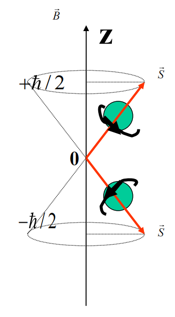

## 第8章 自旋与角动量理论初步

### 8.1 [电子自旋的描述与自旋算符](https://cloud.tsinghua.edu.cn/d/20694cb9c0fb44e6894a/files/?p=%2F%E4%B8%93%E4%B8%9A%E5%9F%BA%E7%A1%80%E8%AF%BE%E7%A8%8B%2F%E9%87%8F%E5%AD%90%E5%8A%9B%E5%AD%A6%2F%EF%BC%88%E9%83%AD%E6%B0%B8%EF%BC%89%2F%E8%AF%BE%E4%BB%B6%2F%E7%AC%AC28%E8%AE%B2.pdf)

#### 电子自旋的假设与电子自旋态

##### 电子自旋假设

电子不是一个质点，不是一个只具有坐标空间的三个自由度的粒子，而是还具有一个内禀自由度——”**自旋**“，相应地有自旋角动量和自旋磁矩。

电子**自旋角动量** $\vec{S}\,$ 的大小为

$$
|\vec{S}| = \sqrt{s(s+1)} \hbar
$$

其中 $s$ 为**自旋量子数**。

电子自旋角动量在空间相对外磁场方向的取向也是空间量子化的，在 $z$ 方向的投影只能取两个值

$$
S_z = \pm \frac{\hbar}{2}
$$

电子在外磁场中的两种自旋运动状态常用下图形象化地描述

应当注意的是，电子的自旋运动是一种内部“固有的”运动，而不是真正的在旋转，没有经典中的对应量。

##### 电子自旋态

###### 二分量波函数

要对电子的状态做出完全的描述，要同时考虑电子的空间坐标和自旋状态，对于自旋状态，更确切地说是要考虑在某给定方向（如 $z$ 轴方向）的投影的两个可能取值的波幅，即波函数中还应包含自旋投影这个变量（习惯上取为 $s_z$ ），记为 $\psi(\vec{r},s_z)$ ，其中 $s_z$ 只能取 $\pm\frac{\hbar}{2}$ 两个离散值，因此可以用**二分量波函数**方便地表示

$$
\psi(\vec{r},s_z) =
\begin{bmatrix}
\psi(\vec{r},+\hbar/2) \\
\psi(\vec{r},-\hbar/2)
\end{bmatrix}
$$

称为**旋量**(spinor)**波函数**。

其中 $|\psi(\vec{r},\hbar/2)|^2$ 是电子自旋向上（ $s_z = \hbar/2$ ），而且位置在 $\vec{r}\,$ 处的概率密度； $|\psi(\vec{r},-\hbar/2)|^2$ 是电子自旋向下（ $s_z = -\hbar/2$ ），而且位置在 $\vec{r}\,$ 处的概率密度。

###### 使用二分量波函数表示概率

**归一化条件**表示为

$$
\sum_{s_z=\pm\hbar/2} \int \mathrm{d}^3r |\psi(\vec{r},s_z)|^2
\\ \ \\
= \int \mathrm{d}^3r 
\begin{bmatrix}
\psi^*(\vec{r},+\hbar/2) &
\psi^*(\vec{r},-\hbar/2)
\end{bmatrix}
\begin{bmatrix}
\psi(\vec{r},+\hbar/2) \\
\psi(\vec{r},-\hbar/2)
\end{bmatrix}
\\ \ \\
= \int \mathrm{d}^3r \left( |\psi(\vec{r},+\frac{\hbar}{2})|^2 + |\psi(\vec{r},-\frac{\hbar}{2})|^2 \right)
\\ \ \\
= \int \mathrm{d}^3r \psi^+ \psi
= 1
$$

**空间概率密度**

$$
\rho(\vec{r},s_z) = \psi^+ \psi = |\psi(\vec{r},\hbar/2)|^2 + |\psi(\vec{r},-\hbar/2)|^2
$$

自旋状态的概率

$$
\Rho(+\frac{\hbar}{2}) = \int |\psi(\vec{r},+\frac{\hbar}{2})|^2\ \mathrm{d}\tau
\\ \ \\
\Rho(-\frac{\hbar}{2}) = \int |\psi(\vec{r},-\frac{\hbar}{2})|^2\ \mathrm{d}\tau
$$

###### 自旋与轨道非耦合时的表达

一般情况下，自旋运动和轨道运动有相互作用，这时有

$$
\psi(\vec{r},+\hbar/2) \ne \psi(\vec{r},-\hbar/2)
$$

当自旋和轨道相互作用小到可以忽略时（即特殊的二分量波函数是自旋和轨道**非耦合**的状态）， $\psi(\vec{r},+\hbar/2),\psi(\vec{r},-\hbar/2)$ 对 $\vec{r}\,$ 的

依赖关系是一样的，此时波函数可以分量变量，即

$$
\psi(\vec{r},s_z) = \phi(\vec{r}) \chi(s_z)
$$

其中 $\chi(s_z)$ 是**自旋波函数**，其一般形式为

$$
\chi(s_z) =
\begin{bmatrix}
a \\
b
\end{bmatrix}
$$

式中 $|a|^2$ 与 $|b|^2$ 分别代表电子 $s_z=\pm\hbar/2$ 的概率，所以归一化条件表示为

$$
|a|^2 + |b|^2 = \chi^+ \chi =
\begin{bmatrix}
a^* &
b^*
\end{bmatrix}
\begin{bmatrix}
a \\

b\end{bmatrix}
= 1
$$

#### 电子自旋算符与Pauli算符

##### 自旋算符

###### 基本介绍

$$
\hat{\vec{S}} = \hat{S}_x \vec{e}_x + \hat{S}_y \vec{e}_y + \hat{S}_z \vec{e}_z
\\ \ \\
\hat{S}^2 = \hat{S}_x^2 + \hat{S}_y^2 + \hat{S}_z^2
$$

自旋算符 $\hat{\vec{S}}$ 具有角动量算符的特征，即 $\hat{\vec{S}} \times \hat{\vec{S}} = \mathrm{i}\hbar\hat{\vec{S}}$ 。

###### 对易关系

$$
\hat{\vec{S}} \times \hat{\vec{S}} = \mathrm{i}\hbar\hat{\vec{S}}
\begin{cases}
[\hat{S}_x , \hat{S}_y] = \mathrm{i}\hbar\hat{S}_z \\
[\hat{S}_y , \hat{S}_z] = \mathrm{i}\hbar\hat{S}_x \\
[\hat{S}_z , \hat{S}_x] = \mathrm{i}\hbar\hat{S}_y
\end{cases}
$$

$$
[\hat{S}^2 , \hat{S}_x] = [\hat{S}^2 , \hat{S}_y] = [\hat{S}^2 , \hat{S}_z] = 0
$$

###### $\{\hat{S}^2 , \hat{S}_z\}$ 的共同本征态

$\{\hat{S}^2 , \hat{S}_z\}$ 的共同本征态为 $|sm\rangle$ ，满足

$$
\hat{S}^2\ |sm\rangle = s(s+1)\hbar^2\ |sm\rangle \\
\hat{S}_z\ |sm\rangle = m\hbar\ |sm\rangle
$$

其中 $s=0,\frac12,1,\frac32,\cdots$ ， $m=-s,-s+1,\cdots,s-1,s$ 。

###### 电子自旋算符

对于电子， $s=\frac12$ ，即 $\vec{S}\,$ 在空间任意方向上的投影只能取两个数值 $\pm\frac{\hbar}{2}$ ，故 $\hat{S}_x , \hat{S}_y , \hat{S}_z$ 的本征值均为 $\pm\frac{\hbar}{2}$ 。

此时在 $\{\hat{S}^2,\hat{S}_z\}$ 表象下，共同本征态为 $| \frac12 , \pm\frac12 \rangle$ ，简记为 $| \pm \rangle$ ，满足

$$
\hat{S}^2\ |\pm\rangle = \frac34\hbar^2\ |\pm\rangle
\\ \ \\
\hat{S}_z\ |\pm\rangle = \pm\frac12\hbar\ |\pm\rangle
$$

##### Pauli算符

###### 基本介绍

为了使自旋算符单位化、无量纲化，引入**Pauli算符** $\hat{\vec{\sigma}}$ ，满足

$$
\hat{\vec{S}} = \frac{\hbar}{2} \hat{\vec{\sigma}}
$$

Pauli算符的分量算符本征值均为 $\pm1$ ，故

$$
\hat{\sigma}_x^2 = \hat{\sigma}_y^2 = \hat{\sigma}_z^2 = I
$$

Pauli算符是**厄米算符**，即 $\hat{\vec{\sigma}}^+ = \hat{\vec{\sigma}}$ 。

###### 对易关系与反对易关系

$$
[\hat{\sigma}^2 , \hat{\sigma}_x] = [\hat{\sigma}^2 , \hat{\sigma}_y] = [\hat{\sigma}^2 , \hat{\sigma}_z] = 0
$$

$$
\hat{\vec{\sigma}} \times \hat{\vec{\sigma}} = 2\mathrm{i}\hat{\vec{\sigma}}
\begin{cases}
[\hat{\sigma}_x , \hat{\sigma}_y] = 2\mathrm{i}\hat{\sigma}_z \\
[\hat{\sigma}_y , \hat{\sigma}_z] = 2\mathrm{i}\hat{\sigma}_x \\
[\hat{\sigma}_z , \hat{\sigma}_x] = 2\mathrm{i}\hat{\sigma}_y
\end{cases}
$$

将 $\hat{\sigma}_x^2 = \hat{\sigma}_y^2 = \hat{\sigma}_z^2 = I$ 与上式联立，可得 $\hat{\vec{\sigma}}$ 的三个分量彼此**反对易**，即

$$
\begin{cases}
\hat{\sigma}_x \hat{\sigma}_y + \hat{\sigma}_y \hat{\sigma}_x = 0 \\
\hat{\sigma}_y \hat{\sigma}_z + \hat{\sigma}_z \hat{\sigma}_y = 0 \\
\hat{\sigma}_z \hat{\sigma}_x + \hat{\sigma}_x \hat{\sigma}_z = 0
\end{cases}
$$

进一步可得

$$
\begin{cases}
\sigma_x \sigma_y = - \sigma_y \sigma_x = \mathrm{i} \sigma_z \\
\sigma_y \sigma_z = - \sigma_z \sigma_y = \mathrm{i} \sigma_x \\
\sigma_z \sigma_x = - \sigma_x \sigma_z = \mathrm{i} \sigma_y \\
\end{cases}
$$

这组式子可归纳为

$$
\sigma_\alpha \sigma_\beta = \delta_{\alpha\beta} + \mathrm{i} \sum_\gamma \varepsilon_{\alpha\beta\gamma} \sigma_\gamma
$$

该式与 $\hat{\vec{\sigma}}^+ = \hat{\vec{\sigma}}$ 概括了Pauli算符的全部代数性质。

##### Pauli矩阵

###### 定义

在 $\{\hat{S}^2,\hat{S}_z\}$ （或 $\{\hat{\sigma}^2,\hat{\sigma}_z\}$ ）表象下，Pauli算符的表示称为**Pauli矩阵**：

$$
\hat{\sigma}_x =
\begin{bmatrix}
0 & 1 \\
1 & 0
\end{bmatrix}
\kern 2em
\hat{\sigma}_y =
\begin{bmatrix}
0 & -\mathrm{i} \\
\mathrm{i} & 0
\end{bmatrix}
\kern 2em
\hat{\sigma}_z =
\begin{bmatrix}
1 & 0 \\
0 & -1
\end{bmatrix}
$$

Pauli矩阵是**厄米**、**自逆**、**零迹**的。

###### 推导

在 $\{\hat{\sigma}^2,\hat{\sigma}_z\}$ 表象下， $\hat{\sigma}_z$ 为对角矩阵，对角元为本征值 $\pm1$ ，故

$$
\hat{\sigma}_z =
\begin{bmatrix}
1 & 0 \\
0 & -1
\end{bmatrix}
$$

设

$$
\hat{\sigma}_x =
\begin{bmatrix}
a & b \\
c & d
\end{bmatrix}
$$

根据 $\sigma_z \sigma_x = - \sigma_x \sigma_z$ ，可得

$$
\begin{bmatrix}
a & b \\
c & d
\end{bmatrix}
\begin{bmatrix}
1 & 0 \\
0 & -1
\end{bmatrix}
= -
\begin{bmatrix}
1 & 0 \\
0 & -1
\end{bmatrix}
\begin{bmatrix}
a & b \\
c & d
\end{bmatrix}
\\ \Downarrow \\
\begin{bmatrix}
a & -b \\
c & -d
\end{bmatrix}
=
\begin{bmatrix}
-a & -b \\
c & d
\end{bmatrix}
\\ \Downarrow \\
a = d = 0
$$

再根据厄米性 $\hat{\vec{\sigma}}^+ = \hat{\vec{\sigma}}$ ，可得 $c = b^*$ ，故

$$
\hat{\sigma}_x =
\begin{bmatrix}
0 & b \\
b^* & 0
\end{bmatrix}
$$

最后，根据 $\hat{\sigma}_x^2 = I$ ，得

$$
\hat{\sigma}_x^2 =
\begin{bmatrix}
0 & b \\
b^* & 0
\end{bmatrix}
\begin{bmatrix}
0 & b \\
b^* & 0
\end{bmatrix}
=
\begin{bmatrix}
|b|^2 & 0 \\
0 & |b|^2
\end{bmatrix}
= I
$$

故 $|b| = 1$ ，则 $b = \mathrm{e}^{\mathrm{i}\delta}$ ，习惯上选择 $\delta=0$ ，即 $b=1$ ，则

$$
\hat{\sigma}_x =
\begin{bmatrix}
0 & 1 \\
1 & 0
\end{bmatrix}
$$

根据 $\sigma_z \sigma_x = \mathrm{i} \sigma_y $ ，可得

$$
\hat{\sigma}_y = - \mathrm{i} \sigma_z \sigma_x = - \mathrm{i}
\begin{bmatrix}
1 & 0 \\
0 & -1
\end{bmatrix}
\begin{bmatrix}
0 & 1 \\
1 & 0
\end{bmatrix}
=
\begin{bmatrix}
0 & -\mathrm{i} \\
\mathrm{i} & 0
\end{bmatrix}
$$

#### 电子的自旋磁矩

##### 电子自旋磁矩算符

实验发现电子自旋磁矩等于一个玻尔磁子，即

$$
|\mu_z| = \mu_B = \frac{e\hbar}{2m_e}
$$

定义**电子自旋磁矩算符**为

$$
\hat{\vec{\mu}}_s = -2 \frac{\mu_B}{\hbar} \hat{\vec{S}} = - \frac{e}{m_e} \hat{\vec{S}}
$$

在 $z$ 方向的分量作用于自旋的本征态可得

$$
\hat{\mu}_{sz} |\pm\rangle
= -2 \frac{\mu_B}{\hbar} \hat{S}_z |\pm\rangle
= -2 \frac{\mu_B}{\hbar} (\pm\frac{\hbar}{2}) |\pm\rangle
= \mp \mu_B |\pm\rangle
$$

##### 电子磁矩总结

轨道磁矩

$$
\hat{\vec{\mu}}_l = g_l \frac{\mu_B}{\hbar} \hat{\vec{L}}
$$

自旋磁矩

$$
\hat{\vec{\mu}}_s = g_s \frac{\mu_B}{\hbar} \hat{\vec{S}}
$$

其中旋磁比

$$
g_l = -1, \kern 2em g_s = -2
$$

电子磁矩与外磁场的相互作用能

$$
W = - (\hat{\vec{\mu}}_l + \hat{\vec{\mu}}_s) \cdot \vec{B}
$$

若外磁场 $\vec{B} = B_0 \vec{e}_z$ ，则

$$
W = - (\hat{\vec{\mu}}_l + \hat{\vec{\mu}}_s) \cdot \vec{B} = \frac{\mu_B B_0}{\hbar} (\hat{\vec{L}}_z + 2\hat{\vec{S}}_z)
$$

### 8.2 角动量

#### [角动量的本征值与本征态](https://cloud.tsinghua.edu.cn/d/20694cb9c0fb44e6894a/files/?p=%2F%E4%B8%93%E4%B8%9A%E5%9F%BA%E7%A1%80%E8%AF%BE%E7%A8%8B%2F%E9%87%8F%E5%AD%90%E5%8A%9B%E5%AD%A6%2F%EF%BC%88%E9%83%AD%E6%B0%B8%EF%BC%89%2F%E8%AF%BE%E4%BB%B6%2F%E7%AC%AC29%E8%AE%B2.pdf)

##### 角动量算符与升降算符

###### 算符定义

若矢量算符 $\hat{\vec{J}}\,$ 满足以下对易关系 

$$
\hat{\vec{J}} \times \hat{\vec{J}} = \mathrm{i}\hbar\hat{\vec{J}}
\begin{cases}
[\hat{J}_x , \hat{J}_y] = \mathrm{i}\hbar\hat{J}_z \\
[\hat{J}_y , \hat{J}_z] = \mathrm{i}\hbar\hat{J}_x \\
[\hat{J}_z , \hat{J}_x] = \mathrm{i}\hbar\hat{J}_y
\end{cases}
$$

则称 $\hat{\vec{J}}\,$ 为**角动量算符**，定义角动量平方算符

$$
\hat{J}^2 = \hat{J}_x^2 + \hat{J}_y^2 + \hat{J}_z^2
$$

其满足

$$
[\hat{J}^2 , \hat{J}_\alpha] = 0 \kern 2em (\alpha=x,y,z)
$$

定义角动量的**升降算符**

$$
\hat{J}_\pm = \hat{J}_x \pm \mathrm{i}\hat{J}_y
$$

其中 $J_+$ 称为**升算符**(raising operator)， $J_-$ 称为**降算符**(lowering operator)。

升降算符不是厄米算符，其满足

$$
\hat{J}_\pm^+ = \hat{J}_\mp
$$

###### 升降算符满足的对易关系与常用公式

*以下只给出结论，证明从略。*

$$
[\hat{J}_+ , \hat{J}_-] = 2\hbar \hat{J}_z
$$

$$
\ [\hat{J}_x , \hat{J}_\pm] = \mp \hbar \hat{J}_z \\
\ [\hat{J}_y , \hat{J}_\pm] = -\mathrm{i} \hbar \hat{J}_z \\
\ [\hat{J}_z , \hat{J}_\pm] = \pm \hbar \hat{J}_\pm
$$

$$
[\hat{J}^2 , \hat{J}_\pm] = 0
$$

$$
\hat{J}_x = \frac12 (\hat{J}_+ + \hat{J}_-)
\kern 2em
\hat{J}_y = \frac{1}{2\mathrm{i}} (\hat{J}_+ - \hat{J}_-)
$$

##### 角动量的本征值

###### 角动量的本征值谱

对于任意类型的角动量（如轨道角动量、自旋角动量、总角动量等），本征值谱为

$$
\hat{J}^2\ |jm\rangle = j(j+1)\hbar^2\ |jm\rangle
\\ \ \\
\hat{J}_z\ |jm\rangle = m\hbar\ |jm\rangle
$$

其中量子数

$$
j = 0,\frac12,1,\frac32,2,\cdots
\\ \ \\
m = -j,-j+1,\cdots,j-1,j
$$

对于轨道角动量

$$
j = l = 0,1,2,\cdots
\\ \ \\
m = 0,\pm1,\pm2,\cdots,\pm j
$$

对于电子自旋角动量

$$
j = \frac12
\\ \ \\
m = \pm \frac12
$$

###### 角动量的本征值求解

角动量 $\{\hat{J}^2,\hat{J}_z\}$ 的本征值问题为

$$
\hat{J}^2\ |\lambda m\rangle = \lambda\hbar^2\ |\lambda m\rangle
\\ \ \\
\hat{J}_z\ |\lambda m\rangle = m\hbar\ |\lambda m\rangle
$$

需要求出 $\lambda,m$ 的可能取值。

首先，根据 $[\hat{J}^2 , \hat{J}_+] = 0$ ，两边取矩阵元可得

$$
\langle \lambda'm'| [\hat{J}^2 , \hat{J}_+] | \lambda m \rangle = 0
$$

结合 $\hat{J}^2\ |\lambda m\rangle = \lambda\hbar^2\ |\lambda m\rangle$ ，可得

$$
\Downarrow \\
\langle \lambda'm'| \hat{J}^2\hat{J}_+ - \hat{J}_+\hat{J}^2 | \lambda m \rangle = 0
\\ \Downarrow \\
\langle \lambda'm'| \hat{J}^2\hat{J}_+ | \lambda m \rangle - \langle \lambda'm'| \hat{J}_+\hat{J}^2 | \lambda m \rangle = 0
\\ \Downarrow \\
\lambda'\hbar^2 \langle \lambda'm'| \hat{J}_+ | \lambda m \rangle - \lambda\hbar^2 \langle \lambda'm'| \hat{J}_+ | \lambda m \rangle = 0
\\ \Downarrow \\
(\lambda'-\lambda) \langle \lambda'm'| \hat{J}_+ | \lambda m \rangle = 0
$$

当 $\lambda' \ne \lambda$ 时， $\langle \lambda'm'| J_+ | \lambda m \rangle = 0$ ，只有当 $\lambda' = \lambda$ 时， $\langle \lambda'm'| J_+ | \lambda m \rangle$ 才可能不为零，所以

$$
\langle \lambda'm'| \hat{J}_+ | \lambda m \rangle = \delta_{\lambda'\lambda} \langle \lambda m'| \hat{J}_+ | \lambda m \rangle
$$

*由于推导该式子时只用了 $[J^2 , J_+] = 0$ 这一个额外条件，故该式子对于 $\hat{J}_+,\hat{J}_x,\hat{J}_y,\hat{J}_z$ 也成立。*

接下来，根据对易关系 $[\hat{J}_z , \hat{J}_\pm] = \pm \hbar \hat{J}_\pm$ ，两边取矩阵元，结合 $\hat{J}_z\ |\lambda m\rangle = m\hbar\ |\lambda m\rangle$ ，可得

$$
\langle \lambda m'| [\hat{J}_z , \hat{J}_\pm] | \lambda m \rangle = \pm \hbar \langle \lambda m'| \hat{J}_\pm | \lambda m \rangle
\\ \Downarrow \\
\langle \lambda m'| \hat{J}_z\hat{J}_\pm - \hat{J}_\pm\hat{J}_z | \lambda m \rangle = \pm \hbar \langle \lambda m'| \hat{J}_\pm | \lambda m \rangle
\\ \Downarrow \\
\langle \lambda m'| \hat{J}_z\hat{J}_\pm | \lambda m \rangle - \langle \lambda m'| \hat{J}_\pm\hat{J}_z | \lambda m \rangle = \pm \hbar \langle \lambda m'| \hat{J}_\pm | \lambda m \rangle
\\ \Downarrow \\
m'\hbar \langle \lambda m'| \hat{J}_\pm | \lambda m \rangle - m\hbar \langle \lambda m'| \hat{J}_\pm | \lambda m \rangle = \pm \hbar \langle \lambda m'| \hat{J}_\pm | \lambda m \rangle
\\ \Downarrow \\
(m'-m\mp1) \langle \lambda m'| \hat{J}_\pm | \lambda m \rangle = 0
\\ \Downarrow \\
\langle \lambda'm'| \hat{J}_\pm | \lambda m \rangle = \delta_{\lambda'\lambda} \delta_{m',m\pm1} \langle \lambda,m\pm1 | \hat{J}_\pm | \lambda m \rangle
$$

*这说明算符 $\hat{J}_\pm$ 使磁量子数 $m$ 增减 $1$ ，所以称为升降算符.*

然后，根据对易关系 $[\hat{J}_+ , \hat{J}_-] = 2\hbar \hat{J}_z$ ，两边取矩阵元，可得

$$
\langle \lambda m' | [\hat{J}_+ , \hat{J}_-] | \lambda m \rangle = 2\hbar \langle \lambda m'| \hat{J}_z | \lambda m \rangle
\\ \Downarrow \\
\langle \lambda m' | \hat{J}_+\hat{J}_- - \hat{J}_-\hat{J}_+ | \lambda m \rangle = 2m\hbar^2 \delta_{m'm}
\\ \Downarrow \\
\langle \lambda m | \hat{J}_+\hat{J}_- | \lambda m \rangle - \langle \lambda m | \hat{J}_-\hat{J}_+ | \lambda m \rangle = 2m\hbar^2
\\ \Downarrow \\
\sum_{m''} \langle \lambda m | \hat{J}_+ | \lambda m'' \rangle \langle \lambda m ''| \hat{J}_- | \lambda m \rangle - \langle \lambda m | \hat{J}_- | \lambda m'' \rangle \langle \lambda m ''| \hat{J}_+ | \lambda m \rangle = 2m\hbar^2
\\ \Downarrow \\
\langle \lambda m | \hat{J}_+ | \lambda,m-1 \rangle \langle \lambda,m-1 | \hat{J}_- | \lambda m \rangle - \langle \lambda m | \hat{J}_- | \lambda,m+1 \rangle \langle \lambda,m+1 | \hat{J}_+ | \lambda m \rangle = 2m\hbar^2
\\ \Downarrow \\
\langle \lambda m | \hat{J}_+ | \lambda,m-1 \rangle \langle \lambda,m-1 | \hat{J}_+ | \lambda m \rangle^* - \langle \lambda m | \hat{J}_+ | \lambda,m+1 \rangle^* \langle \lambda,m+1 | \hat{J}_+ | \lambda m \rangle = 2m\hbar^2
\\ \Downarrow \\
\left| \langle \lambda m | \hat{J}_+ | \lambda,m-1 \rangle \right|^2 - \left| \langle \lambda,m+1 | \hat{J}_+ | \lambda m \rangle \right|^2 = 2m\hbar^2
$$

令 $\xi_{m}\hbar = \langle \lambda,m+1 | \hat{J}_+ | \lambda m \rangle = \langle \lambda m | \hat{J}_- | \lambda,m+1 \rangle^*$ ，则

$$
|\xi_{m-1}|^2 - |\xi_m|^2 = 2m 
$$

此方程的解为

$$
|\xi_m|^2 = C - m(m+1)
$$

其中 $C$ 为与 $m$ 无关的实常数。根据 $|\xi_m|^2 \ge 0$ 可知

$$
m(m+1) \le C
$$

这表明量子数 $m$ 的取值要受到一定限制，即 $m$ 有一个上界 $\overline{m}$ 与下界 $\underline{m}$ ，在此范围外（即 $m>\overline{m}$ 或 $m<\underline{m}$），应有 $\langle \lambda m | \lambda m \rangle = 0$ ，故

$$
\xi_{\overline{m}}
= \frac{1}{\hbar} \langle \lambda,\overline{m}+1 | \hat{J}_+ | \lambda \overline{m} \rangle
= \frac{1}{\hbar} \langle \lambda,\overline{m}+1 | \lambda,\overline{m}+1 \rangle
= 0
$$

故 $C = \overline{m}(\overline{m}+1)$ ，同理有

$$
\xi_{\underline{m}-1}
= \frac{1}{\hbar} \langle \lambda,\underline{m}-1 | \hat{J}_- | \lambda \underline{m} \rangle^*
= \frac{1}{\hbar} \langle \lambda,\underline{m}-1 | \lambda,\underline{m}-1 \rangle^*
= 0
$$

故 $C = \underline{m}(\underline{m}-1)$ ，根据两个 $C$ 的表达式，可得

$$
\underline{m} = - \overline{m}
$$

由于相邻的两个 $m$ 值相差 $1$ ，故任意两个 $m$ 的差均为整数，故

$$
\overline{m} - \underline{m} = 非负整数
\\ \Downarrow \\
2\overline{m} = 非负整数
\\ \Downarrow \\
\overline{m} = \frac{非负整数}{2}
$$

记 $\overline{m} = j$ ，则 $j$ 可能取值为 $\frac12$ 的非负整数倍，即

$$
j =
\begin{cases}
\frac12,\frac32,\frac52,\cdots & (半奇数) \\
0,1,2,\cdots & (非负整数)
\end{cases}
$$

故

$$
|\xi_m|^2
= C - m(m+1)
= \overline{m}(\overline{m}+1) - m(m+1)
= j(j+1) - m(m+1)
\\ \ \\
= (j-m)(j+m+1)
$$

通过以上推导，已经得出了量子数 $j$ 与 $m$ 的限制关系以及升降算符矩阵元不为零的位置，接下来只需要找到 $\lambda$ 与 $j$ 的关系，就可以求出 $\hat{J}^2$ 与 $\hat{J}_z$ 的本征值了：考虑

$$
\hat{J}^2
= \hat{J}_x^2 + \hat{J}_y^2 + \hat{J}_z^2
\\ \ \\
= \frac14 (\hat{J}_+ + \hat{J}_-)^2 - \frac14 (\hat{J}_+ - \hat{J}_-)^2 + \hat{J}_z^2
\\ \ \\
= \frac12 (\hat{J}_+\hat{J}_- + \hat{J}_-\hat{J}_+) + \hat{J}_z^2
$$

两边取平均值可得

$$
\langle \lambda m | \hat{J}^2 | \lambda m \rangle = \frac12 \langle \lambda m| \hat{J}_+\hat{J}_- + \hat{J}_-\hat{J}_+ | \lambda m \rangle + \langle \lambda m| \hat{J}_z^2 | \lambda m \rangle
\\ \Downarrow \\
\lambda \hbar^2 = \frac12 \left( \langle \lambda m| \hat{J}_+\hat{J}_- | \lambda m \rangle + \langle \lambda m| \hat{J}_-\hat{J}_+ | \lambda m \rangle \right) + m^2 \hbar^2
\\ \Downarrow \\
\lambda \hbar^2 = \frac12 \sum_{m'} \left( \langle \lambda m| \hat{J}_+ | \lambda m' \rangle \langle \lambda m' | \hat{J}_- | \lambda m \rangle + \langle \lambda m| \hat{J}_- | \lambda m' \rangle \langle \lambda m' | \hat{J}_+ | \lambda m \rangle \right) + m^2 \hbar^2
\\ \Downarrow \\
\lambda \hbar^2 = \frac12 \left( \langle \lambda m| \hat{J}_+ | \lambda,m-1 \rangle \langle \lambda,m-1 | \hat{J}_- | \lambda m \rangle + \langle \lambda m| \hat{J}_- | \lambda,m+1 \rangle \langle \lambda,m+1 | \hat{J}_+ | \lambda m \rangle \right) + m^2 \hbar^2
\\ \Downarrow \\
\lambda \hbar^2 = \frac{\hbar^2}{2} \left( |\xi_{m-1}|^2 + |\xi_m|^2 \right) + m^2 \hbar^2
\\ \Downarrow \\
\lambda = \frac12 \left[ (j-m+1)(j+m) + (j-m)(j+m+1) \right] + m^2
\\ \Downarrow \\
\lambda = j(j+1)
$$

综上，即完成了本征值的求解。

###### 角动量算符的矩阵元

在 $\{\hat{J}^2,\hat{J}_z\}$ 表象中， $\hat{J}^2,\hat{J}_z$ 是对角矩阵

$$
\langle j'm'| \hat{J}^2 | jm \rangle = j(j+1) \hbar^2\ \delta_{jj'} \delta_{mm'}
\\ \ \\
\langle j'm'| \hat{J}_z | jm \rangle = m \hbar\ \delta_{jj'} \delta_{mm'}
$$

其余的角动量相关算符对 $j$ 而言是对角矩阵，而对 $m$ 而言，升降算符只在主对角线一侧的斜线上有非零矩阵元：

$$
\langle j,m+1 | \hat{J}_+ | jm \rangle = \hbar \sqrt{j(j+1) - m(m+1)}
\\ \ \\
\langle j,m-1 | \hat{J}_- | jm \rangle = \hbar \sqrt{j(j+1) - m(m-1)}
$$

角动量在 $x,y$ 分量的算符只在主对角线两侧的斜线上有非零矩阵元：

$$
\langle j,m+1 | \hat{J}_x | jm \rangle = \frac{\hbar}{2} \sqrt{j(j+1) - m(m+1)}
\\ \ \\
\langle j,m-1 | \hat{J}_x | jm \rangle = \frac{\hbar}{2} \sqrt{j(j+1) - m(m-1)}
\\ \ \\
\langle j,m+1 | \hat{J}_y | jm \rangle = -\frac{\mathrm{i}\hbar}{2} \sqrt{j(j+1) - m(m+1)}
\\ \ \\
\langle j,m-1 | \hat{J}_y | jm \rangle = \frac{\mathrm{i}\hbar}{2} \sqrt{j(j+1) - m(m-1)}
$$

*实际上，角动量的升降算符与 $x,y$ 分量算符的矩阵表示均有相位不确定性，即有因子 $\mathrm{e}^{\mathrm{i}\delta}$ ，习惯上取 $\delta = 0$ ，即得上述表达式。*

#### [角动量的合成](https://cloud.tsinghua.edu.cn/d/20694cb9c0fb44e6894a/files/?p=%2F%E4%B8%93%E4%B8%9A%E5%9F%BA%E7%A1%80%E8%AF%BE%E7%A8%8B%2F%E9%87%8F%E5%AD%90%E5%8A%9B%E5%AD%A6%2F%EF%BC%88%E9%83%AD%E6%B0%B8%EF%BC%89%2F%E8%AF%BE%E4%BB%B6%2F%E7%AC%AC30%E8%AE%B2.pdf)

##### 角动量合成的一般规则

###### 总角动量

设设角动量 $\hat{\vec{J}}_1$ 和 $\hat{\vec{J}}_2$ 互相独立，即两个角动量的分量是对易的

$$
[\hat{J}_{1\alpha} , \hat{J}_{2\beta}] = 0 \kern 2em (\alpha,\beta = x,y,z)
$$

则矢量和 $\hat{\vec{J}} = \hat{\vec{J}}_1 + \hat{\vec{J}}_2$ 也是一个角动量算符，称为**总角动量**，它是厄米算符，且满足角动量的一般对易关系，即

$$
\hat{\vec{J}} \times \hat{\vec{J}} = \mathrm{i}\hbar \hat{\vec{J}}
$$

###### 对易关系

由于两个角动量 $\hat{\vec{J}}_1$ 和 $\hat{\vec{J}}_2$ 互相独立，容易证明

$$
[\hat{J}_1^2 , \hat{\vec{J}}_2] = [\hat{J}_2^2 , \hat{\vec{J}}_1] = 0
$$

由此容易推得

$$
\ [\hat{J}_1^2 , \hat{\vec{J}}] = [\hat{J}_2^2 , \hat{\vec{J}}] = 0
\\ \ \\
\ [\hat{J}_1^2 , \hat{J}^2] = [\hat{J}_2^2 , \hat{J}^2] = 0
$$

根据 $J_\alpha = J_{1\alpha} + J_{2\alpha}$ 与 $[J_{1\alpha} , J_{2\alpha}] = 0$ ，可得

$$
[\hat{J}_\alpha , \hat{J}_{1\alpha}] = [\hat{J}_{\alpha} , \hat{J}_{2\alpha}] = 0 \kern 2em (\alpha = x,y,z)
$$

根据 $[\hat{J}_{\alpha} , \hat{J}_{\beta}] = \varepsilon_{\alpha\beta\gamma} \mathrm{i}\hbar \hat{J}_{\gamma}$ 以及

$$
\hat{J}^2
= (\hat{J}_1 + \hat{J}_2)^2
\\ \ \\
= \hat{J}_1^2 + \hat{J}_2^2 + 2 \hat{J}_1 \cdot \hat{J}_2
\\ \ \\
= \hat{J}_1^2 + \hat{J}_2^2 + 2 \left( \hat{J}_{1x} \hat{J}_{2x} + \hat{J}_{1y} \hat{J}_{2y} + \hat{J}_{1z} \hat{J}_{2z} \right)
$$

可得

$$
[\hat{J}^2 , \hat{\vec{J}}_1] \ne 0
,\kern 1em
[\hat{J}^2 , \hat{\vec{J}}_2] \ne 0
$$

##### 耦合表象与非耦合表象

###### 非耦合表象

非耦合表象使用 $\psi_{j_1m_1}(1)\psi_{j_2m_2}(2)$ 为基底，即两个角动量可以独立地考虑，**力学量完备集**为

$$
\{ \hat{J}_1^2 , \hat{J}_{1z} , \hat{J}_2^2 , \hat{J}_{2z} \}
$$

使用Dirac符号表示**基底**为

$$
| j_1m_1j_2m_2 \rangle = | j_1m_1 \rangle | j_2m_2 \rangle
$$

对于确定的 $j_1 , j_2$ ，可得 $m_1 , m_2$ 具有确定的取值范围，故**维数**为

$$
(2j_1 + 1)(2j_2 + 1)
$$

**封闭关系**为

$$
\sum_{m_1=-j_1}^{j_1} \sum_{m_2=-j_2}^{j_2} | j_1m_1j_2m_2 \rangle \langle j_1m_1j_2m_2 | = I
$$

需要注意的是，在非耦合表象中， $\hat{J}_1^2 , \hat{J}_{1z}$ 只对 $| j_1m_1 \rangle$ 作用， $\hat{J}_2^2 , \hat{J}_{2z}$ 只对 $| j_2m_2 \rangle$ 作用，故

$$
\hat{J}_1^2\ | j_1m_1j_2m_2 \rangle = j_1(j_1+1)\hbar^2\ | j_1m_1j_2m_2 \rangle 
\\ \ \\
\hat{J}_{1z}\ | j_1m_1j_2m_2 \rangle = m_1\hbar\ | j_1m_1j_2m_2 \rangle 
\\ \ \\
\hat{J}_2^2\ | j_1m_1j_2m_2 \rangle = j_2(j_2+1)\hbar^2\ | j_1m_1j_2m_2 \rangle 
\\ \ \\
\hat{J}_{2z}\ | j_1m_1j_2m_2 \rangle = m_2\hbar\ | j_1m_1j_2m_2 \rangle
$$

###### 耦合表象

非耦合表象使用 $\psi_{j_1j_2jm}(1,2)$ 为基底，即两个角动量需要综合地考虑，**力学量完备集**为

$$
\{ \hat{J}_1^2 , \hat{J}_{2}^2 , \hat{J}^2 , \hat{J}_{z} \}
$$

使用Dirac符号表示**基底**为

$$
| j_1j_2jm \rangle
$$

**封闭关系**为

$$
\sum_{j=j_{\min}}^{j_{\max}} \sum_{m=-j}^{j} | j_1j_2jm \rangle \langle j_1j_2jm | = I
$$

在耦合表象中，算符对态的作用为

$$
\hat{J}_1^2\ | j_1j_2jm \rangle = j_1(j_1+1)\hbar^2\ | j_1j_2jm \rangle 
\\ \ \\
\hat{J}_2^2\ | j_1j_2jm \rangle = j_2(j_2+1)\hbar^2\ | j_1j_2jm \rangle 
\\ \ \\
\hat{J}^2\ | j_1j_2jm \rangle = j(j+1)\hbar^2\ | j_1j_2jm \rangle 
\\ \ \\
\hat{J}_{z}\ | j_1j_2jm  \rangle = m\hbar\ | j_1j_2jm  \rangle
$$

###### 表象变换

对于确定的 $j_1,j_2$ ，在 $(2j_1+1)(2j_2+1)$ 维子空间中，非耦合表象的基底向耦合表象的基地变换公式为

$$
| j_1j_2jm  \rangle = \sum_{m_1=-j_1}^{j_1} \sum_{m_2=-j_2}^{j_2} | j_1m_1j_2m_2 \rangle \langle j_1m_1j_2m_2 | j_1j_2jm  \rangle 
$$

其中的展开系数称为**Clebsch-Gordan(CG)系数**，记为

$$
C_{j_1m_1j_2m_2}^{jm} = \langle j_1m_1j_2m_2 | j_1j_2jm  \rangle 
$$

##### 总角动量 $\{ \hat{J}^2 , \hat{J}_z \}$ 的本征值谱

###### 总角量子数

总角动量 $\{ \hat{J}^2 , \hat{J}_z \}$ 的共同本征态为 $| jm \rangle$ ，对于确定的量子数 $j_1,j_2$ ，**总角量子数** $j$ 的取值系列为

$$
j = |j_1-j_2|\ ,\ |j_1-j_2|+1\ ,\ \cdots ,\ j_1+j_2-1\ ,\ j_1+j_2 
$$

###### 总角量子数取值范围的推导

首先，根据非耦合表象向耦合表象的基底变换，可得

$$
\hat{J}_z\ | j_1j_2jm  \rangle
= m\hbar\ | j_1j_2jm  \rangle
= \sum_{m_1=-j_1}^{j_1} \sum_{m_2=-j_2}^{j_2} m\hbar\ C_{j_1m_1j_2m_2}^{jm} | j_1m_1j_2m_2 \rangle
$$

而根据 $\hat{J}_z = \hat{J}_{1z} + \hat{J}_{2z}$ ，可得

$$
\hat{J}_z\ | j_1j_2jm  \rangle
= (\hat{J}_{1z} + \hat{J}_{2z}) | j_1j_2jm  \rangle
\\ \ \\
= (\hat{J}_{1z} + \hat{J}_{2z}) \sum_{m_1=-j_1}^{j_1} \sum_{m_2=-j_2}^{j_2} C_{j_1m_1j_2m_2}^{jm} | j_1m_1j_2m_2 \rangle
\\ \ \\
= \sum_{m_1=-j_1}^{j_1} \sum_{m_2=-j_2}^{j_2} (m_1+m_2)\hbar\ C_{j_1m_1j_2m_2}^{jm} | j_1m_1j_2m_2 \rangle
$$

两式对比，可得

$$
\sum_{m_1=-j_1}^{j_1} \sum_{m_2=-j_2}^{j_2} (m-m_1-m_2)\hbar\ C_{j_1m_1j_2m_2}^{jm} | j_1m_1j_2m_2 \rangle = 0
$$

由于基矢 $| j_1m_1j_2m_2 \rangle$ 是线性独立的，故所有系数均为零，即

$$
m = m_1 + m_2
$$

考虑到 $m_1,m_2$ 的取值系列分别为

$$
m_1 = -j_1\ ,\ -j_1+1\ , \cdots ,\ j_1-1\ ,\ j_1 \\
m_2 = -j_2\ ,\ -j_2+1\ , \cdots ,\ j_2-1\ ,\ j_2
$$

故可得 $m$ 能取到的最大值为

$$
m_{\max} = (m_1 + m_2)_{\max} = j_1 + j_2
$$

而 $m$ 的取值范围为从 $-j$ 到 $j$ ，故

$$
j_{\max} = m_{\max} = j_1 + j_2
$$

值得注意的是 $j_{\min}$ 无法直接通过 $m$ 的可取值范围得到，而是需要根据表象变换空间维数保持不变这一特征来求出，由于当 $j$ 确定时，维数为 $2j+1$ ，故

$$
\sum_{j=j_{\min}}^{j_1+j_2} (2j+1) = (2j_1+1)(2j_2+1)
\\ \Downarrow \\
\frac12(j_1+j_2-j_{\min}+1)[(2j_{\min}+1)+(2j_1+2j_2+1)] = (2j_1+1)(2j_2+1)
\\ \Downarrow \\
(j_1+j_2-j_{\min}+1)(j_{\min}+j_1+j_2+1) = (2j_1+1)(2j_2+1)
\\ \Downarrow \\
(j_1+j_2+1)^2 - j_{\min}^2 = (2j_1+1)(2j_2+1)
\\ \Downarrow \\
j_{\min}^2 = (j_1-j_2)^2
\\ \Downarrow \\
j_{\min} = |j_1-j_2|
$$

### 8.3 自旋角动量以及角动量合成的具体应用

$$
\hat{\vec{J}}_1 \cdot \hat{\vec{J}}_2 = \frac12 \left( \hat{J}^2 - \hat{J}_1^2 - \hat{J}_2^2 \right)
$$

#### [碱金属原子能谱的双线结构和Zeeman效应](https://cloud.tsinghua.edu.cn/d/20694cb9c0fb44e6894a/files/?p=%2F%E4%B8%93%E4%B8%9A%E5%9F%BA%E7%A1%80%E8%AF%BE%E7%A8%8B%2F%E9%87%8F%E5%AD%90%E5%8A%9B%E5%AD%A6%2F%EF%BC%88%E9%83%AD%E6%B0%B8%EF%BC%89%2F%E8%AF%BE%E4%BB%B6%2F%E7%AC%AC31%E8%AE%B2.pdf)

#### [两电子体系](https://cloud.tsinghua.edu.cn/d/20694cb9c0fb44e6894a/files/?p=%2F%E4%B8%93%E4%B8%9A%E5%9F%BA%E7%A1%80%E8%AF%BE%E7%A8%8B%2F%E9%87%8F%E5%AD%90%E5%8A%9B%E5%AD%A6%2F%EF%BC%88%E9%83%AD%E6%B0%B8%EF%BC%89%2F%E8%AF%BE%E4%BB%B6%2F%E7%AC%AC32%E8%AE%B2.pdf)

两电子体系的自旋自由度为 $2$ ，可以选择非耦合表象，即 $\{ \hat{S}_1^2 , \hat{S}_{1z} , \hat{S}_2^2 , \hat{S}_{2z} \}$ 作为自旋力学量完全集，也可以选择耦合表象，即 $\{ \hat{S}_1^2 , \hat{S}_2^2 , \hat{S}^2 ,  \hat{S}_{z} \}$ 作为自旋力学量完全集。

*对于电子，由于 $\hat{S}_1^2 , \hat{S}_2^2$ 的本征值是确定的，均为 $\frac34\hbar^2$ ，故上述力学量完全集中的 $\hat{S}_1^2 , \hat{S}_2^2$ 可略去不写。*

##### 非耦合表象下态的表示

在单体近似下，忽略两个电子间的 $S-S$ 耦合，两电子的自旋函数 $\chi(S_{1z},S_{2z})$ 可以用每个电子自旋函数 $\chi_{m_s}(S_{kz})$ 之积来表示，即

$$
\chi(S_{1z},S_{2z}) = \chi_{m_s}(S_{1z})\ \chi_{m_s'}(S_{2z})
$$

其中自旋量子数 $s_1 = s_2 = \frac12$ ，自旋磁量子数 $m_s = \pm\frac12 , m_s' = \pm\frac12$ 。由此，即可得出无耦合表象的基底

$$
\chi^{(1)} = |\uparrow\ \rangle_1 |\uparrow\ \rangle_2 = \chi_{1/2}(S_{1z})\ \chi_{1/2}(S_{2z})
\\ \ \\
\chi^{(2)} = |\downarrow\ \rangle_1 |\downarrow\ \rangle_2 = \chi_{-1/2}(S_{1z})\ \chi_{-1/2}(S_{2z})
\\ \ \\
\chi^{(3)} = |\uparrow\ \rangle_1 |\downarrow\ \rangle_2 = \chi_{1/2}(S_{1z})\ \chi_{-1/2}(S_{2z})
\\ \ \\
\chi^{(4)} = |\downarrow\ \rangle_1 |\uparrow\ \rangle_2 = \chi_{-1/2}(S_{1z})\ \chi_{1/2}(S_{2z})
$$

其中的 $|\uparrow\ \rangle_1$ 表示第一个电子的自旋向上，其余表示依次类推，对于两个电子的自旋态，也可使用诸如 $|\uparrow\ \uparrow\ \rangle_{12}$ 的形式表述。

##### 耦合表象下态的表示

###### 结论

在耦合表象中，基底为

$$
\chi_{00} = \frac{1}{\sqrt{2}} \left[\ |\uparrow\ \rangle_1 |\downarrow\ \rangle_2 - |\downarrow\ \rangle_1 |\uparrow\ \rangle_2\ \right]
\\ \ \\
\chi_{10} = \frac{1}{\sqrt{2}} \left[\ |\uparrow\ \rangle_1 |\downarrow\ \rangle_2 + |\downarrow\ \rangle_1 |\uparrow\ \rangle_2\ \right]
\\ \ \\
\chi_{11} = |\uparrow\ \rangle_1 |\uparrow\ \rangle_2
\\ \ \\
\chi_{1,-1} = |\downarrow\ \rangle_1 |\downarrow\ \rangle_2
$$

对应的本征值与交换对称性如表所示

| 态             | 交换对称性 | $\hat{S}^2$ 的本征值 | $\hat{S}_z$ 的本征值 |
|:-------------:|:-----:|:---------------:|:----------------:|
| $\chi_{00}$   | 反对称   | $0$             | $0$              |
| $\chi_{10}$   | 对称    | $2\hbar^2$      | $0$              |
| $\chi_{11}$   | 对称    | $2\hbar^2$      | $\hbar$          |
| $\chi_{1,-1}$ | 对称    | $2\hbar^2$      | $-\hbar$         |

其中：自旋总量子数 $s=1$ 的态（ $\chi_{10},\chi_{11},\chi_{1,-1}$ ）表示两电子自旋互相平行，对于给定的自旋总量子数是三重简并的，称为**自旋三重态**；自旋总量子数 $s=0$ 的态（ $\chi_{00}$ ）表示两电子自旋互相反平行，对于给定的自旋总量子数是非简并的，称为**自旋单态**。

*电子为Fermi子，多电子体系的总波函数应该是交换反对称的，故若自旋波函数为交换对称的，则空间波函数当为自旋反对称的，而若自旋波函数为交换反对称的，则空间波函数当为自旋对称的。*

###### 推导

在非耦合表象的基底中，可以验证四个态均为 $S_z$ 的本征态，根据 $\hat{S}_{z} = \hat{S}_{1z} + \hat{S}_{2z}$ ，以及 

$$
\hat{S}_{kz} |\uparrow\ \rangle_k = \frac12\hbar\ |\uparrow\ \rangle_k
\\ \ \\
\hat{S}_{kz} |\downarrow\ \rangle_k = -\frac12\hbar\ |\downarrow\ \rangle_k
$$

容易得到

$$
\hat{S}_z\ |\uparrow\ \rangle_1 |\uparrow\ \rangle_2 = \hbar\ |\uparrow\ \rangle_1 |\uparrow\ \rangle_2
\\ \ \\
\hat{S}_z\ |\downarrow\ \rangle_1 |\downarrow\ \rangle_2 = -\hbar\ |\downarrow\ \rangle_1 |\downarrow\ \rangle_2
\\ \ \\
\hat{S}_z\ |\uparrow\ \rangle_1 |\downarrow\ \rangle_2 = 0\ |\uparrow\ \rangle_1 |\downarrow\ \rangle_2
\\ \ \\
\hat{S}_z\ |\downarrow\ \rangle_1 |\uparrow\ \rangle_2 = 0\ |\downarrow\ \rangle_1 |\uparrow\ \rangle_2
$$

同时，根据

$$
\hat{S}^2
= (\hat{\vec{S}}_1 + \hat{\vec{S}}_2)^2
\\ \ \\
= \hat{S}_1^2 + \hat{S}_2^2 + 2 \hat{\vec{S}}_1 \cdot \hat{\vec{S}}_2
\\ \ \\
= \frac32 \hbar^2 + 2 \left( \hat{S}_{1x}\hat{S}_{2x} + \hat{S}_{1y}\hat{S}_{2y} + \hat{S}_{1z}\hat{S}_{2z}\right)
$$

以及

$$
\hat{S}_x\ |\uparrow\ \rangle
= \frac{\hbar}{2}
\begin{bmatrix}
0 & 1 \\
1 & 0
\end{bmatrix}
\begin{bmatrix}
1 \\
0
\end{bmatrix}
= \frac{\hbar}{2}
\begin{bmatrix}
0 \\
1
\end{bmatrix}
= \frac{\hbar}{2}\ |\downarrow\ \rangle
\\ \ \\
\hat{S}_x\ |\downarrow\ \rangle
= \frac{\hbar}{2}
\begin{bmatrix}
0 & 1 \\
1 & 0
\end{bmatrix}
\begin{bmatrix}
0 \\
1
\end{bmatrix}
= \frac{\hbar}{2}
\begin{bmatrix}
1 \\
0
\end{bmatrix}
= \frac{\hbar}{2}\ |\uparrow\ \rangle
\\ \ \\
\hat{S}_y\ |\uparrow\ \rangle
= \frac{\hbar}{2}
\begin{bmatrix}
0 & -\mathrm{i} \\
\mathrm{i} & 0
\end{bmatrix}
\begin{bmatrix}
1 \\
0
\end{bmatrix}
= \frac{\mathrm{i}\hbar}{2}
\begin{bmatrix}
0 \\
1
\end{bmatrix}
= \frac{\mathrm{i}\hbar}{2}\ |\downarrow\ \rangle
\\ \ \\
\hat{S}_y\ |\downarrow\ \rangle
= \frac{\hbar}{2}
\begin{bmatrix}
0 & -\mathrm{i} \\
\mathrm{i} & 0
\end{bmatrix}
\begin{bmatrix}
0 \\
1
\end{bmatrix}
= -\frac{\mathrm{i}\hbar}{2}
\begin{bmatrix}
1 \\
0
\end{bmatrix}
= -\frac{\mathrm{i}\hbar}{2}\ |\uparrow\ \rangle
$$

可得 $|\uparrow\ \rangle_1 |\uparrow\ \rangle_2$ 和 $|\downarrow\ \rangle_1 |\downarrow\ \rangle_2$ 也是 $\hat{S}^2$ 的本征态，满足

$$
\hat{S}^2\ |\uparrow\ \rangle_1 |\uparrow\ \rangle_2 = 2\hbar^2\ |\uparrow\ \rangle_1 |\uparrow\ \rangle_2
\\ \ \\
\hat{S}^2\ |\downarrow\ \rangle_1 |\downarrow\ \rangle_2 = 2\hbar^2\ |\downarrow\ \rangle_1 |\downarrow\ \rangle_2
$$

根据对应的本征值（量子数），将这两个态记为 $\chi_{11}$ 与 $\chi_{1,-1}$ ，而 $|\uparrow\ \rangle_1 |\downarrow\ \rangle_2$ 和 $|\downarrow\ \rangle_1 |\uparrow\ \rangle_2$ 不是 $\hat{S}^2$ 的本征态，需要通过线性组合构成 $\hat{S}^2$ 的本征态，可得

$$
\hat{S}^2 \frac{1}{\sqrt{2}} \left[\ |\uparrow\ \rangle_1 |\downarrow\ \rangle_2 - |\downarrow\ \rangle_1 |\uparrow\ \rangle_2\ \right]
= 0 \times \frac{1}{\sqrt{2}} \left[\ |\uparrow\ \rangle_1 |\downarrow\ \rangle_2 - |\downarrow\ \rangle_1 |\uparrow\ \rangle_2\ \right]
\\ \ \\
\hat{S}^2 \frac{1}{\sqrt{2}} \left[\ |\uparrow\ \rangle_1 |\downarrow\ \rangle_2 + |\downarrow\ \rangle_1 |\uparrow\ \rangle_2\ \right] = 2\hbar^2\ \frac{1}{\sqrt{2}} \left[\ |\uparrow\ \rangle_1 |\downarrow\ \rangle_2 + |\downarrow\ \rangle_1 |\uparrow\ \rangle_2\ \right]
$$

根据对应的本征值（量子数），将这两个态记为 $\chi_{00}$ 与 $\chi_{10}$ 。